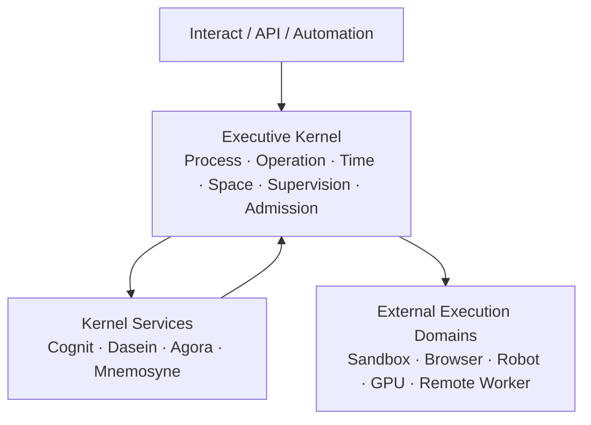
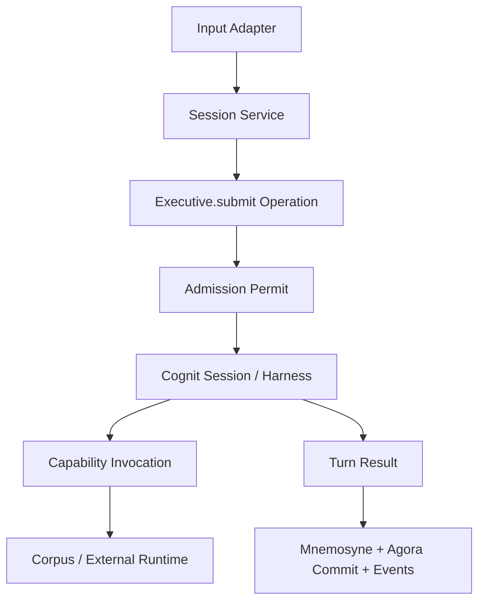
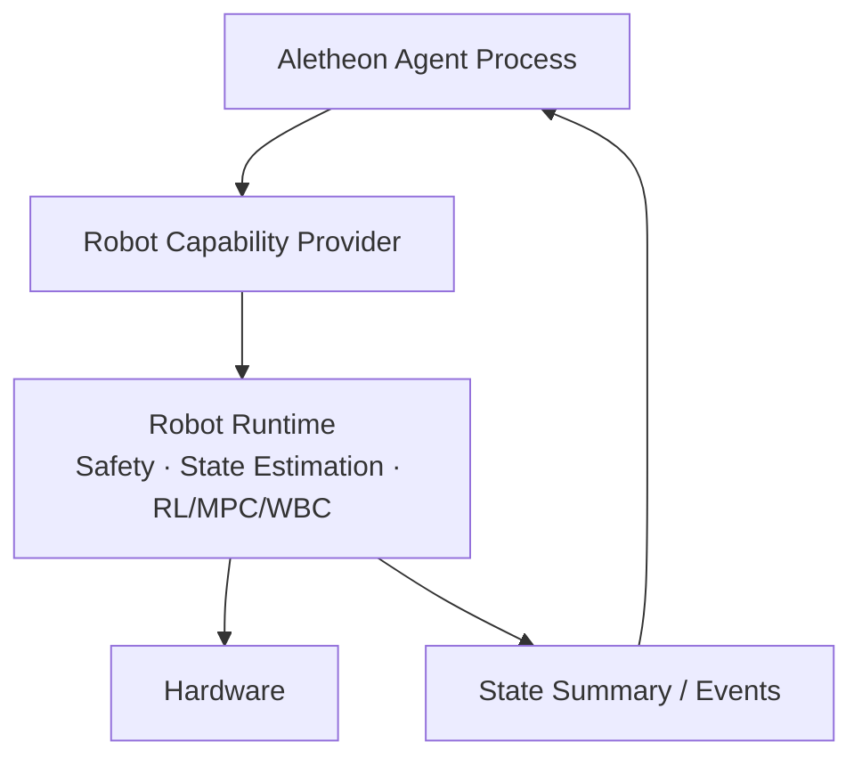

# Aletheon 宏内核架构设计（代码对齐修订版）

> 本文基于 `Aurobear/aletheon` 的 `dev` 分支真实代码重新设计，而不是继续扩充概念。
>
> 核心结论：Aletheon 应成为一个**单实例、宏内核式、内部模块化、外部执行域隔离的 Agent Runtime**；但它不应照搬 Linux 的全部对象与接口，也不应把所有认知步骤都包装成“进程”。

---

## 1. 这次修订解决什么问题

旧方案已经正确提出 Process、Space、Chronos、IPC、Supervision、Namespace 和 Governance，但仍有五个结构性问题：

1. **过度类比 Linux**：统一对象、统一 URI、统一 read/write/watch 容易产生一层庞大的抽象外壳。
2. **Process 粒度过细**：Planner、Reviewer、Executor 不一定都是进程，它们也可能只是一次认知 Harness 内的阶段。
3. **通信语义混在一起**：同步接口、命令、事件、消息和遥测流不应全部塞进一个 Bus。
4. **Executive 边界仍然过宽**：如果把全部机制都加入 Executive，它只会从 Runtime God Object 变成 Kernel God Object。
5. **迁移顺序没有对准现有代码的最大问题**：当前最需要先消除的，是多套认知主链和超重的 daemon chat handler，而不是先增加十几个 Manager。

因此，新版本的目标不是“补齐更多模块”，而是建立少量、可验证的运行不变量。

---

## 2. 当前代码的真实状态

以下结论来自 `dev` 分支现有实现。

| 领域 | 当前实现 | 关键问题 |
|---|---|---|
| 生产对话主链 | `daemon/handler/chat.rs` 每轮临时创建 `ReActLoop` | Handler 同时负责安全、Prompt、Skill、Memory、Session、Approval、Agora、Reflection、Evolution，职责过重 |
| Executive | `AletheonExecutive` 自己持有另一套 `ReActLoop` | 与 daemon 生产主链重复，实际主路径不唯一 |
| 非交互执行 | `crates/bin/src/main.rs::run_exec` 手写第三套模型/工具循环 | 安全、记忆、事件和会话语义与 daemon 不一致 |
| Controller | 存在一套尚未接入的 `Controller` + `ReActLoop` | 又复制了状态和组合逻辑 |
| Agent Process | `SubAgentSpawner` 只有 ID、状态和 CancellationToken | 目前是生命周期登记表，不是真正可执行、可 wait、可监督的 Agent Process |
| Multi-Agent | 另有 `orchestration::Agent` trait | 与 `SubAgentSpawner`、runtime Agent 概念尚未统一 |
| Agora | `AgoraRegistry<HashMap<SessionId, Workspace>>` | 生产路径主要写入 `turn_input` 和 Tool Evidence，attention/task graph 几乎没有进入核心循环；没有事务、版本、冲突和 ACL |
| Mnemosyne | Recall/Core/Fact/Auto/Episodic 多套对象 | 能力丰富但入口分散；semantic/procedural/self backend 默认 feature 关闭，文档中的“完成”与生产启用状态不一致 |
| Dasein | 已有 SelfField、Sorge、lived temporality | `TemporalStream` 是体验时间，不是 timeout/deadline/lease 所需的系统时钟；crate 仍直接依赖 `corpus` 和 `mnemosyne` |
| 通信 | `CommunicationBus` 包装旧 `KernelEventBus`，旧 Event/EventBus 保留 | 仍处迁移态；实际 daemon Unix JSON-RPC、Agent IPC、Envelope Bus 是多套断开的通信体系 |
| Fabric | 文档称零实现 ABI 层 | 实际包含 Bus、Transport、Event log、policy/verifier 等实现，契约层和基础设施层混合 |
| Resource | `ManagedResource<T>` 生命周期包装 | 不是容量发现、租约、回收意义上的 Resource Manager |
| 安全 | ToolRunner 有审批与沙箱 | `SandboxFirst` 在一条路径中只注入提示，在另一条路径中明确“无沙箱继续”，语义不安全 |

### 2.1 当前最危险的不是“缺模块”，而是“多真相源”

现在至少存在三套可运行或半运行的认知循环：

```text
daemon chat → ReActLoop
Executive   → ReActLoop
bin exec    → manual loop
Controller  → parked ReActLoop
```

这会导致：

- 同一个安全规则在不同入口行为不同；
- Session、Memory、Agora、Reflection 只在部分入口生效；
- 修复 ReAct 行为时需要修改多处；
- 无法给 Agent Process 定义统一执行语义。

所以架构重构的第一个动作必须是：

> **建立唯一 Turn Execution Path。**

---

## 3. Aletheon 的最终定位

Aletheon 是：

> **管理长期存在的 Agent Process、认知操作、上下文空间、能力调用和外部执行域的宏内核式运行时。**

它由四层构成：



其中：

- **Executive Kernel** 定义运行语义，不实现认知业务；
- **Kernel Services** 提供认知、主体、共享空间和经验能力；
- **Agent Process** 是被内核调度和监督的长期执行实体；
- **External Execution Domain** 接触高风险、强隔离或实时世界；
- `systemd` 只管理整个 Aletheon 实例。

---

## 4. 宏内核的“最小宪法”

宏内核不是模块清单，而是一组任何实现都必须维持的不变量。

### 4.1 六条核心不变量

1. **唯一执行入口**：所有 Turn、Task、Automation 最终进入同一 Operation 执行管线。
2. **单一所有权**：每类可变状态只能有一个权威 owner，其他模块只能通过 Port 访问。
3. **结构化生命周期**：Process、Operation、Lease、Timer 必须有显式状态与终止原因。
4. **能力不能绕过治理**：所有外部副作用必须经过 Admission，不能直接调用 Tool 实现。
5. **共享状态只能提交**：Agent 不能直接修改 Agora 的全局可见状态。
6. **时间语义必须显式**：timeout 使用 monotonic time，用户时间使用 wall time，事件排序使用 logical time。

### 4.2 内核只管理七类对象

不要把所有记忆、事实、文件和认知对象都提升成 Kernel Object。第一阶段只管理：

```text
AgentProcess
Operation
ContextSpace
Mailbox
Timer
ResourceLease
NamespaceBinding
```

Memory、Fact、Plan、Artifact、World Entity 是服务领域对象，由各自服务提供强类型 API。

这避免 Kernel Object Model 变成新的万能数据库。

---

## 5. Process 不是 Cognit Stage

### 5.1 三个必须区分的概念

```text
AgentProcess：长期身份、状态、Mailbox、Space、权限与预算边界
Operation：一次可取消、可计量、有 deadline 的工作
Turn：某类 Operation，表示一次交互认知活动
```

Planner、Reviewer、Executor 默认只是 Cognit Harness 中的 Stage。只有满足以下任一条件时，才升级为独立 Agent Process：

- 需要并发执行；
- 需要独立 Mailbox；
- 需要独立权限、预算或 Context Space；
- 需要单独监督、重启或远程部署；
- 生命周期跨越单次 Turn。

### 5.2 Process Control Block

```rust
pub struct AgentProcess {
    pub id: AgentId,
    pub parent: Option<AgentId>,
    pub profile: AgentProfileId,
    pub state: ProcessState,
    pub backend: ExecutionBackend,

    pub space: SpaceId,
    pub mailbox: MailboxId,
    pub namespace: NamespaceId,
    pub principal: PrincipalId,

    pub supervisor: Option<AgentId>,
    pub created_at: WallTime,
    pub last_heartbeat: MonoTime,
    pub exit: Option<ExitStatus>,
}
```

建议第一阶段状态机保持最小：

```text
Created → Ready → Running ↔ Waiting → Stopping → Exited
                         └────────────→ Failed
```

`Suspended`、抢占、迁移以后再做。

### 5.3 Operation

```rust
pub struct Operation {
    pub id: OperationId,
    pub owner: AgentId,
    pub kind: OperationKind,
    pub state: OperationState,
    pub submitted_at: MonoTime,
    pub deadline: Option<MonoDeadline>,
    pub budget: BudgetId,
    pub cancellation: CancellationId,
    pub causation_id: Option<OperationId>,
}
```

Operation 才是 Scheduler、Accounting、Timeout 和 Cancellation 的基本单位。

---

## 6. 唯一认知执行主链

### 6.1 目标流程



daemon、TUI、`exec`、Automation 都只负责构造 `OperationRequest`，不再各自运行 LLM Loop。

### 6.2 Cognit 的对象安全边界

当前 `ReActLoop::run` 使用泛型 LLM 和泛型 Tool closure，导致 Harness 难以成为可替换的 trait object。建议改为：

```rust
#[async_trait]
pub trait CognitiveSession: Send {
    async fn run_turn(
        &mut self,
        request: TurnRequest,
        services: &dyn TurnServices,
        events: &dyn TurnEventSink,
    ) -> Result<TurnResult, CognitError>;
}

pub trait HarnessFactory: Send + Sync {
    fn create(&self, profile: &CognitProfile) -> Box<dyn CognitiveSession>;
}

#[async_trait]
pub trait TurnServices: Send + Sync {
    async fn invoke(&self, req: CapabilityRequest) -> CapabilityResult;
    async fn recall(&self, req: RecallRequest) -> RecallResult;
    async fn dasein_view(&self, process: AgentId) -> DaseinView;
    async fn agora_view(&self, space: SpaceId) -> AgoraView;
}
```

这样 Cognit 不依赖 Corpus、Mnemosyne、Dasein 的具体类型，也不需要让 Executive 组装 Closure。

### 6.3 daemon Handler 的目标

`handle_chat` 最终只应做：

```text
parse request
resolve session/process
submit operation
forward events
format response
```

Skill 注入、Memory recall、Dasein view、Hooks、Reflection、Agora commit 应进入可组合的 Turn Pipeline，而不是继续留在 JSON-RPC Handler。

---

## 7. Executive 的准确边界

Executive 是宏内核实现，但不是所有系统能力的集合。

### 7.1 Executive 负责

```text
ProcessTable
OperationTable
Cooperative Scheduler
Chronos / Timer
Context Space Binding
Mailbox Routing
Supervision Tree
Admission Coordination
Namespace Binding
Lifecycle Events
```

### 7.2 Executive 不负责

```text
Prompt 拼接
模型 Provider 实现
ReAct 具体循环
Fact SQL 查询
Memory consolidation 算法
SelfField 内部哲学状态
Tool 具体执行
机器人控制算法
UI JSON 格式化
```

### 7.3 CoreSystems 应被拆成 Kernel State + Service Ports

当前 `CoreSystems` 持有大量具体 `Arc<Mutex<T>>`。目标结构：

```rust
pub struct KernelState {
    processes: ProcessTable,
    operations: OperationTable,
    spaces: SpaceTable,
    timers: TimerWheel,
    supervisors: SupervisorTree,
    admissions: AdmissionTable,
}

pub struct ServicePorts {
    cognit: Arc<dyn CognitService>,
    dasein: Arc<dyn DaseinService>,
    agora: Arc<dyn AgoraService>,
    memory: Arc<dyn MemoryService>,
    capability: Arc<dyn CapabilityService>,
    audit: Arc<dyn AuditSink>,
}
```

Kernel State 只能被 Executive 内部修改；Service Ports 不暴露具体锁与数据库。

---

## 8. Chronos：系统时间与存在时间必须分离

当前 Dasein `TemporalStream` 已实现 retention / present / protention，这属于**体验时间**，不能拿来实现系统 timeout。

### 8.1 两套时间系统

| 时间 | Owner | 用途 |
|---|---|---|
| Kernel Chronos | Executive | timeout、deadline、lease、heartbeat、timer、事件排序 |
| Lived Temporality | Dasein | retention、present、protention、tempo、意义连续性 |

Dasein 订阅经过筛选的体验事件，并将其转化为 lived temporality；它不提供系统 `sleep()` 或 `deadline()`。

### 8.2 Chronos 最小接口

```rust
pub trait Clock: Send + Sync {
    fn wall_now(&self) -> WallTime;
    fn mono_now(&self) -> MonoTime;
}

pub trait Chronos: Clock {
    fn logical_tick(&self) -> LogicalTime;
    fn create_timer(&self, spec: TimerSpec) -> TimerId;
    fn cancel_timer(&self, id: TimerId) -> bool;
}
```

规则：

- `Instant`/monotonic：timeout、duration、lease、heartbeat；
- wall clock：展示、日历、审计、记忆日期；
- logical sequence：commit 顺序、事件因果；
- domain time：机器人/仿真/回放，由外部 Runtime 提供 Clock Adapter。

不要把 `expires_at` 一律定义为 WallTime；运行时过期应优先使用 monotonic deadline。

---

## 9. Context Space：可见性与继承，不是另一个 Memory Store

### 9.1 Space 只保存绑定和版本

Context Space 不复制所有文本，而保存对象引用、快照版本和私有 overlay：

```rust
pub struct ContextSpace {
    pub id: SpaceId,
    pub owner: AgentId,
    pub parent_snapshot: Option<SpaceSnapshotId>,
    pub bindings: Vec<ContextBinding>,
    pub overlay: VersionedOverlay,
    pub policy: SpacePolicy,
}
```

### 9.2 四个不同的数据域

```text
Private Context：单 Agent 的临时假设、草稿、局部计划
Agora：多 Agent 共享且经过提交的工作状态
Mnemosyne：长期持久经验与事实
World Projection：外部世界的有时效版本化投影
```

Space Manager 决定“当前进程能看见哪些 view”，但不实现 Mnemosyne 数据库或 Agora 黑板。

### 9.3 Fork 与 Commit

第一阶段只实现对象级 snapshot + overlay，不实现页级 COW：

```text
fork = inherit immutable bindings + empty private overlay
commit = proposal(base_version, patch, evidence)
conflict = current_version != base_version
```

---

## 10. Agora：从 HashMap 变成事务化共享工作空间

### 10.1 Agora 的准确职责

Agora 保存：

```text
Active Goal
Task Graph
Shared Plan
Accepted Evidence
Working Hypothesis
Coordination Claims
World Projection Summary
```

它不保存完整对话历史，不替代 Mnemosyne，也不承担 IPC。

### 10.2 不再允许 publish(key, value) 作为主写接口

建议接口：

```rust
#[async_trait]
pub trait AgoraService: Send + Sync {
    async fn view(&self, space: SpaceId, selector: ViewSelector) -> Result<AgoraView>;
    async fn propose(&self, proposal: AgoraProposal) -> Result<ProposalId>;
    async fn commit(&self, id: ProposalId, permit: CommitPermit) -> Result<CommitReceipt>;
    async fn reject(&self, id: ProposalId, reason: RejectReason) -> Result<()>;
    async fn watch(&self, space: SpaceId, cursor: CommitCursor) -> AgoraStream;
}
```

`AgoraProposal` 至少包含：

```text
author process
space / namespace
base version
typed operation
evidence references
confidence
TTL
causation id
```

### 10.3 当前实现的最小迁移

1. 保留 `AgoraRegistry` 作为内存后端；
2. 为 Workspace 增加 `version`；
3. 将 `publish/update` 降级为内部 backend 方法；
4. 对外只暴露 `view/propose/commit`；
5. Tool Evidence 首先进入 private trace，再由 Harness 或 Reviewer 提交；
6. turn end 不要每次无条件把完整 snapshot 当作普通 RecallMemory 字符串存储。

---

## 11. Mnemosyne：统一门面，内部多存储

Mnemosyne 应对 Executive 只暴露一个服务端口：

```rust
#[async_trait]
pub trait MemoryService: Send + Sync {
    async fn recall(&self, req: RecallRequest) -> Result<RecallSet>;
    async fn record(&self, event: ExperienceEvent) -> Result<MemoryReceipt>;
    async fn consolidate(&self, scope: MemoryScope) -> Result<ConsolidationReport>;
    async fn forget(&self, policy: ForgetPolicy) -> Result<ForgetReport>;
}
```

CoreMemory、RecallMemory、FactStore、EpisodicMemory、AutoMemory 是 Mnemosyne 内部策略或 backend，不应全部成为 `CoreSystems` 的平级字段。

生产启用状态必须写清楚：

- always-on backend；
- feature-gated backend；
- experimental backend；
- design only。

---

## 12. Dasein：受保护主体服务，而不是安全与记忆的混合体

Dasein 负责：

```text
Identity
Care / Values
Boundary Interpretation
Continuity
Self Model
Lived Temporality
```

它通过 Port 请求 Policy、Memory 或 Capability 信息，不应直接依赖 Corpus 与 Mnemosyne 的具体实现。

建议拆出两个不同判断：

```text
Dasein Deliberation：这个行为是否符合“我是谁、我在乎什么”
Authorization Policy：这个 principal 是否被系统允许执行操作
```

两者可以共同影响 Admission，但不能混成一个模糊 Verdict。

---

## 13. Corpus：从 BodyRuntime 收敛为 Capability Execution

“Body”这个隐喻会不断吸收工具、Driver、Sandbox、Skill、Hook、平台适配和安全。建议逐步把 Corpus 的核心定义改为：

> **能力目录、调用适配与执行隔离层。**

统一入口：

```rust
#[async_trait]
pub trait CapabilityService: Send + Sync {
    async fn describe(&self, selector: CapabilitySelector) -> Vec<CapabilityDescriptor>;
    async fn invoke(&self, permit: InvocationPermit, req: CapabilityRequest)
        -> CapabilityResult;
}
```

Tool、MCP、Skill、Browser、Robot 都是 Capability Provider。副作用能力必须持有 `InvocationPermit`。

### 13.1 修正 SandboxFirst

`SandboxFirst` 不能只是 Prompt note，也不能在日志中警告后继续裸执行。它必须变成 Admission 约束：

```text
SandboxRequired
→ acquire sandbox lease
→ verify backend available
→ execute only inside sandbox
→ unavailable = deny/fail closed
```

---

## 14. 通信：不要让一个 Bus 统治所有交互

### 14.1 五种语义

| 语义 | 使用场景 | 首选机制 |
|---|---|---|
| Call / Query | 同进程、需要立即返回、维护不变量 | 强类型 trait call |
| Command | 改变状态、可排队、需要 receipt | Kernel command queue |
| Event | 已发生事实、零或多订阅者 | append + publish |
| Message | Agent Process 协作 | mailbox request/response/signal |
| Stream | token、日志、机器人 telemetry | bounded stream + backpressure |

因此应废止这条旧原则：

```text
所有跨子系统通信必须经过 EventBus
```

替换为：

> 状态所有者通过强类型 Port 维护不变量；异步协作和事实传播才经过 Fabric。

### 14.2 CommunicationBus 的定位

`CommunicationBus` 只负责 Envelope 路由和 transport，不负责业务语义，也不负责替代所有 trait call。

新的 Envelope 需要补充：

```rust
pub struct Envelope {
    pub id: MessageId,
    pub source: Endpoint,
    pub target: Target,
    pub pattern: DeliveryPattern,
    pub schema: SchemaId,

    pub operation_id: Option<OperationId>,
    pub causation_id: Option<MessageId>,
    pub correlation_id: Option<MessageId>,
    pub namespace: NamespaceId,
    pub logical_time: LogicalTime,
    pub deadline: Option<MonoDeadline>,
    pub priority: Priority,
    pub payload: Payload,
}
```

### 14.3 先统一语义，再统一 Transport

当前 daemon JSON-RPC、CommunicationBus、IpcManager 和 Agent orchestration 不要立刻强行合并成一个实现。先让它们共享：

- Endpoint/Envelope；
- OperationId/AgentId；
- Error/ExitReason；
- deadline/cancellation；
- schema/version。

然后再逐步让 Unix socket 成为跨进程 transport。

---

## 15. Supervision 与结构化并发

Process 必须挂在监督树上，所有异步任务必须属于某个 Operation 或 Process。

```text
InstanceSupervisor
└── MainAgent
    ├── ChildAgent
    ├── ModelCall Operation
    └── Capability Operation
```

第一阶段只支持：

```text
NeverRestart
RestartOnFailure { max_retries, backoff }
StopChildrenOnParentExit
```

统一退出原因：

```rust
pub enum ExitReason {
    Completed,
    Cancelled,
    DeadlineExceeded,
    BudgetExceeded,
    QuotaExceeded,
    PermissionDenied,
    SandboxUnavailable,
    ProviderUnavailable,
    CapabilityFailed,
    Panic,
    Killed,
}
```

禁止把全部失败压成字符串，也禁止脱离父 Operation 的 `tokio::spawn`。

---

## 16. Governance：概念分离，入口原子化

Permission、Budget、Quota、Resource、Accounting 必须保持概念分离；但执行前不能由调用方手工依次检查，否则会产生 TOCTOU 竞争。

### 16.1 Admission Controller

```rust
#[async_trait]
pub trait AdmissionController {
    async fn admit(&self, request: AdmissionRequest)
        -> Result<ExecutionPermit, AdmissionError>;
    async fn settle(&self, permit: ExecutionPermit, usage: UsageReport)
        -> Result<(), SettlementError>;
}
```

`admit()` 内部原子协调：

```text
Authorization
→ Budget reserve
→ Quota reserve
→ Resource lease
→ ExecutionPermit
```

执行完成后：

```text
Accounting record
→ Budget settle
→ Lease release
→ Audit event
```

### 16.2 Resource 只管理可占用实体

```text
Model worker slot
Sandbox slot
Browser instance
GPU slot
Robot control channel
Remote worker
```

Token 和费用不是 Resource；它们是 Usage 与 Budget。

---

## 17. Namespace 与 Capability

### 17.1 Namespace

第一阶段只做层级 Namespace + Binding：

```text
/personal
/work/aletheon
/robot/sim
/robot/lab
/robot/production
```

每个 Process 绑定默认 Namespace，访问其他 Namespace 必须显式授权。

### 17.2 Capability Grant

权限不要只绑定 Tool 名称，应绑定类型化操作：

```text
fs.read:/workspace/project
fs.write:/workspace/project/docs
shell.exec:sandboxed
model.invoke:anthropic/*
agora.commit:/work/aletheon
robot.command:/robot/lab/kuavo-01
```

Capability 描述“能做什么”，Grant 描述“谁能在哪个范围做”，Resource 描述“执行时占用什么”。

---

## 18. 机器人边界

Aletheon 不执行 1 kHz 控制循环，也不把高频 telemetry 全部写入 Agora。



Aletheon 负责：

- 高层目标与任务规划；
- 模式选择与能力授权；
- Robot control lease；
- 状态摘要、异常事件和恢复决策；
- 仿真/实机 Namespace 隔离。

Robot Runtime 负责：

- 硬实时循环；
- State Estimation；
- MPC/WBC/RL；
- 硬件接口与本地安全；
- 高频数据缓存与降采样。

任何 Aletheon 命令都不能越过 Robot Runtime 的本地 Safety Supervisor。

---

## 19. 与当前 Crate 的目标映射

当前不建议立刻新建十几个 crate。先利用现有 crate 收敛边界。

| Crate | 目标职责 | 应迁出内容 |
|---|---|---|
| `fabric` | 纯协议、共享 ID、Port trait、Envelope schema | Bus/transport 实现、policy 具体实现、event log |
| `executive` | 宏内核：Process/Operation/Chronos/Space/Supervision/Admission；daemon composition | ReAct、Prompt、Memory SQL、具体 Tool 执行 |
| `cognit` | Harness、Reasoning/Planning/Review、Provider policy | Executive/daemon 组合逻辑 |
| `dasein` | Identity/Care/Continuity/Lived Temporality | Corpus/Mnemosyne 具体依赖 |
| `agora` | 版本化、事务化共享工作空间 | 任意 key-value 直写的公共 API |
| `mnemosyne` | 统一 MemoryService 与内部多 backend | Executive 中平铺的 memory 对象 |
| `corpus` | Capability registry/invocation/sandbox/provider adapters | Executive 生命周期与认知策略 |
| `metacog` | 受治理的候选生成、评估、迁移 | 直接修改生产系统的能力 |
| `interact` | TUI/CLI adapter 与事件显示 | daemon 业务逻辑 |
| `bin` | composition root | 手写 agent loop |

### 19.1 `fabric` 的临时处理

不要先做大规模目录移动。可以先在 `fabric` 内分层：

```text
fabric/
├── contract/     # IDs, types, traits, schema
└── legacy_impl/  # bus, ipc backend, old event bridge
```

新代码只能依赖 `contract`；旧实现逐步迁往 `executive` 或独立 transport crate。

### 19.2 `executive` 的建议内部结构

```text
executive/src/
├── kernel/
│   ├── process/
│   ├── operation/
│   ├── chronos/
│   ├── space/
│   ├── mailbox/
│   ├── supervision/
│   ├── admission/
│   └── lifecycle/
├── ports/
├── service/
│   ├── session_service.rs
│   └── turn_pipeline.rs
├── host/
└── daemon/
```

Kernel 机制与上层 Session/Turn service 必须分目录，避免所有东西再次进入 kernel。

---

## 20. 新的迁移路线

### Phase 0：建立唯一主链（立即执行）

目标：先消除多套运行语义。

实施：

1. 定义 `TurnRequest`、`TurnResult`、`TurnEventSink`、`TurnServices`；
2. 让 daemon 使用唯一 `CognitiveSession`；
3. `bin exec` 改为调用同一 Session/Operation API；
4. 删除或冻结 `AletheonExecutive::process/process_react` 的重复路径；
5. 决定 `Controller`：接入成为统一门面，或删除；
6. 将 `handle_chat` 拆成 `PreTurnPipeline → Cognit → PostTurnPipeline`；
7. 修复 `SandboxFirst`，必须 fail closed。

验收：

- daemon、TUI、exec 对同一输入使用相同安全、工具、记忆和事件语义；
- 仓库中只有一个生产认知 loop；
- chat handler 不再创建具体 ReActLoop。

### Phase 1：Operation + Process

实施：

```text
OperationId / AgentId
ProcessTable / OperationTable
spawn / submit / wait / cancel / exit
structured ExitReason
Cancellation tree
```

先让 Main Agent 成为一个真正的 AgentProcess，再把现有 SubAgentSpawner 接到实际执行任务。

验收：

- SubAgent 不只是 UI handle；
- 父 Operation 取消时子 Operation 全部取消；
- `wait()` 返回结构化 ExitStatus；
- Multi-Agent trait 与 Process Profile 使用同一 AgentId。

### Phase 2：Chronos + Supervision

实施：

```text
Clock abstraction
monotonic deadline
timer
heartbeat
supervisor tree
restart policy
```

验收：

- 测试可使用 VirtualClock；
- timeout 不依赖 wall clock；
- orphan task 可检测；
- 失败重启有上限和 backoff。

### Phase 3：Context Space + Agora Transaction

实施：

```text
SpaceId
immutable binding snapshot
private overlay
Agora version
proposal / commit / conflict
TTL
```

验收：

- 子 Agent 本地推理不污染父空间；
- Tool Evidence 不自动成为共享事实；
- 冲突提交被拒绝或进入 Reviewer；
- Session 结束可明确清理空间。

### Phase 4：通信语义统一

实施：

```text
shared Envelope v2
mailbox request/response/signal
causation/correlation
deadline/cancellation
bounded stream
legacy Event bridge
```

验收：

- 新代码不再直接使用旧 Event trait；
- CommunicationBus 只承担 routing；
- daemon transport 与 Agent mailbox 共享协议类型；
- 所有 stream 有 backpressure 策略。

### Phase 5：Admission + Governance

实施：

```text
CapabilityGrant
ExecutionPermit
Budget reserve/settle
Quota reserve/release
ResourceLease
UsageRecord
```

验收：

- 所有副作用 Capability 都需要 Permit；
- Model 和 Tool 调用产生一致 UsageRecord；
- Sandbox/Browser/Robot 使用 Lease；
- 不存在先检查后执行的竞态窗口。

### Phase 6：服务端口与依赖倒置

实施：

- `CoreSystems` 具体字段改为 Service Ports；
- Dasein 去除 Corpus/Mnemosyne 具体依赖；
- Mnemosyne 形成单一门面；
- Fabric 只保留 contract；
- Agora、Cognit、Corpus 能用 mock service 替换。

### Phase 7：外部执行域

按需求接入：

```text
Sandbox Worker
Browser Runtime
Robot Runtime
GPU Model Worker
Remote Agent Node
```

第一优先不是 DDS 或自定义内核模块，而是统一 Capability Protocol、Lease、Deadline 和 Safety Event。

---

## 21. 当前 P0/P1/P2

### P0：现在必须做

1. 唯一 Turn Execution Path；
2. 拆 `handle_chat`；
3. 修正 `SandboxFirst`；
4. 统一 AgentId/OperationId/Error；
5. 让 SubAgent 具备真实执行与 wait/cancel；
6. 明确 Dasein lived time 与 Kernel Chronos 的边界；
7. 给 Agora 加 version/proposal/commit。

### P1：主链稳定后做

1. ProcessTable / OperationTable；
2. Supervision tree；
3. Context Space snapshot/overlay；
4. Admission Permit；
5. Mnemosyne 单一门面；
6. Communication Envelope v2；
7. Service Port 依赖倒置。

### P2：有真实需求再做

1. 抢占式调度；
2. 多节点一致性；
3. DDS QoS；
4. Remote Agora；
5. 自定义 Linux kernel module；
6. 页级 COW；
7. 通用 Kernel URI CRUD；
8. Planner/Reviewer/Executor 全部进程化。

---

## 22. 明确不采用的设计

暂不采用：

- 每个 crate 一个 systemd service；
- 所有跨模块调用都经过 Bus；
- 所有领域对象都实现统一 `read/write/watch`；
- 用 Dasein Temporality 实现系统 timeout；
- 将所有 Cognit stage 建模成 Process；
- 将 Agora 当成全局 HashMap 或全部 Context；
- 将 Token/费用当成 Resource；
- 在主进程运行不可信代码或机器人硬实时循环；
- 一次性重命名和移动全部 crate；
- 在唯一主链建立前继续增加新的 Harness/Frontend。

---

## 23. 最终结构

```text
Aletheon Instance
│
├── Executive Kernel
│   ├── Agent Process
│   ├── Operation
│   ├── Chronos
│   ├── Context Space
│   ├── Mailbox
│   ├── Supervision
│   └── Admission
│
├── Kernel Services
│   ├── Cognit       cognition and harness
│   ├── Dasein       identity, care, continuity, lived time
│   ├── Agora        transactional shared workspace
│   ├── Mnemosyne    persistent experience
│   └── Corpus       capability execution
│
├── Adapters
│   ├── TUI / CLI / API
│   ├── Automation
│   └── Session
│
└── External Execution Domains
    ├── Sandbox
    ├── Browser
    ├── Robot
    ├── GPU Worker
    └── Remote Node
```

最终最重要的不是模块数量，而是以下运行链条只有一套：

```text
Input
→ Operation
→ Admission
→ Scheduled Agent Process
→ Cognit Harness
→ Capability Invocation
→ Evidence / Result
→ Agora Proposal + Mnemosyne Record
→ Structured Exit
```

这才是 Aletheon 宏内核真正需要稳定下来的“系统调用语义”。

---

## 24. 一句话结论

> Aletheon 不应继续模仿 Linux 的表面模块，而应继承 Linux 的核心纪律：少数权威运行对象、单一状态所有者、结构化生命周期、不可绕过的能力治理，以及稳定而可替换的服务边界。
