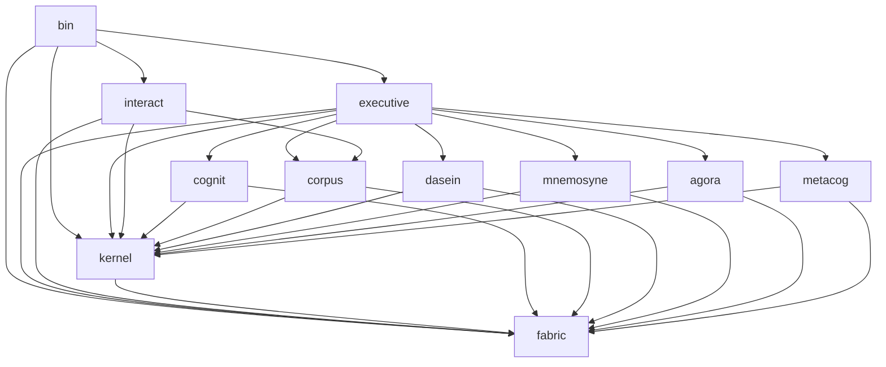
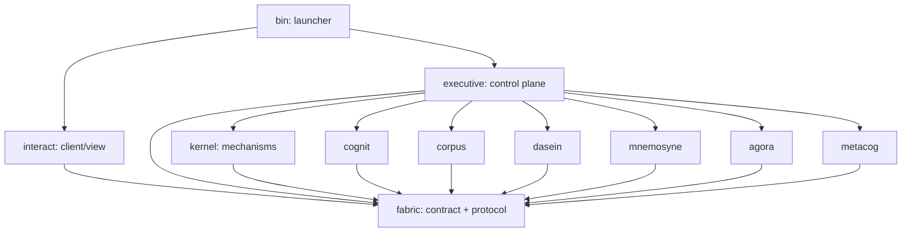
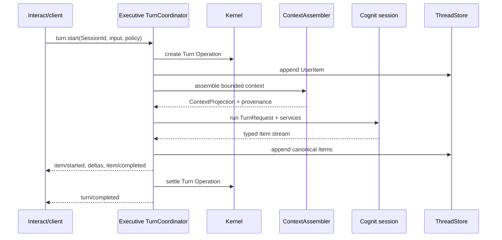
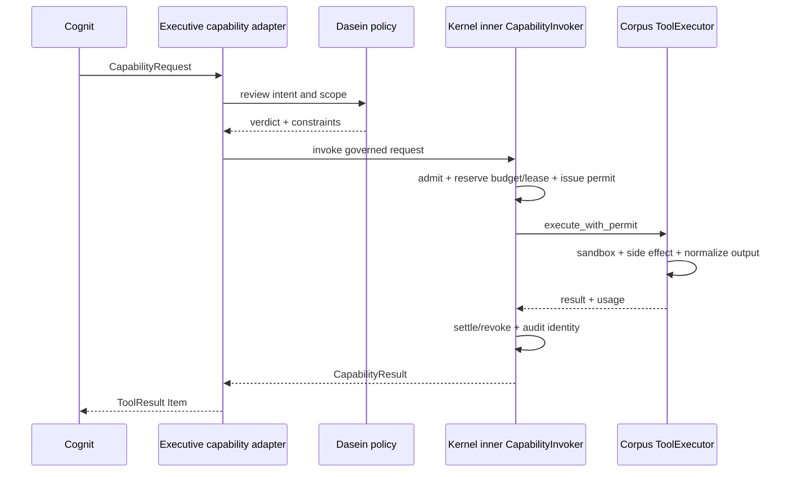

# Aletheon Architecture and Coupling Optimization Plan

> **Status:** Blocked by V02 — architecture slices pass; live production acceptance remains indexed in `2026-07-16-original-plan-coverage-matrix.md`
>
> **Target branch:** `dev`
>
> **Aletheon baseline:** `65f74981`
>
> **Reference baseline:** local Codex source `1bbdb327`; Linux architecture concepts only
>
> **Scope:** all workspace crates, their internal modules, production call paths, ownership, coupling, and migration order
>
> **Execution rule:** change one vertical slice at a time. Keep the current daemon path operational until its replacement passes equivalent lifecycle, capability, persistence, and protocol tests.

## Code-Reality Update (2026-07-17)

Code-level verification reveals that Executive coupling is significantly worse than this document describes. Several claims about current state, achieved boundaries, and module responsibility are inaccurate or misleading. This section documents the discrepancies. The plan sections below remain unchanged as the aspirational target.

### Executive Coupling is Worse Than Described

**TurnPipeline** (`crates/executive/src/service/turn_pipeline.rs:42-59`): 7 of 14 fields are concrete types (not trait objects), and 2 are wrapped in `Arc<Mutex<...>>`. `TurnPipeline::run()` directly calls `self.kernel.inspect_process()` (line 272) and `self.kernel.upsert_space_binding()` (lines 279, 283) -- bypassing trait boundaries and accessing Kernel internals directly.

**DaemonTurnOrchestrator** (`crates/executive/src/service/daemon_turn/orchestrator.rs:22-30`): 7 of 7 fields are concrete types, and 4 of 7 are wrapped in `Arc<Mutex<...>>`. Its public method `notify_tx()` (line 45) returns `&Arc<Mutex<Option<mpsc::Sender<String>>>>`, exposing bare mutex handles outside the module.

**TurnRuntimeResources** (`crates/executive/src/service/turn_runtime_ports.rs:105-135`): 17 of 17 fields are concrete types, 8 wrapped in `Mutex`. `pub(crate)` visibility. **This struct is not mentioned anywhere in this architecture document** -- it is a newly discovered coupling hotspot directly composed into `TurnPipeline` (line 54 as `runtime_ports: Arc<TurnRuntimePorts>`).

**Aggregate tally across these three structs:** 38+ concrete fields, 14 Mutex-wrapped. The plan's target (line 1062) that "no public `Arc<Mutex<ConcreteDomainStore>>` crosses a domain boundary" is not met even at `pub(crate)` scope.

### KernelRuntime "Immutable Snapshots" Claim is False

Section 7.1 (line 732) describes a target model where "Other modules receive immutable snapshots." However, at `crates/kernel/src/runtime.rs:189-209`, three public methods on `KernelRuntime` return `Arc<concrete mutable types>`:

- `mailbox_service()` (line 189) returns `Arc<InProcessMailboxService>`
- `budget_controller()` (line 205) returns `Arc<InMemoryBudgetController>`
- `lease_manager()` (line 209) returns `Arc<InMemoryResourceLeaseManager>`

These are direct references to shared mutable state -- not immutable snapshots. Consumers receive an `Arc` they can clone, hold, and mutate concurrently.

### Bootstrap "Confined to One Module" Claim is Misleading

`crates/executive/src/impl/daemon/bootstrap/mod.rs:3-4` states: "Construction code in this module is the only production code allowed to know the concrete implementations." However, `mod.rs` itself is only 36 lines. The actual composition root is `request.rs` (1391 lines), directly instantiating 30+ concrete types across 5 sub-modules (`channels.rs`, `google.rs`, `request.rs`, `runtime.rs`, `storage.rs`). The claim that knowledge is confined to one module is technically true but obscures the scale: the "one module" is a directory of files totaling over 2500 lines of concrete instantiation.

### Other Factual Corrections

- **CodexRuntime does not exist.** Any references should say `PiRuntime` (`crates/executive/src/impl/runtime/pi.rs:61`). Pi is the standalone coding runtime that implements `SubAgentRuntime` (line 294).
- **`AgentHarness` trait** (`crates/executive/src/impl/agent/harness.rs`) has **zero implementations** across the entire codebase. It is a scaffold with no production wiring.
- **`AgentRuntime` struct** (`crates/executive/src/impl/agent/mod.rs:16`) is an in-memory `HashMap` stub (`agents: RwLock<HashMap<String, AgentInfo>>`, line 17). It implements the `Subsystem` trait but is **not wired** to `AgentControlService`.
- **Real production agent management** uses `AgentControlService` (`crates/executive/src/service/agent_control/mod.rs:100`) + `SqliteAgentRunRepository` (wired at `crates/executive/src/impl/daemon/bootstrap/request.rs:884`), which persists agent runs to SQLite.

### Impact on Plan Phases

These findings reinforce the plan's direction but indicate the gap is larger than described:

- Phase 3 (boundary enforcement, `DomainPorts` trait facade) must now also cover `TurnRuntimeResources` -- all 17 concrete fields need trait ports.
- Phase 4 (bootstrap as sole composition root, lines 1062-1063) must account for the 1391-line `request.rs` composition root, not the 36-line `mod.rs` scaffold.
- The `KernelRuntime` public API must return trait object handles (`Arc<dyn MailboxService>`, `Arc<dyn BudgetController>`, `Arc<dyn LeaseManager>`) instead of concrete `Arc<InMemory*>` types.
- `AgentRuntime` (the `HashMap` stub) should either be wired to `AgentControlService` or removed to avoid confusion with the SQLite-backed production path.

## 1. Executive conclusion

Aletheon does not primarily need more crates, another global bus, or a rewrite. It needs a smaller number of authoritative runtime paths and enforceable ownership rules.

The current workspace already contains most of the right primitives:

- Fabric ports and versioned envelopes;
- Kernel Process, Operation, Space, Admission, Budget, Lease, Supervisor, Clock and Mailbox mechanisms;
- Cognit ReAct and linear cognitive sessions;
- Corpus tool registry, guarded runner, sandbox and connectors;
- Dasein SelfField and semantic policy;
- Mnemosyne memory stores and a service facade;
- Agora transactional proposals and commits;
- Metacog candidate, verification and rollback concepts;
- Executive session, daemon, runtime and sub-agent orchestration;
- Interact TUI, CLI and RPC clients.

The problem is that these primitives are not yet the only path. Several concepts have two or more implementations, and Executive frequently reaches through facades into concrete stores and locks. The highest-risk example is capability execution: Fabric declares a mandatory `CapabilityInvoker`, Kernel implements `DefaultCapabilityInvoker`, but production daemon and exec paths still assemble their own admit/execute/settle pipelines.

The target is:

```text
one Session/Turn/Item lifecycle
one ContextAssembler
one CapabilityInvoker path
one Process/Operation/Space authority
one MemoryService boundary
one transactional Agora boundary
one recurrent Dasein–Agora core with Mnemosyne continuity and SubAgent processors
one append-only runtime event spine
many replaceable domain implementations
```

The recommended order is not a horizontal rewrite. First converge capability execution, then Session/Turn/Item, then Kernel lifecycle and duplicate removal, then domain facades, trace/projections, configuration and UI.

## 2. Method and confidence

This plan is based on static inspection of:

- every workspace crate's `Cargo.toml`, module tree and main public surface;
- the daemon and exec turn paths;
- tool admission and execution paths;
- Process, Operation, Space and supervision implementations;
- session, event, memory, Agora and sub-agent paths;
- local Codex protocol, app-server, tools, thread-store, execpolicy, rollout-trace, configuration and multi-agent sources.

No Rust toolchain is installed in the current environment, so test counts and build health were not re-verified. Existing documents that state passing test totals must therefore not be treated as current evidence. This plan distinguishes confirmed source structure from proposed behavior.

## 3. Current dependency graph

The Cargo graph has no direct crate cycle, but the absence of a Cargo cycle does not mean low coupling.



The architectural coupling is concentrated in three places:

1. Fabric exports contracts, runtime implementations, legacy compatibility and global infrastructure from one very large surface.
2. Executive owns a concrete object graph and coordinates domains by accessing public fields and shared locks.
3. Domain crates import concrete Kernel clocks or services, while Interact imports Corpus capability implementations.

### 3.1 Source shape

| Crate | Rust files | Current architectural pressure |
|---|---:|---|
| Fabric | 111 | Oversized ABI plus implementations and legacy compatibility |
| Kernel | 20 | Small enough, but service locator and incomplete lifecycle invariants |
| Executive | 195 | Largest orchestration and composition hotspot |
| Cognit | 62 | Reasoning plus providers plus system-wide configuration |
| Corpus | 128 | Tools, security, hooks, skills, drivers and connectors overlap |
| Dasein | 74 | Self semantics mixed with OS perception and enforcement |
| Mnemosyne | 50 | Many stores but incomplete canonical service path |
| Agora | 9 | Coherent small domain, still has legacy mutation API |
| Metacog | 26 | Coherent pipeline, but mutation bypasses capability governance |
| Interact | 42 | UI owns protocol details and concrete computer capabilities |
| Bin | 1 | Thin in size, broader dependencies than a launcher should need |

File count is not itself a defect. The meaningful signal is whether a module has one owner and whether production calls must pass through its contract.

## 4. Architecture principles

### 4.1 Adopt from Linux: concepts, not code

| Linux idea | Aletheon interpretation | Constraint |
|---|---|---|
| Mechanism vs policy | Kernel performs atomic lifecycle/resource enforcement; Dasein and Executive select policy | Kernel must not know Agora, memory meaning or cognitive policy |
| Syscall boundary | Fabric contracts form a narrow, stable ABI for runtime effects | Do not expose concrete stores or mutexes through the ABI |
| Handles/descriptors | Callers hold IDs and service handles, not internal tables | Lifecycle owner can validate, revoke, inspect and clean up |
| Process tree | Agent Process and Operation trees define ownership and cancellation | A sub-agent is not an untracked callback |
| Namespaces/cgroups | Space isolates context; Budget and Lease isolate resources | Context inheritance and resource accounting remain separate |
| LSM-style policy hook | Dasein emits semantic verdicts; Kernel/Corpus enforce them | Dasein must not execute tools or own sandbox backends |
| VFS-style interface | Tools, MCP, connectors and drivers expose one capability contract | Implementations remain replaceable and policy-filtered |
| Netlink/event model | Completed facts flow through typed events | Commands, queries and transactions do not all go through a bus |

Do not imitate Linux's source layout, syscall inventory or monolithic kernel implementation. The useful part is ownership and invariants.

### 4.2 Adopt from Codex: boundary discipline

Local Codex source demonstrates several directly useful patterns:

- `codex-rs/protocol` and `codex-rs/app-server-protocol`: typed, versioned protocol types with generated TypeScript and JSON Schema;
- `codex-rs/app-server/README.md`: explicit `Thread → Turn → Item` lifecycle, initialization handshake and bounded queues with overload behavior;
- `codex-rs/thread-store`: canonical append-only thread history is separate from derived metadata and memory;
- `codex-rs/tools`: tool specification, call, executor and output contracts are reusable outside the main core;
- `codex-rs/core/src/tools/router.rs`: one router owns dispatch into registered runtimes;
- `codex-rs/execpolicy`: composable allow/prompt/forbidden policy with examples validated as tests and strictest-match resolution;
- `codex-rs/rollout-trace`: observe raw ordered evidence first, reduce it into semantic graphs later;
- configuration layers and schema generation make provenance and compatibility inspectable;
- protocol-driven TUI state and snapshots keep UI behavior reviewable;
- multi-agent control separates reservation, process/session creation, message delivery and result lifecycle.

Copy these mechanics only where they support Aletheon's own ontology. Dasein, Agora, Mnemosyne and Metacog remain Aletheon-specific domains.

### 4.3 Binding rules for Aletheon

1. Every mutable fact has one authoritative owner.
2. Every side effect enters through one governed capability boundary.
3. Direct typed calls are the default for commands and queries.
4. Typed events carry completed facts and observations, not hidden transactions.
5. No domain exposes its database, registry or lock to Executive request handlers.
6. Kernel owns lifecycle invariants; it does not choose cognitive or self policy.
7. Fabric contains contracts and shared value types, not default production object graphs.
8. A canonical transcript is not semantic memory, Agora state or debug trace.
9. Projections may lag and be rebuilt; authorities may not.
10. Architecture rules must be checked in CI, not left only in documents.

## 5. Module-by-module audit and target

## 5.1 Fabric

### Current role

Fabric currently contains:

- ports under `include/`;
- shared types under `types/`;
- IPC, mailboxes, transport, envelopes and turn streams;
- event and hook types;
- policy, security and sandbox-related implementations;
- debug/registry/observable modules under a `kernel` namespace;
- Dasein-facing ABI types;
- many root-level compatibility re-exports and deprecated paths.

The useful contract set already includes `TurnServices`, `MemoryBackend`, `AgoraService`, `AdmissionController`, `CapabilityInvoker`, `ProcessManager`, `OperationManager`, `SpaceManager`, `Clock`, `Timer`, mailbox and transport ports.

### Problems

- Fabric has become an “everything shared” crate. Its public surface is much larger than a stable ABI should be.
- `fabric::contract` currently only re-exports `EnvelopeV2`; it is not the real boundary.
- `CommunicationBus` still converts V2 envelopes into a legacy envelope for transport and accepts deprecated event forms.
- Documentation tells subsystems to use the bus for all inter-subsystem communication, which obscures command/query semantics and failure ownership.
- Production implementations such as in-process transport, security/policy pieces and sandbox execution live beside contracts.
- `fabric::kernel` conflicts conceptually with the independent `aletheon-kernel` crate.
- `#![allow(deprecated)]` and broad compatibility exports make removal progress difficult to measure.

### Target role

Fabric is the stable contract and value layer:

```text
ids + immutable values + errors + versioned protocol + narrow ports
```

Initially keep one crate to avoid a disruptive split, but impose internal zones:

```text
fabric/
  contract/     authoritative ports and request/result types
  protocol/     Session/Turn/Item and external wire events
  model/        shared IDs, time, permissions, usage
  compat/       explicitly quarantined legacy types
```

Move implementations into their owning crates. Rename or remove `fabric::kernel`; do not leave two namespaces called kernel.

### Required changes

- Make `EnvelopeV2` the only production envelope.
- Separate `CommandBus` and `EventSink` only if both are needed; do not advertise a universal bus.
- Move in-process mailbox/transport implementation into Kernel or Executive runtime infrastructure while retaining Fabric traits and envelopes.
- Move sandbox executor implementation into Corpus.
- Move policy evaluation implementation to Dasein or a dedicated policy module; retain verdict types in Fabric.
- Replace root-level wildcard compatibility exports with explicit prelude modules.
- Add a deprecation inventory with a zero-new-uses CI gate.
- Keep Fabric free of workspace dependencies.

## 5.2 Kernel

### Current role

Kernel contains the correct mechanism-oriented foundation:

- `ProcessTable` and process handles;
- `OperationTable` and `OperationScope`;
- `InMemorySpaceManager` and context bindings;
- `ProductionAdmissionController`, budgets, leases and permits;
- monotonic/wall clocks and timers;
- `SupervisorTree`;
- `DefaultCapabilityInvoker`;
- `ServicePorts` composition.

`ProcessTable` already forks a child Space from its parent and releases the Space on process exit. `OperationTable` already propagates cancellation to descendants. These are strong foundations.

### Problems

- `ServicePorts` is a public concrete service locator, not a narrow port boundary. It exposes tables, mutexes and in-memory implementations as public fields.
- It contains `AgoraOps`, which is a cognitive domain service and does not belong in Kernel.
- It constructs `InProcessMailboxService` from Fabric, so implementation ownership flows backwards.
- `DefaultCapabilityInvoker` is used by tests but is not the canonical production wiring.
- `mark_exit` writes a terminal process state directly instead of validating an exact transition.
- Operation start/success/failure only reject terminal states; exact transition rules and parent existence are not enforced.
- `SupervisorTree` returns decisions, but restart execution and ProcessTable lifecycle are not one atomic workflow.
- Domain crates depend on Kernel mainly to instantiate `SystemClock`, leaking mechanism implementations upwards.

### Target role

Kernel is a small domain-neutral runtime mechanism layer:

```text
Process + Operation + Space + Admission + Permit + Budget + Lease
+ Clock/Timer + Supervision + logical Mailbox routing
```

It owns state transitions, identity, cancellation, cleanup and resource accounting. It does not own Agora, memory, tools, providers, self policy or application composition.

### Required changes

- Replace public `ServicePorts` fields with narrow service traits or an opaque `KernelRuntime` handle.
- Remove Agora from Kernel composition; Executive owns `DomainPorts`.
- Make tables private implementation details where possible.
- Define and test exact process and operation transition matrices.
- Validate parent Process/Operation existence at creation.
- Couple terminal transitions to cleanup and notification atomically.
- Integrate Supervisor decisions with a lifecycle service rather than requiring every caller to replay decisions correctly.
- Make `DefaultCapabilityInvoker` the single inner production admit/execute/settle mechanism. Executive exposes only a governed wrapper that performs Dasein review and approval before delegating to it.
- Remove domain production dependencies on concrete `SystemClock`; inject `Clock`, with Kernel only as a dev-dependency where tests need `TestClock`.

### Kernel repositioning decision

Kernel does not need a new philosophical role. Its current name and core primitives are appropriate. It needs contraction and enforcement, not expansion.

It must not become:

- the dependency injection container for all domains;
- a global event bus;
- an Agent reasoning runtime;
- the place where Dasein policy, Agora state or memory semantics live.

## 5.3 Executive

### Current role

Executive is simultaneously:

- composition root;
- daemon and JSON-RPC server;
- session/history manager;
- turn orchestrator;
- context builder;
- model router coordinator;
- capability pipeline assembler;
- goal/evolution coordinator;
- plugin manager;
- sub-agent supervisor;
- observability and debug event publisher.

`CoreSystems` publicly exposes `ServicePorts`, a mutex-protected `AletheonExecutive`, SelfField, Reflector, concrete memory/security/corpus/session groups, morphogenesis pipeline, debug counters and cancellation state. Request paths frequently access those fields directly.

### Problems

- `CoreSystems` is a god container and service locator. It makes any handler capable of reaching any store or mutex.
- `init.rs` manually constructs most of the full system and has become a large dependency graph encoded as imperative code.
- Daemon and exec are not one turn path. `TurnPipeline::run` and `TurnService::submit` converge only at the `ReActLoop` type and admission concept.
- `AletheonExecutive` owns a ReActLoop while daemon turns construct/use another path, creating duplicate cognitive runtime state.
- `TurnPipeline` performs SelfField review, memory composition, hooks, session persistence, tool assembly, model routing, ReAct execution, event conversion, approvals, Agora commits and post-turn handling in one service.
- Daemon tool execution and exec tool execution each implement their own admission and settlement chain.
- `executive/src/impl/kernel/` contains another `AgentKernel`, supervisor, message channel, scratchpad and token pool, overlapping the independent Kernel crate.
- Session/history, journal, event publisher, debug bus, turn event stream and Agora trace overlap without a clear authority/projection hierarchy.
- A daemon turn is currently registered as `OperationKind::SubAgent`, showing semantic drift at a central boundary.

### Target role

Executive is the application control plane and composition root:

```text
Host bootstrap
SessionService
TurnCoordinator
ContextAssembler
ConsciousCoreCoordinator
AgentControlService
Goal/Evolution coordination
protocol adapters
projection workers
```

It coordinates domains through use-case ports. It may own application transactions, but not domain databases or internal locks.

### Target internal modules

```text
executive/
  bootstrap/          construct KernelRuntime and DomainPorts
  session/            Session/Turn/Item authority and thread store
  turn/               one TurnCoordinator and phase services
  context/            bounded ContextAssembler
  conscious_core/     Dasein–Agora competition, broadcast and recurrence
  capability/         application request mapping to CapabilityInvoker
  agent/              AgentControlService and runtime registry
  projection/         memory, Agora, debug and UI consumers
  protocol/           daemon/app-server adapters
  config/             layered application configuration
```

### Required changes

- Replace `CoreSystems` access in request code with use-case services.
- Break bootstrap into subsystem builders returning opaque ports, not concrete groups.
- Retire `AletheonExecutive`'s duplicate ReActLoop or make it a facade over the same `CognitiveSessionFactory` used by daemon and exec.
- Replace the daemon/exec split with one `TurnCoordinator`; mode-specific behavior is injected policy, not a second orchestration implementation.
- Delete `executive::impl::kernel` after migrating its unique functionality.
- Correct operation kinds and establish a single ID mapping.
- Move post-turn memory/Agora/Metacog work into event-driven projections where it does not need to block the response.
- Add a `ConsciousCoreCoordinator` that composes Dasein and Agora through Fabric ports without owning either domain's state.
- Keep approval and capability transactions synchronous and explicit.

## 5.4 Cognit

### Current role

Cognit contains:

- reasoning, planner, critic, reflector, learner, world model and awareness core modules;
- ReAct harness, circuit breaker, reflection and linear cognitive session;
- LLM providers, model routing, scheduling and learning implementations;
- bridges for providers, learning and inference;
- a large `AppConfig` that includes many non-cognitive system settings.

`LinearCognitiveSession` is a promising reusable boundary: it uses `TurnServices` to recall, obtain views and invoke capabilities. The daemon path does not yet use it as the common session abstraction.

### Problems

- `AppConfig` owns sandbox, MCP, plugin, memory/GBrain, daemon, perception, channel and deployment concerns that belong to application composition.
- `ReActLoop` owns mutable conversation and tool state; multiple construction sites create divergent session behavior.
- constructors instantiate `SystemClock` rather than requiring an injected `Clock`.
- provider retry, streaming, capability discovery and model catalog concerns risk spreading into orchestration.

### Target role

Cognit answers “how should this cognitive session reason?” It owns:

- cognitive state machine and harnesses;
- model/provider abstraction and routing policy;
- bounded model-visible context consumption;
- tool-call intentions, not tool execution;
- reflection outputs, not memory persistence.

### Required changes

- Make `CognitiveSessionFactory` the construction boundary used by daemon, exec and native sub-agents.
- Move system `AppConfig` to Executive; retain `CognitConfig`, `ProviderConfig`, routing and harness config.
- Inject Clock, context and services into sessions.
- Normalize provider streaming, retries, capabilities and error taxonomy behind one provider runtime.
- Keep Cognit free of concrete Kernel production dependencies.

## 5.5 Corpus

### Current role

Corpus contains:

- a large built-in tool catalog and registry;
- MCP and external service adapters;
- sandbox, audit, approval, output guardrail and tool runner logic;
- host drivers and low-level isolation code;
- skills and plugins;
- at least two hook models and two skill trees.

`ToolRunnerWithGuard` is close to the correct execution implementation, while `AletheonBodyRuntime` is another adapter around registry and execution.

### Problems

- `ToolRegistry::default()` eagerly creates a mega catalog, making exposure and policy hard to reason about.
- Tool execution is entered through several paths: `BodyRuntime`, guarded runner, daemon executor, exec services, provider/MCP/plugin helpers and direct `Tool::execute` call sites.
- Admission, approval, SelfField policy, sandboxing and runtime enforcement overlap across Corpus, Dasein, Kernel and Executive.
- `corpus/src/hook` and `corpus/src/tools/hooks` are separate hook systems.
- `corpus/src/skill` and `corpus/src/tools/skills` are separate skill systems.
- driver-level sandbox code and security-level sandbox code overlap.
- Sandbox implementation pieces live in Fabric while Corpus constructs and uses them.

### Target role

Corpus owns executable capabilities and adapters:

```text
catalog -> resolve -> execute_with_permit -> normalize output -> audit
```

Suggested internal bounded contexts:

```text
corpus/
  catalog/       definitions, discovery, exposure
  runtime/       ToolExecutor implementation and output handling
  sandbox/       execution backends and enforcement
  connectors/    MCP, Google and external services
  drivers/       host-level adapters
  extension/     one skills/plugins/hooks model
```

### Required changes

- Implement Kernel's `ToolExecutor::execute_with_permit` using the Corpus runtime.
- Construct one inner `DefaultCapabilityInvoker` in Executive, then inject only the governed wrapper everywhere else.
- Make direct registry execution private to Corpus runtime.
- Replace eager default catalog with explicit discovery plus per-session exposure.
- Merge the hook systems and merge the skill systems.
- Clarify policy ownership:
  - Dasein: semantic self-boundary verdict;
  - Executive: user/session approval workflow;
  - Kernel: atomic admission, budgets, leases and permit;
  - Corpus: sandbox and runtime enforcement under that permit.
- Move Fabric sandbox implementations here.
- Move ACIX/computer control from Interact into Corpus capabilities.

## 5.6 Dasein

### Current role

Dasein contains the distinctive SelfField model: identity, boundary, care, narrative, conflict, attention, continuity, mutation and evolution validation. Its existential substrate also contains retention/present/protention, an involvement world, mutable self assertions, negation, open possibilities, projection, thrownness, fallenness, concern rhythm and a continuous Sorge loop. This makes Dasein one of Aletheon's two consciousness-core domains, not merely a security policy service.

`SelfField::review` currently sequences hooks, policy, boundary, care, permission and narrative decisions. `DaseinModule` separately updates temporality, mood, world, self-model and CareStructure.

### Problems

- Semantic self policy is mixed with mechanism: raw `/proc`, journald, eBPF and inotify sources; sandbox/rollback enforcement; and a second guarded tool runner.
- Dasein re-exports security implementations from Fabric while defining overlapping implementations.
- Dasein hooks overlap Corpus hooks and Executive hook lifecycle.
- SelfField owns concrete hook and policy bridges, making it difficult to test as a pure decision service.
- Policy errors are not handled consistently: some paths fail closed while per-tool review logs an error and proceeds.
- SelfField and DaseinModule form two partially overlapping self systems without one versioned state transition joining constitutional identity, lived temporality, narrative and reflective self-questioning.
- configured retention depth/decay are ignored by DaseinModule construction, which hard-codes its own values.
- Dasein persistence currently restores the SelfField tables but only the mood from the existential substrate; world, temporal stream, self assertions, possibilities and CareStructure are lost.
- Sorge handles only a subset of declared Dasein events, uses a concrete SystemTimer and is driven partly by arbitrary ticks rather than meaningful experience.
- current production integration is mostly formatted prompt injection plus keyword-based mood changes; structured Dasein state does not yet causally control the full cognitive loop.
- Continuity is checked as a wall-clock gap, although a long shutdown is not itself an identity break; continuity should be a verified causal lineage.

### Target role

Dasein owns the temporally continuous, concerned, self-interpreting pole of Aletheon:

```text
committed experience or global broadcast
    -> temporal integration
    -> world/self/care update
    -> salience, protention and narrative signals

intent or self-mutation proposal
    -> SelfVerdict + constraints + continuity consequence
```

Internally, unify four explicit aspects behind one versioned `DaseinCore`: Constitutional Self, Lived Self, Autobiographical Self and Reflective Self. Dasein does not execute a tool, collect raw host signals, implement a sandbox, or let recalled/model-generated text mutate identity directly.

### Required changes

- Implement one `SelfTransitionRequest/Receipt` reducer so every self-state change is atomic, versioned, narrated, idempotent and persisted.
- Expose narrow `SelfPolicy`, `SelfSnapshot`, `SelfSalience`, `SelfIntegrator` and `ObservationInterpreter` ports.
- add a full append-only SelfLedger plus snapshots/replay for temporal, world, self-model, care, narrative and lineage state.
- make Sorge event-driven and restartable; use injected Clock/Timer only for decay, expiry and scheduled reflection.
- replace keyword mood updates and hidden-reasoning text ingestion with structured outcome, prediction, confidence and surprise events.
- Move raw OS perception drivers to Corpus; feed normalized observations into Dasein.
- Move sandbox and rollback mechanisms to Corpus/Kernel.
- Remove Dasein's duplicate guarded tool runner.
- Merge hook semantics into one extension event model; Dasein may subscribe or contribute policy, not own process execution.
- Define fail-closed behavior for unavailable self policy on governed effects.
- make Dasein self-relevance, care and prediction error modulate Agora candidate selection, and integrate committed Agora broadcasts as lived experience.
- Preserve Dasein as an independent domain; do not reduce it to Codex execpolicy.

Detailed design:

- `docs/plans/2026-07-15-dasein-agora-conscious-core-plan.md`

## 5.7 Mnemosyne

### Current role

Mnemosyne has episodic, recall, core, fact, auto, archival, semantic, procedural and self-related storage, plus pipeline and GBrain integration. `MemoryService` provides `record`, `recall`, `consolidate` and `forget`, and `CompositeMemoryService` supports local-first plus supplemental GBrain recall.

### Problems

- The facade is not the authority. Executive still accesses concrete stores through `MemoryGroup`.
- `record` writes experience types that normal `recall` does not query.
- recall currently relies mainly on `FactStore`, ignores the session constraint, and does not unify episodic/recall/core stores.
- `forget` is a no-op and consolidation is mostly fact decay.
- canonical session history, experience memory, semantic memory and context injection are not clearly separated.

### Target role

Mnemosyne is the sole long-term memory authority. It exposes:

- `ExperienceRecorder`;
- `RecallService`;
- `MemoryAdmin` for consolidation, forgetting and inspection;
- bounded `ContextMemory` projections.

Executive owns canonical Session/Turn/Item history. GBrain remains a supplemental external backend behind Mnemosyne, not a second memory authority.

### Required changes

Implement the separate detailed plan:

- `docs/plans/2026-07-15-mnemosyne-unified-memory-plan.md`

At the architecture level:

- forbid production access to concrete memory stores outside Mnemosyne and bootstrap;
- make session, principal, goal, agent and task scopes real query constraints;
- derive semantic memory asynchronously from canonical experience events;
- keep prompt projection bounded and label recalled text as untrusted data;
- keep GBrain optional, spooled and local-first.

## 5.8 Agora

### Current role

Agora is a compact transactional workspace: blackboard, attention, task graph, scratchpad, trace, claims, proposals and commits. `AgoraRegistry` supports both a legacy direct mutation interface and a newer propose/commit service. It is intended to be the second consciousness-core domain: the capacity-limited field in which selected contents become globally available.

### Problems

- Two APIs permit two mutation semantics.
- The registry constructs its own `SystemClock` per workspace.
- a global session map mutex can be held while persistence is awaited during commit.
- Agora trace risks becoming a second runtime event log.
- Kernel `ServicePorts` owns an optional Agora handle.
- Blackboard contents are overwriteable untyped JSON without provenance, confidence, TTL, visibility or supersession.
- Attention is a manually assigned string; it does not run candidate competition, ignition or broadcast.
- multiple proposals accepted at one base version can commit sequentially because commit does not revalidate the base version.
- `CommitPermit { authorized: bool }` is not bound to the workspace, proposal, operation, author, version or expiry.
- state is mutated before persistence is awaited, so a durability failure can be returned after an in-memory commit already happened.
- plans can commit without materializing TaskGraph, invalid task updates can become committed no-ops, and claims do not enforce ownership safely.
- production mainly records tool evidence; Cognit, Dasein, Mnemosyne and Metacog do not yet interact through global broadcasts.

### Target role

Agora owns the capacity-limited, globally accessible field of current cognitive contents:

```text
typed candidates
  -> bounded competition
  -> Dasein-modulated salience
  -> ignition/selection
  -> versioned global broadcast
  -> recurrent processor responses
```

It retains proposal/commit semantics underneath this loop. Agora trace records workspace selection, broadcast and response edges only. Raw runtime evidence and hidden model reasoning do not belong in Agora.

### Required changes

- Keep only `AgoraService`; migrate off deprecated `AgoraOps` direct mutation.
- replace the generic blackboard as the primary contract with typed `WorkspaceContent`, `WorkspaceCandidate`, `SalienceVector` and `WorkspaceBroadcast` values carrying provenance and visibility.
- revalidate base version at commit and bind commit permits to space/proposal/process/operation/version/expiry.
- implement candidate bounds, deterministic scoring, source quotas, aging, refractory penalties, ignition threshold and anti-starvation metrics.
- add a real bounded broadcast/acknowledgement stream; processor responses become later candidates.
- Inject one Clock and persistence adapter.
- use per-session synchronization, a proposal-to-space index and a durable writer/outbox; avoid holding global locks across I/O.
- make claim and task operations semantically validated and ownership-safe.
- integrate Scratchpad and complete versioned snapshots.
- persist commit and broadcast records and support deterministic replay.
- move Agora from Kernel ports into Executive `DomainPorts`.
- expose versioned views, not internal workspace mutexes.
- accept Dasein salience modulation and send committed broadcasts back to Dasein through Executive's `ConsciousCoreCoordinator`.

Detailed design:

- `docs/plans/2026-07-15-dasein-agora-conscious-core-plan.md`

## 5.9 Metacog

### Current role

Metacog contains candidate generation, sandbox testing, evaluation, migration, rollback, lineage and genome concepts. Executive's `EvolutionCoordinator` decides when to trigger it.

### Problems

- `DefaultMetaRuntime` can perform filesystem/self mutation directly.
- high-risk authorization is mainly configuration booleans rather than a per-operation approval and permit.
- rollback snapshots are in memory and version state can become stale.
- lineage appears in both Executive coordination and Metacog migration management.

### Target role

Metacog owns evolution proposals and evaluation, not unrestricted mutation:

```text
Candidate
  -> Dasein review
  -> isolated verification capability
  -> signed MigrationPlan
  -> Kernel Operation and Permit
  -> Corpus apply capability
  -> health window
  -> commit or rollback
```

### Required changes

- convert filesystem and runtime changes into governed capabilities;
- persist lineage, migration state and rollback artifacts through one Metacog repository;
- require an explicit approval artifact and ExecutionPermit for apply;
- make candidate generation and evaluation replayable/pure where possible;
- use Executive only to trigger and coordinate; do not duplicate lineage ownership there.

## 5.10 Interact

### Current role

Interact includes CLI, TUI, RPC, workflow, accessibility, OCR/computer interaction and stream control. TUI `App` stores many fields that duplicate parts of `AppState`, and clients manually construct JSON-RPC values.

### Problems

- Interact depends directly on Corpus and Kernel.
- ACIX/computer components register executable tools from the UI crate.
- manual JSON-RPC construction creates protocol drift risk.
- client state is not consistently reduced from one typed event model.
- concrete `SystemClock`/`SystemTimer` use pulls runtime mechanism into presentation code.

### Target role

Interact is a protocol client and presenter:

```text
typed request -> app protocol -> typed Item events -> reducer -> view
```

### Required changes

- generate a typed Rust client and optional TypeScript/JSON schema from Fabric app protocol;
- remove Corpus and Kernel dependencies;
- move ACIX/computer control implementations into Corpus;
- use one reducer-owned `AppState` and make stream controllers inputs to it;
- add snapshot tests for user-visible state transitions;
- handle bounded-queue overload and reconnect/resume explicitly.

## 5.11 Bin

Bin should be a launcher. Its current direct Fabric and Kernel dependencies broaden composition beyond its purpose.

Target:

- parse top-level arguments;
- select daemon, exec or TUI host mode;
- call public Executive/Interact host APIs;
- own no domain construction and no runtime state.

Remove direct Kernel/Fabric dependencies when protocol types no longer leak into the entry point.

## 6. Duplicate mechanisms and canonical owners

This is the most important consolidation table.

| Concept | Current competing locations | Canonical owner | Migration result |
|---|---|---|---|
| Agent/process kernel | `aletheon-kernel` and `executive::impl::kernel` | Kernel | Delete Executive duplicate |
| Process identity | `ProcessId`, `Pid`, `AgentId`, session strings | Fabric IDs; Kernel lifecycle | Define conversions once; no interchangeable strings |
| Operation | Kernel operations plus ad hoc turn/tool/sub-agent tasks | Kernel | Every long-running unit gets one typed Operation kind |
| Tool admission/execution | daemon closure, exec services, guarded runners, BodyRuntime, direct calls | Kernel `CapabilityInvoker` + Corpus `ToolExecutor` | One governed path |
| Budget | Kernel budget, token pool, iteration budget, goal ledger, tool budget | Kernel resource reservation plus domain-local limits | Explicit hierarchy and settlement |
| Session/history | SessionManager, SessionStore, SessionGateway, ReAct histories | Executive SessionService/ThreadStore | One canonical append path |
| Cognitive session | AletheonExecutive loop, daemon loop, linear session, sub-agent loop | Cognit `CognitiveSession`; Executive factory | Same harness contract, mode policy injected |
| Eventing | legacy Event, Envelope, EnvelopeV2, TurnEventStream, DebugBus, journal, publisher | Fabric protocol + Executive event spine | One raw event identity, multiple projections |
| Runtime trace | Agora trace, debug events, session journal | Executive observability store | Raw append-only evidence; Agora only workspace decisions |
| Memory | direct stores and MemoryService | Mnemosyne | Facade becomes authority |
| Hooks | Dasein hooks, Corpus hooks, tool hooks, Executive lifecycle | one extension event model; policy consumers by domain | One registration/execution pipeline |
| Skills/plugins | two Corpus skill trees plus Executive plugins | Corpus extension catalog; Executive lifecycle/config | One catalog, scoped activation |
| Config | Cognit AppConfig, Executive config, engine/harness configs | Executive layered AppConfig; domain sub-configs | Provenance and schema generation |
| Clock | concrete SystemClock constructed across domains | Fabric `Clock` port, injected by Executive/Kernel | deterministic tests, no concrete cross-layer dependency |

## 7. Target ownership and dependency model

### 7.1 Authority map

| Runtime object | Authority | Other modules receive |
|---|---|---|
| Session / Turn / Item | Executive SessionService and ThreadStore | IDs, immutable snapshots, event stream |
| Agent Process | Kernel | ProcessHandle and ProcessSnapshot |
| Operation / cancellation | Kernel | OperationHandle and scoped token |
| Context Space | Kernel | SpaceId and bounded projected bindings |
| Cognitive session | Cognit | session handle and item stream |
| Continuous self-state | Dasein SelfLedger/Core | versioned SelfView, salience, verdict and transition signals |
| Parallel cognitive processors | Executive AgentControl + Cognit runtimes | scoped candidates, progress and AgentResult |
| Capability catalog/runtime | Corpus | definitions and `execute_with_permit` |
| Execution Permit | Kernel Admission | opaque validated permit |
| Long-term memory | Mnemosyne | bounded recall records/projections |
| Global working field | Agora | candidate receipt, versioned broadcast/view and commit receipt |
| Evolution candidate/migration | Metacog | candidate, plan, status and lineage |
| Raw runtime trace | Executive observability | ordered event refs and derived projections |
| UI state | Interact | reducer state derived from protocol events |

### 7.2 Target dependency rules



Binding rules:

- domain crates do not depend on one another;
- Kernel depends only on Fabric and general libraries;
- domain crates depend on Fabric contracts, not concrete Kernel implementations;
- Executive is the only crate allowed to compose all domains;
- Interact depends only on application protocol/client types;
- Bin depends only on host APIs from Executive and Interact;
- test/dev dependencies may use Kernel `TestClock` until a shared test-support crate is justified.

Do not immediately create a crate for every box. First enforce these zones inside existing crates. A later physical split is justified only when APIs are stable and dependency checks prove the boundary.

## 8. Target production call paths

## 8.1 Session and turn



`ContextAssembler` directly queries typed ports:

- canonical recent Session history from ThreadStore;
- bounded recall from Mnemosyne;
- Self snapshot/constraints from Dasein;
- versioned workspace view from Agora;
- environment and capability exposure from Executive/Corpus.

It returns one bounded `ContextProjection` with source provenance and hard limits. It never returns store handles.

The latest committed Agora broadcast and a bounded structured Dasein SelfView are first-class context inputs. A formatted existential prompt may remain as a compatibility projection, but it is not the primary Dasein–Cognit integration.

## 8.2 Capability execution



Approval can pause between Dasein review and Kernel invocation, but the execution rule remains absolute:

```text
No valid ExecutionPermit -> no side effect.
```

The raw Kernel invoker is private to bootstrap. Cognit, plugins, MCP, sub-agents and handlers receive only Executive's governed `CapabilityInvoker` wrapper, so they cannot skip Dasein review or approval and call the inner mechanism directly. The transaction-critical chain stays direct. Events are emitted after each state transition for observation and projection; an event bus never substitutes for policy review, approval, admission or settlement.

## 8.3 Post-turn projections

After canonical Items are appended, Executive emits completed facts:

```text
TurnCompleted
ToolOutcomeRecorded
GoalOutcomeRecorded
SelfNarrativeRecorded
WorkspaceCommitRecorded
```

Consumers:

- Mnemosyne records selected lived experience and schedules extraction; later
  recall returns as a scoped Agora candidate rather than direct self/truth;
- Agora runs candidate competition and updates the current global field through
  versioned selection/broadcast commits;
- SubAgents consume scoped broadcasts and return evidence, hypotheses and
  results as candidates, not direct root-state mutations;
- Dasein integrates committed broadcasts and outcomes, updating self relevance
  for later selection;
- Metacog observes eligible outcomes and may propose candidates;
- observability appends raw trace events;
- Interact receives public protocol projections.

Projection failure does not rewrite canonical Session history. Critical persistence failure is explicit and retryable.

## 8.4 Sub-agent path

Sub-agents reuse the same primitives:

```text
AgentControlService
  -> reserve concurrency/budget
  -> Kernel child Process + child Operation + forked Space
  -> bounded ContextProjection
  -> selected SubAgentRuntime
       -> NativeCognitRuntime uses CognitiveSessionFactory
       -> external runtime remains supervised capability/process
  -> same CapabilityInvoker
  -> typed Item/status stream
  -> durable AgentRun result
  -> child-scoped Mnemosyne experience
  -> typed evidence/result candidates
  -> root Agora competition and broadcast
  -> Dasein interpretation of selected content
```

An unselected child result remains valid child work and trace evidence, but it
must not be represented as something the root subject globally experienced or
endorsed.

Implement the separate detailed plan:

- `docs/plans/2026-07-15-subagent-unified-harness-plan.md`

## 9. Calls versus events

One cause of current complexity is treating “communication” as one category. Use this rule table.

| Interaction | Form | Why |
|---|---|---|
| Read current memory/workspace/self view | Direct typed query | Caller needs a bounded result and explicit error |
| Start/cancel/inspect Process or Operation | Direct Kernel command/query | Atomic lifecycle invariant |
| Review intent | Direct Dasein query | Must complete before effect |
| Admit/execute/settle capability | Direct transaction | Ordering and failure cannot be eventually consistent |
| Append canonical Session Item | Direct store command | Establishes durable order |
| Announce Item/Turn completion | Typed event | Multiple observers and rebuildable projections |
| Record trace observation | Best-effort append | Must not fail the turn |
| Trigger memory extraction | Durable job/event | Asynchronous and retryable |
| Update Agora workspace | Direct propose/commit transaction | Version conflict must be returned to caller |
| Notify UI | Protocol event projection | Client may reconnect/resume |

Consequently, change Fabric documentation from “use bus for all inter-subsystem communication” to:

```text
Use typed ports for commands, queries and transactions.
Use versioned events for completed facts, observations and projections.
```

## 10. Migration plan

## Phase 0 — Freeze architectural drift

### Work

1. Add `cargo xtask architecture-check` or an equivalent script.
2. Encode allowed workspace dependencies.
3. Inventory and gate new uses of:
   - legacy `Envelope` and deprecated `Event`;
   - direct `Tool::execute` outside approved Corpus modules/tests;
   - concrete `SystemClock::new()` in domain and Interact production code;
   - `CoreSystems` field access outside bootstrap/legacy adapters;
   - `executive::impl::kernel` imports.
4. Mark the two current turn paths and all capability paths with migration tests.
5. Update stale architecture documents so they no longer claim dependencies or path convergence that the source does not have.

### Acceptance

- CI fails on a new forbidden dependency or bypass.
- The baseline allows known legacy call sites from an explicit allowlist.
- The allowlist can only shrink.

## Phase 1 — Make CapabilityInvoker real

This is the highest-value and highest-security phase.

### Work

1. Create a Corpus adapter implementing `aletheon_kernel::capability::ToolExecutor`.
2. Move pre/post tool runtime hooks, output guardrails, sandbox enforcement and audit into that adapter.
3. Change `DefaultCapabilityInvoker` request mapping so risk, principal, scope, budget, lease and sandbox requirement are supplied by the application request rather than hard-coded to read-only/not-required.
4. Construct one inner `DefaultCapabilityInvoker` in Executive bootstrap, then wrap it in one governed Executive invoker that owns Dasein review and approval ordering.
5. Expose only the governed invoker to daemon, exec, native sub-agent, MCP, plugin, provider and orchestration paths.
6. Remove manual admit/execute/settle closures after parity tests pass.
7. Make raw registry execution inaccessible outside Corpus.
8. Standardize fail-closed behavior for policy, sandbox and settlement errors.

### Acceptance

- no production direct tool execution outside Corpus runtime;
- every result has one permit ID, audit ID and usage settlement;
- daemon and exec run the same capability contract;
- sandbox-required execution fails closed if no sandbox is available;
- cancellation and timeout revoke/settle reservations exactly once.

## Phase 2 — Canonical Session/Turn/Item lifecycle

### Work

1. Define versioned `Session`, `Turn`, `Item` and notification types in Fabric protocol.
2. Add generated JSON Schema and typed client artifacts.
3. Create Executive `ThreadStore`/`SessionService` with one canonical append API.
4. Make daemon and exec enter one `TurnCoordinator`.
5. Make `CognitiveSessionFactory` build the same Cognit session contract for daemon, exec and native child agents.
6. Express mode differences as policies:
   - persistence mode;
   - approval reviewer;
   - memory eligibility;
   - Agora availability;
   - event sink;
   - environment/sandbox profile.
7. Remove duplicate ReAct state from `AletheonExecutive`.
8. Add resume, fork, interrupt and replay integration tests.

### Acceptance

- one orchestration entry point handles daemon and exec;
- each turn has correct `OperationKind::Turn` rather than `SubAgent`;
- canonical Items reproduce the next-turn context deterministically;
- Interact no longer manually invents JSON field names;
- history, memory and trace are separate stores.

## Phase 3 — Contract Kernel and remove the duplicate kernel

### Work

1. Introduce an opaque `KernelRuntime` or narrow lifecycle services.
2. Remove Agora from Kernel `ServicePorts`.
3. make Process/Operation/Space tables private behind ports where feasible.
4. add exact transition tables and property/integration tests.
5. validate parent existence and ownership on creation.
6. tie supervision restart decisions to Process/Operation cleanup.
7. unify ProcessId/AgentId/Pid mapping and Operation kinds.
8. map budgets into a hierarchy:
   - root rollout reservation;
   - Agent Process reservation;
   - Turn Operation reservation;
   - capability sub-reservation;
   - Cognit iteration/tool limits as local guards, not separate money ledgers.
9. migrate unique features from `executive/src/impl/kernel/` and delete it.

### Acceptance

- only Kernel owns Process/Operation/Space state;
- illegal transitions and orphan parents are rejected;
- terminal transition releases Space, leases, budget reservations and mailboxes deterministically;
- no Executive-local supervisor/token kernel remains.

## Phase 4 — Replace the god container with use-case ports

### Work

1. Introduce private Executive composition structs:

```rust
struct DomainPorts {
    cognition: Arc<dyn CognitiveSessionFactory>,
    self_policy: Arc<dyn SelfPolicy>,
    memory: Arc<dyn RecallService>,
    experiences: Arc<dyn ExperienceRecorder>,
    workspace: Arc<dyn AgoraService>,
    capabilities: Arc<dyn CapabilityInvoker>,
    evolution: Arc<dyn EvolutionService>,
}
```

2. Give each request handler only the use-case service it needs.
3. Extract `ContextAssembler` from `TurnPipeline`.
4. Extract Session append, approval flow, capability adapter and post-turn projection workers.
5. Remove public concrete groups from `CoreSystems`, then remove or rename the container to private `CompositionRoot`.
6. Split `init.rs` by subsystem builder and lifecycle stage.

### Acceptance

- handlers cannot access memory stores, registries or domain mutexes;
- `TurnCoordinator` reads as orchestration, not implementation detail;
- no public `Arc<Mutex<ConcreteDomainStore>>` crosses a domain boundary;
- bootstrap is the only place that knows all concrete implementations.

## Phase 5 — Make each domain facade authoritative

### Mnemosyne

- complete the unified memory plan;
- remove direct Executive store access;
- make recall scoped, bounded and provenance-aware.

### Agora

- migrate to `AgoraService` propose/commit only;
- fix commit/version/permit/claim invariants;
- introduce typed candidates, capacity-limited competition, ignition and broadcast;
- add per-session locks, durable writer, persistence and replay;
- remove Agora from Kernel.

### Dasein

- move OS perception and sandbox mechanisms out;
- unify SelfField and DaseinModule through a versioned state reducer;
- add full SelfLedger persistence and causal lineage;
- expose policy, snapshot, salience and integration ports;
- close the recurrent Dasein–Agora loop through Executive;
- remove duplicate tool runner and hook execution.

### Metacog

- convert verify/apply/rollback into governed operations/capabilities;
- persist one lineage and migration state.

### Corpus

- consolidate catalogs, hooks, skills and sandbox paths;
- use scoped capability exposure instead of eager defaults.

### Cognit

- narrow configuration;
- remove concrete Kernel construction;
- make CognitiveSession the single harness boundary.

### Acceptance

- each domain has one facade used by production request paths;
- concrete stores are testable internally but not imported by Executive handlers;
- domain crates compile without production dependency on Kernel concrete implementations;
- domain failures have explicit typed errors and retry policy.

The detailed Dasein–Agora work and its functional consciousness indicators are defined in:

- `docs/plans/2026-07-15-dasein-agora-conscious-core-plan.md`

## Phase 6 — Event spine, trace and projections

### Work

1. Make `EnvelopeV2` and versioned payload schemas canonical.
2. Assign one ordered event ID/sequence within each Session/Agent tree.
3. Append raw runtime observations and large payload references separately.
4. Build deterministic reducers for:
   - public Session/Turn/Item view;
   - debug/observability graph;
   - memory extraction jobs;
   - Agent parent-child edges;
   - performance metrics.
5. Keep trace best-effort and sensitive by default.
6. Remove legacy envelope conversion and overlapping debug/session event models.

### Acceptance

- a recorded fixture can rebuild the same derived state;
- raw runtime evidence is distinguishable from model-visible transcript;
- Agora trace no longer duplicates runtime trace;
- schema mismatch is explicit, not silently coerced to a legacy type;
- bounded queues expose overload/backpressure behavior.

## Phase 7 — Configuration, extensions and Interact

### Work

1. Move layered application config to Executive.
2. keep typed domain sub-configs and generate a schema.
3. record configuration provenance and effective values.
4. unify skills, plugins, MCP tools and hooks into one extension catalog with scoped activation.
5. generate typed protocol clients.
6. remove Corpus/Kernel from Interact dependencies.
7. converge TUI fields into reducer state and add snapshots.
8. reduce Bin to host selection and startup.

### Acceptance

- config changes update generated schema in CI;
- extension activation cannot bypass capability policy;
- TUI can reconnect/resume from protocol state;
- UI snapshots cover Item and approval lifecycle;
- Bin has no direct domain/runtime construction.

## Phase 8 — Optional physical crate split

Only after the previous boundaries are stable, evaluate:

- `aletheon-app-protocol` from Fabric protocol;
- transport/runtime implementations out of Fabric;
- a separate extension SDK if external plugin compilation needs a stable surface.

Do not split simply to reduce line counts. Split when it removes an actual dependency edge or stabilizes an external ABI.

## 11. First implementation slices

The first three reviewable PRs should be small vertical slices.

### PR 1 — Corpus executor under DefaultCapabilityInvoker

- implement the adapter;
- wire only CLI exec through it;
- retain behavior and add parity tests;
- remove exec's manual admit/settle code.

Expected size: under 500 non-mechanical changed lines.

### PR 2 — Daemon tool calls use the same invoker

- supply Dasein/sandbox/principal/risk context in the request;
- adapt daemon events and approval flow;
- remove the closure-level admission pipeline;
- add cancellation, sandbox-required and settlement tests.

### PR 3 — Correct Turn operation identity

- add/use `OperationKind::Turn`;
- validate process and parent ownership;
- ensure all success/failure/cancel exits settle the Operation;
- add a lifecycle integration test.

These slices reduce security and lifecycle divergence before the larger Session rewrite.

## 12. Architecture fitness tests

Add automated tests/checks for the intended shape.

### Dependency checks

```text
fabric: no workspace dependencies
kernel: fabric only
domain crates: fabric only in production target
interact: application protocol only
executive: only composition layer allowed to import all domains
```

### Static bypass checks

- no `.execute(` on a `Tool` outside Corpus runtime and tests;
- no production use of deprecated Envelope/Event;
- no `SystemClock::new()` in domain or Interact request paths;
- no imports from `executive::impl::kernel` after Phase 3;
- no Executive handler imports of concrete Mnemosyne stores or Corpus registries;
- no `tokio::process::Command` in Dasein or Executive hook paths after capability migration.

### Behavioral invariants

- permit issued before execution and settled exactly once;
- Process and Operation parent cancellation reaches all descendants;
- terminal Process cleanup releases Space and resource reservations;
- Session Items are append-only and replayable;
- context projection enforces item/token/byte/time limits;
- Agora commit rejects stale versions;
- memory recall respects scope and provenance;
- projection failure does not corrupt canonical history;
- a sub-agent cannot inherit parent-only approvals or secrets.

### Maintainability gates

Adopt the Codex-inspired review targets:

- target production Rust modules below 500 lines;
- do not add new responsibilities to files already around 800 lines or larger;
- keep public crate exports explicit and small;
- prefer integration tests for lifecycle changes;
- require schema and snapshot updates with protocol/UI changes;
- keep non-mechanical changes under roughly 500 lines per PR where possible.

These are review heuristics, not arbitrary compile failures. Architecture dependency and bypass rules should be hard failures.

## 13. Important current inconsistencies to fix early

The following source-level observations should become tracked issues:

1. daemon `execute_turn` creates a per-turn operation using `OperationKind::SubAgent`;
2. `DefaultCapabilityInvoker` states that direct tool calls are forbidden, but production wiring does not use it;
3. daemon per-tool SelfField errors currently log and proceed, while top-level turn review fails closed;
4. exec checks permit validity against `MonoTime(0)` rather than the injected current monotonic time;
5. `ServicePorts` claims clean interfaces but exposes concrete public fields and an Agora domain service;
6. existing architecture documents describe dependency edges and turn convergence that do not match current Cargo/source behavior;
7. Agora missing from ServicePorts causes warning/degraded behavior, even though Agora should not be a Kernel port;
8. `TurnPipeline` spawns hook scripts directly, bypassing the governed capability path;
9. multiple constructors create fresh `SystemClock` values inside one turn/tool path;
10. `MemoryService` records messages into stores that its normal recall path does not query.

Treat these as evidence of boundary drift, not isolated bugs. Fixing them through the target architecture prevents recurrence.

## 14. What not to do

- Do not route every method call through `CommunicationBus`.
- Do not turn Kernel into the global service container.
- Do not split Fabric into many crates before reducing its public surface.
- Do not rewrite all memory stores before making `MemoryService` authoritative.
- Do not add a third hook, skill, event or budget abstraction.
- Do not copy Codex Session internals or Linux syscall names literally.
- Do not merge Dasein into generic command policy; its self model is a distinct domain.
- Do not make GBrain canonical memory storage.
- Do not let Metacog self-modification bypass the same capability and approval path as other effects.
- Do not preserve daemon/exec divergence under a new shared facade that still contains two implementations.

## 15. Definition of architectural completion

This program is complete when:

1. daemon, exec and native sub-agents use one CognitiveSession and Turn lifecycle;
2. all side effects use one CapabilityInvoker and Corpus executor path;
3. Kernel is the only Process/Operation/Space authority and has exact lifecycle invariants;
4. Executive coordinates through use-case ports and exposes no god container to handlers;
5. Session history, runtime trace, Agora workspace and Mnemosyne memory are separate authorities;
6. Dasein and Agora form a versioned recurrent core: globally selected broadcasts change the self-state, and self relevance changes later selection;
7. Mnemosyne supplies cross-time continuity without letting recalled content directly become self/truth, while SubAgents supply bounded parallel cognition without implicitly becoming independent subjects;
8. recalled memory keeps provenance and an explicit recalled-versus-observed epistemic label through Agora selection and Dasein interpretation;
9. SubAgent outputs compete as scoped candidates, and an unselected child result cannot be recorded as root experience or directly mutate root Dasein/Agora state;
10. each domain has one production facade and no cross-domain concrete imports;
11. Interact is a typed protocol client without Corpus/Kernel dependencies;
12. Fabric is a small, versioned contract/protocol layer with legacy code quarantined;
13. architecture checks prevent dependency and execution bypass regressions;
14. the detailed conscious-core, memory and sub-agent plans land on top of these shared boundaries rather than inventing parallel infrastructure.

The practical north star is simple:

```text
Executive decides the workflow.
Kernel guarantees lifecycle and resources.
Domains own their meaning and data.
Corpus performs governed effects.
Fabric defines the narrow language between them.
Interact observes and requests through a versioned protocol.
```
