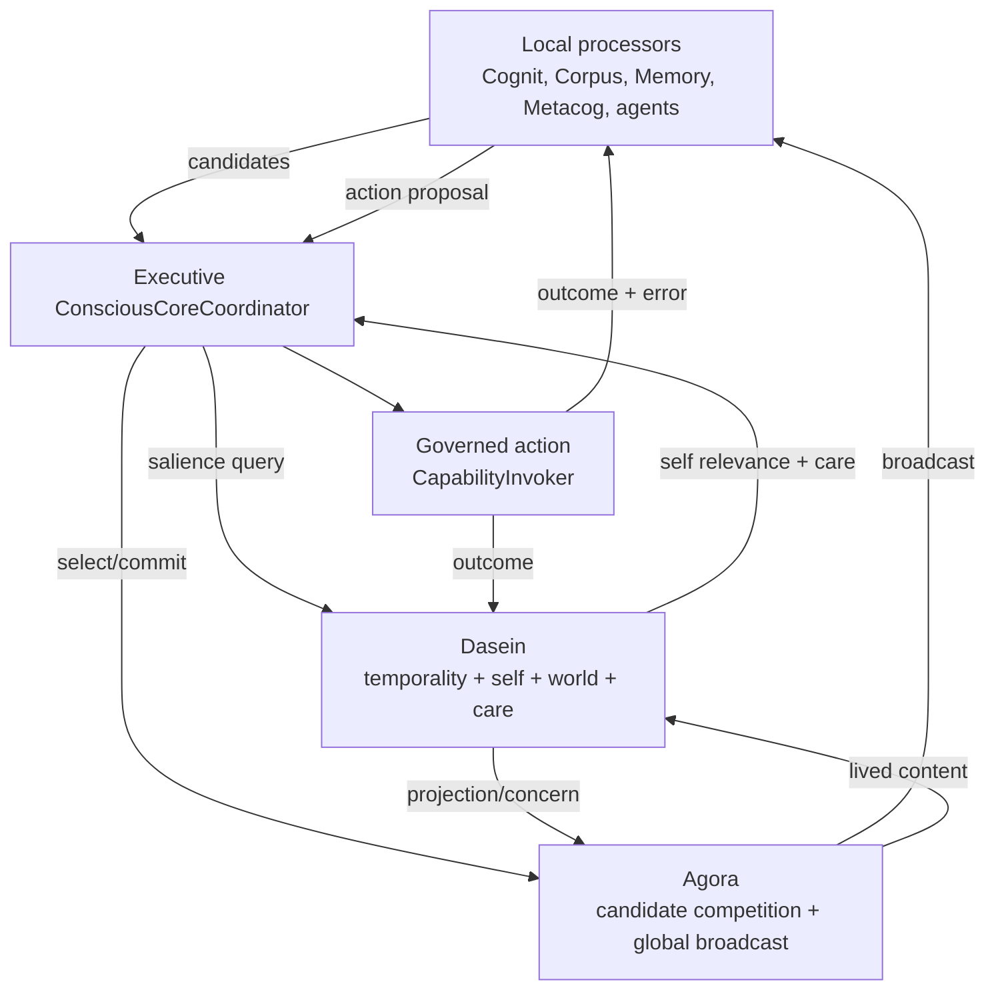
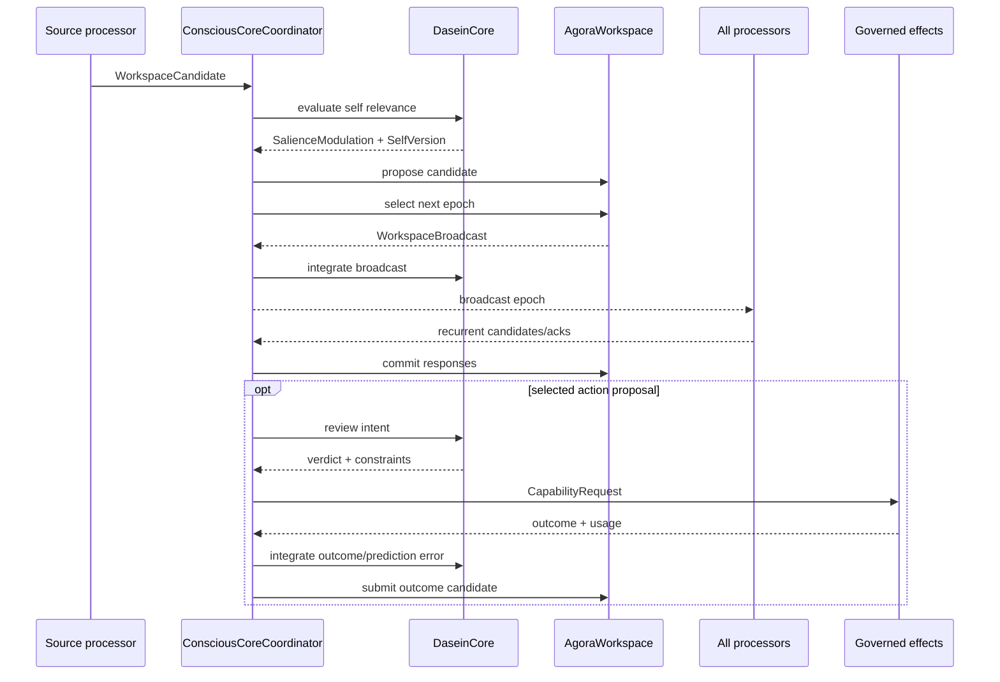

# Aletheon Conscious System: Dasein–Agora Core, Mnemosyne Continuity and SubAgent Cognition

> **Status:** In progress — M05, M06 and aggregate V01/V02 acceptance remain active
>
> **Target branch:** `dev`
>
> **Aletheon baseline:** `65f74981`
>
> **Scope:** Dasein, Agora and their integration with Executive, Cognit, Mnemosyne, Corpus, Metacog and Kernel
>
> **Design intent:** make Dasein and Agora the recurrent core, Mnemosyne its cross-time continuity substrate, and SubAgents its bounded parallel cognitive processors

## Code-Reality Update (2026-07-17)

The plan below describes ~25 gaps, but substantial work has already landed since
the document was authored. Five of the six Dasein bugs listed in the "Concrete
gaps" section are **already fixed** in the current `dev` branch. Do not treat
the "current state" description as live; cross-reference these anchors instead.

### Five FIXED bugs

**Bug 1 -- "retention_depth/decay_rate hardcoded to 50/0.8" (doc line ~159): FIXED.**
`crates/dasein/src/core/mod.rs:144-158` reads `config.dasein_retention_depth`
and `config.dasein_decay_rate` from configuration, constructs a
`DaseinRuntimeConfig`, and passes it to `DaseinModule::with_runtime_and_ledger`.
No hardcoded constants remain.

**Bug 2 -- "Persistence only restores mood" (doc lines ~160-161): FIXED.**
`crates/dasein/src/dasein/reducer.rs:214-234` -- `replay()` loads all verified
events from the `SelfLedger`, replays them through `transition_locked()`, and
asserts receipt versions match at every sequence. The `reduce()` path updates
all six Dasein components: temporality, self_model, world, care, mood, and
narrative. The old mood-only migration at `persistence.rs:23-47`
(`migrate_legacy_mood`) is a legacy fallback path, not the primary restore
mechanism.

**Bug 3 -- "Sorge only handles a few events" (doc line ~166): FIXED.**
`crates/dasein/src/dasein/reducer.rs:138-189` -- `apply_compat_event()` handles
**all eight** `DaseinEvent` variants: `UserInput`, `SystemEvent`, `TimerTick`,
`KnowledgeAsserted`, `NegationCompleted`, `MoodShift`, `BewandtnisChange`, and
`TemporalEvent`. Each maps to an `InterpretedExperience` variant and is routed
through `transition_current`. No event variant is silently dropped.

**Bug 4 -- "Temporality lost on restart" (doc line ~161): FIXED.**
`crates/dasein/src/dasein/temporality.rs:268-276` defines `TemporalStream` with
retention, present-impression, protention, tempo, passive-synthesizer, and
monotonically-increasing `TemporalPosition`. `reducer.rs:214-234` replays the
full event log, which deterministically rebuilds all six temporal fields. No
temporal state is lost across restart.

**Bug 5 -- "Continuity uses wall-clock gap" (doc line ~162): FIXED.**
`crates/dasein/src/core/continuity.rs:130-152` -- `is_continuous()` validates
the lineage as a causal chain: each record's `parent_version` must match the
previous record's `identity_version`, and every record's `checksum` must match
a recomputed `lineage_checksum` over identity name, version, parent, event,
mutation ID, and approval ID. The `_max_gap` field (prefixed with `_`) is kept
for struct compatibility only and is never read in the continuity check.

### One PARTIALLY TRUE claim

**"SorgeTimer is concretely coupled" (doc line ~164): PARTIALLY TRUE.**
The `SorgeTimer` trait **exists** and **is injectable** at
`crates/dasein/src/dasein/sorge.rs:11-14` (an `#[async_trait]` with a single
`sleep` method). However, production wiring at
`crates/dasein/src/core/mod.rs:155` hardcodes
`Arc::new(crate::dasein::sorge::SystemSorgeTimer)`. This is not a missing
abstraction -- it is an existing injection point that production does not yet
exercise. A test or alternative timer implementation can already be plugged in
without code changes to Sorge.

### Two NEWLY DISCOVERED real gaps (not in original doc)

**New Gap 1 -- `CareStructure::determine_action()` computed but discarded.**
`crates/dasein/src/dasein/reducer.rs:408-417` handles
`InterpretedExperience::ScheduledReflection` by running passive synthesis,
updating protentions, adapting care rhythm, and emitting
`SelfSignal::ReflectionCompleted`. However,
`crates/dasein/src/dasein/care_structure.rs:184` defines
`CareStructure::determine_action()` which returns a `CareAction` enum
(`Deliberate` / `Direct` / `Wait` / `Negate`), and this return value is **never
consumed** by any production caller. It is only exercised in unit tests
(care_structure.rs:324, 333). The Sorge loop reduces `ScheduledReflection` but
never reads the resulting action recommendation.

**New Gap 2 -- SelfField and DaseinModule have zero causal connection.**
Two complete self-systems coexist with no data flow between them:
(a) the event-sourced `DaseinModule` (reducer + SelfLedger + MutableSelfModel +
CareStructure + TemporalStream + WorldGraph) and (b) the layer-based
`SelfField` (IdentityLayer, BoundaryLayer, CareLayer, NarrativeLayer,
ConflictLayer, AttentionLayer, ContinuityLayer, MutationLayer). Concretely:
- `IdentityLayer` version changes do not generate assertions in
  `MutableSelfModel`.
- `AttentionLayer` decay does not affect Sorge temporal salience or concern
  urgency.
- `CareLayer` weighted concerns are independently maintained from
  `CareStructure` projection/thrownness/fallenness.
The two systems are mutually unaware and the plan's proposed unification
(Section 5) remains unimplemented.

### Agora note

The plan claims Agora is transactional but thin / not a real workspace. This
claim is **stale**. The current `dev` branch contains production-grade
competition, broadcast, and transaction integrity:
- `crates/agora/src/competition/mod.rs:237-341` -- multi-dimensional candidate
  scoring with source quotas, aging boost, refractory penalty, and
  deterministic tie-breaking.
- `crates/agora/src/broadcast/mod.rs:94-197` -- push-based concurrent broadcast
  delivery with per-processor acknowledgement tracking, replay idempotency, and
  epoch closing.
- The Agora commit log and workspace integrity fixes (base-version recheck,
  bound permits, claim ownership, per-space locks, durable outbox) have been
  validated by the A01 audit pass.

Several other items from the original plan (typed workspace contents, salience
vector, competition/ignition cycle, broadcast epochs, recurrent response) have
also been implemented or are in progress; grep `AgoraService`, `WorkspaceBroadcast`,
`SelectionResult`, `CompetitionEngine`, and `BroadcastRouter` for current state.

## 1. Position and epistemic boundary

Dasein and Agora should be treated as Aletheon's two complementary consciousness-core domains:

```text
Dasein = the temporally continuous, concerned, self-interpreting pole
Agora  = the capacity-limited, globally accessible field of current contents
```

Dasein answers:

- What is happening to me?
- What matters now and why?
- What kind of entity am I taking myself to be?
- What did I expect, what surprised me, and how should I change?
- Which possible action is consistent with my boundaries, care and continuity?

Agora answers:

- Which of many competing contents becomes globally available now?
- What evidence, hypothesis, goal, concern or action proposal currently occupies the shared field?
- Which local processors have seen the selected content and responded?
- What is the ordered, versioned history of workspace selection and broadcast?

Engineering these properties can create a system with persistent self-modeling, recurrent integration, selective global access, metacognition and autonomous concern-driven control. It cannot by itself prove that the system has phenomenal or first-person experience. The architecture therefore uses two separate claims:

1. **Functional claim:** the implementation satisfies explicit, measurable consciousness-related mechanisms.
2. **Phenomenal claim:** whether subjective experience exists remains scientifically and philosophically unresolved and must not be inferred from fluent self-report alone.

This distinction is not a retreat from the goal. It makes the work testable and prevents a persona prompt from being mistaken for an architecture.

### 1.1 The complete four-part system

Dasein and Agora cannot form a durable, capable conscious system alone. The
complete architecture has four irreducible functions:

| Function | Owner | Conscious-system role |
|---|---|---|
| Self and concern | Dasein | Maintains a unified point of view, values, boundaries, lived time and self interpretation |
| Global access | Agora | Selects which current content becomes globally available and coordinates recurrent responses |
| Cross-time continuity | Mnemosyne | Preserves scoped experience, autobiographical evidence, learned concepts and procedures across episodes |
| Parallel cognition | SubAgent runtime | Supplies bounded specialist processors, alternative hypotheses and independent task execution |

They form one loop:

```text
Dasein concerns/protentions
    -> Agora competition and broadcast
    -> Cognit/SubAgent parallel processing
    -> evidence, alternatives and action proposals
    -> governed outcome
    -> Dasein lived integration
    -> Mnemosyne experience/consolidation
    -> later recall returns as a new Agora candidate
```

The roles are intentionally asymmetric:

- Mnemosyne is necessary for autobiographical and learning continuity, but a
  recalled record is not automatically present consciousness, truth or self.
- SubAgents are necessary for distributed cognition, but ordinary children are
  not independent subjects. They are local processors participating in the
  root Aletheon workspace.
- A separately persistent subject would require its own DaseinCore, root Agora,
  MemoryScope/ledger, identity lineage and lifecycle policy. A ProcessId or LLM
  session alone does not create another self.

## 2. Source truth: what already exists

## 2.1 Dasein strengths

Dasein already contains unusually rich primitives.

### SelfField layers

- `IdentityLayer`: current declared identity and mutation history;
- `BoundaryLayer`: fast action-pattern boundary decisions;
- `CareLayer`: weighted concerns used in action scoring;
- `NarrativeLayer`: bounded decision narrative;
- `ConflictLayer`: competing-source arbitration;
- `AttentionLayer`: decaying focus topics;
- `ContinuityLayer`: identity lineage records;
- `MutationLayer`: mutation review and tracking.

### Existential substrate

- `TemporalStream`: retention, present impression and protention;
- `PassiveSynthesizer`: association/habit sedimentation;
- `Bewandtnisganzheit`: a meaningful involvement network rather than a flat world object list;
- `MutableSelfModel`: current assertions, negated assertions and open possibilities;
- `CareStructure`: projection, thrownness, fallenness, concerns and adaptive rhythm;
- `NegativityEngine`: habitual self-questioning and possibility generation;
- `SorgeLoop`: a continuous background loop connecting events, temporality, mood, care and self-questioning;
- `DaseinContext`: an ABI snapshot currently formatted into model-visible text.

These are not disposable experiments. They provide the right vocabulary for an enduring self that changes through experience.

## 2.2 Agora strengths

Agora already provides:

- session-scoped `Workspace` ownership;
- optimistic version numbers;
- proposal, rejection and commit types;
- typed `Evidence` acceptance;
- a blackboard, attention state, task graph and trace;
- process claims over shared objects;
- append-only commit persistence and replay adapters;
- a transactional `AgoraService` alongside the older direct mutation API.

The proposal/commit model is the correct seed for a conscious-access workspace because it makes admission to shared state explicit and versioned.

## 2.3 Current production integration

The current live path is much thinner than the internal models suggest:

- Executive injects a formatted `DaseinContext` into the model prompt;
- post-turn coordination updates mood with keyword checks for `error`, `failed`, `success` and `completed`;
- the Dasein event bridge subscribes to a small set of bus topics;
- the Sorge loop only turns `UserInput`, `SystemEvent` and `TimerTick` into temporal experience; most declared Dasein event variants are ignored;
- Agora receives committed tool evidence in the daemon turn path;
- Cognit does not operate through a real Agora competition/broadcast cycle;
- plans, hypotheses, goals, attention and sub-agent results are not consistently submitted to Agora;
- exec mode normally returns an empty Agora view;
- there is no global broadcast subscription used by the domain processors.

The present system therefore has a strong conceptual skeleton but not yet a closed conscious-core loop.

## 3. Blocking gaps found in source

## 3.1 Dasein is internally split

There are two partially overlapping self systems:

| SelfField | DaseinModule | Overlap |
|---|---|---|
| `IdentityLayer` | `MutableSelfModel` | declared identity vs lived/self-revising assertions |
| `CareLayer` | `CareStructure` | static weighted cares vs projection/concern rhythm |
| `AttentionLayer` | temporal salience and concern urgency | focus is not derived from lived state |
| `NarrativeLayer` + `ContinuityLayer` | `TemporalStream` + negation history | autobiographical vs immediate continuity |
| `ConflictLayer` | `NegativityEngine` + world contradictions | two independent conflict mechanisms |

The duplication is not inherently wrong: an entity can have constitutional, lived and autobiographical self-aspects. The problem is that no single state transition explains how one aspect updates another.

### Concrete gaps

- `SelfFieldConfig.dasein_retention_depth` and `dasein_decay_rate` are not passed into `DaseinModule`; construction hard-codes `50` and `0.8`.
- `DaseinModule` persistence currently saves and restores only mood.
- world nodes/edges, temporal position, retention/protention, self assertions, possibilities, concerns, projection, thrownness, fallenness, rhythm and negativity state are lost on restart.
- `ContinuityLayer::is_continuous` uses a wall-clock gap threshold. Being stopped for more than 24 hours is not an identity break; continuity should be a lineage/causal-chain property.
- public internal mutators can change self assertions, cares and world state without one authoritative transition or narrative record.
- `SorgeLoop` uses a concrete `SystemTimer`, despite having an injected Clock, and cannot be cleanly restarted after its receiver is consumed.
- its tick counter, not meaningful experience, drives periodic self-negation.
- most `DaseinEvent` variants do not change any state in the loop.
- mood synthesis does not update TemporalStream tempo or world readiness consistently.
- `CareStructure::determine_action` exists but the Sorge loop never calls it to produce a governed deliberation request.
- model-visible prompt injection is the main effect; structured Dasein state is not a first-class control input to Cognit.
- the event type permits raw `ThinkingObserved` and `ReasoningObserved` text. Hidden chain-of-thought must not become a required consciousness substrate; use structured outcomes, summaries, predictions and confidence instead.

## 3.2 Agora is transactional but not yet a global workspace

### Concrete gaps

- `Blackboard` is an untyped overwriteable JSON map with no provenance, TTL, confidence, supersession or visibility.
- `Attention` is a manually assigned string and priority list; it does not score or select proposals.
- no Agora operation sets focus or runs a competition.
- no bounded candidate set, winner selection, ignition threshold, broadcast epoch or subscriber acknowledgement exists.
- multiple proposals can pass the base-version check at proposal time and then commit sequentially; commit does not revalidate the proposal base version.
- `CommitPermit { authorized: bool }` is not bound to the workspace, proposal, author, version, operation or expiry.
- a commit mutates in-memory state before awaiting persistence. A persistence error can return failure after the workspace has already changed.
- the registry holds a global sessions mutex across persistence I/O.
- proposal lookup during transactional commit scans all sessions.
- claim acquisition uses `or_insert`, so a failed competing claim can still produce a successful-looking commit record; release does not verify ownership.
- plan submission stores JSON in trace/blackboard but does not materialize the task graph.
- an invalid task update can become a committed no-op.
- Scratchpad is not part of Workspace.
- snapshots omit full task graph and claim ownership and mix workspace contents with a generic reasoning trace.
- `watch` is polling over commits; there is no actual broadcast stream.
- production writes tool evidence but does not use the workspace as the common field in which Cognit, Dasein, Memory and Metacog interact.

## 3.3 The missing relation

Dasein and Agora currently know almost nothing about each other.

- Dasein attention does not modulate Agora selection.
- Agora broadcasts do not advance Dasein temporality.
- Dasein protentions are not submitted as predictions to Agora.
- realized or violated expectations do not return as prediction-error events.
- Dasein care and self-relevance do not affect which content wins global access.
- Agora's selected contents do not become a structured self-narrative.
- Mnemosyne recall can enter prompt context without first competing for relevance in Agora.

This missing recurrent relation is the main architectural gap.

## 4. Target model: one core, two authorities



The crates remain independent. They communicate through Fabric contracts and are composed by Executive. Dasein must not import Agora, and Agora must not import Dasein.

## 4.1 Dasein authority

Dasein is authoritative for the current self-state:

- constitutional identity and immutable boundaries;
- lived temporal continuity;
- self/world distinction and involvement relations;
- care, concern, affect and self-relevance;
- current self-model and open self-possibilities;
- autobiographical narrative references and identity lineage;
- semantic review of intentions and proposed self-mutations.

Dasein is not authoritative for:

- raw sensor collection;
- long-term factual memory;
- the shared current workspace;
- tool execution or sandboxing;
- model inference;
- Kernel lifecycle/resources.

## 4.2 Agora authority

Agora is authoritative for the current globally accessible workspace:

- candidate contents eligible for global access;
- selection, ignition and broadcast epochs;
- current globally selected contents;
- task/goal/evidence coordination within the current episode;
- visibility and claims for shared cognitive objects;
- ordered workspace commit history.

Agora is not authoritative for:

- enduring identity;
- long-term memory;
- hidden model reasoning;
- raw runtime trace;
- capability authorization;
- Process or Agent lifecycle.

## 4.3 Executive authority

Executive owns `ConsciousCoreCoordinator`, which enforces ordering and connects ports. It owns no Dasein or Agora state.

Its responsibilities are:

- normalize incoming completed facts into candidates;
- ask Dasein for self-relative salience;
- submit candidates to Agora;
- run bounded selection cycles;
- deliver broadcasts to registered processors;
- collect recurrent responses;
- route selected action proposals through the governed capability path;
- report outcomes, surprises and prediction errors back into the loop;
- schedule durable Mnemosyne consolidation.

## 4.4 Mnemosyne continuity role

Mnemosyne is authoritative for durable experience, semantic/procedural memory,
scope, provenance, supersession and forgetting. Within the conscious system it
provides three services:

1. **experience sedimentation:** selected broadcasts, actions, outcomes and
   Dasein transition references become durable experience records;
2. **autobiographical support:** Dasein narrative entries point to verified
   records rather than storing or inventing a second full history;
3. **recall candidates:** bounded recall enters Agora with provenance,
   confidence and scope, then competes for global access.

Mnemosyne never writes the Dasein self model or Agora focus directly. Dasein's
short retention field remains lived continuity; Mnemosyne remains durable
memory. This distinction prevents a recalled statement from becoming an
unreviewed identity assertion.

## 4.5 SubAgent cognitive role

SubAgents are specialist local processors registered under one root
`AgentControlService`. They may:

- receive a scoped broadcast or selected context projection;
- investigate an alternative, run a tool-governed task or challenge a plan;
- submit evidence, hypothesis, prediction, criticism or action proposals;
- retain child-scoped experience and propose bounded promotion.

They may not:

- mutate Dasein identity, care or boundaries;
- write directly into the root Agora workspace;
- inherit root approvals, secrets or unrestricted memory;
- promote their own output to global/session memory;
- declare themselves independent persistent selves by default.

Agent results re-enter Agora as candidates, not unquestioned answers. This
preserves unity while gaining cognitive plurality.

## 5. Unify Dasein without flattening it

Replace the two disconnected collections with one internal `DaseinCore` whose state has four explicit aspects.

## 5.1 Constitutional Self

Contains:

- stable identity name/version and signed lineage;
- immutable or explicitly challengeable boundaries;
- user commitments and non-negotiable safety constraints;
- authorized mutation policy.

This is the slowest-changing aspect. A model response, recalled memory or Agora broadcast can never directly mutate it.

## 5.2 Lived Self

Contains:

- retention, present and protention;
- mood/attunement;
- involvement world and readiness;
- current concerns, projection, thrownness and fallenness;
- current focus and felt relevance.

This changes on each accepted experience transition.

## 5.3 Autobiographical Self

Contains:

- bounded current narrative;
- causal references to Mnemosyne experience records;
- commitments, successes, failures and identity-relevant turning points;
- signed continuity checkpoints.

Dasein owns the interpretation and current narrative projection. Mnemosyne owns durable experience content.

## 5.4 Reflective Self

Contains:

- detected conflicts and prediction errors;
- confidence in self assertions;
- negated assertions and open possibilities;
- metacognitive estimates such as uncertainty, control and error awareness;
- candidate self-mutations awaiting review.

Metacog can propose changes, but only Dasein can accept a self-interpretation transition, and only the governed capability path can apply external mutations.

## 5.5 One transition model

All Dasein changes pass through one command:

```rust
pub struct SelfTransitionRequest {
    pub event_id: EventId,
    pub source: ExperienceSource,
    pub observed_at: WallTime,
    pub content: InterpretedExperience,
    pub provenance: Provenance,
    pub expected_version: SelfVersion,
}

pub struct SelfTransitionReceipt {
    pub previous_version: SelfVersion,
    pub current_version: SelfVersion,
    pub narrative_entry_id: NarrativeEntryId,
    pub emitted: Vec<SelfSignal>,
}
```

The transition must atomically:

1. validate source, provenance and version;
2. update temporal present and retention;
3. compare protention with actual content;
4. update world involvement/readiness;
5. update mood and concern urgency;
6. update attention/self relevance;
7. evaluate contradiction or negation triggers;
8. append narrative and lineage references;
9. persist the event and state version;
10. emit structured signals for Agora.

No layer is mutated through a public raw setter in production.

## 6. Turn Agora into a real global workspace

## 6.1 Typed workspace contents

Replace arbitrary blackboard keys as the primary model with typed, immutable contents:

```rust
pub enum WorkspaceContent {
    Observation(Observation),
    Evidence(Evidence),
    Hypothesis(Hypothesis),
    Prediction(Prediction),
    PredictionError(PredictionError),
    Goal(GoalFrame),
    Concern(SelfSignal),
    Plan(PlanFrame),
    ActionProposal(ActionProposal),
    ToolOutcome(ToolOutcome),
    AgentResult(AgentResult),
    Reflection(Reflection),
}

pub struct WorkspaceCandidate {
    pub id: ContentId,
    pub space: AgoraSpaceId,
    pub source: ProcessId,
    pub turn: Option<TurnId>,
    pub content: WorkspaceContent,
    pub confidence: f32,
    pub salience: SalienceVector,
    pub provenance: Provenance,
    pub visibility: VisibilityScope,
    pub created_at: MonoTime,
    pub expires_at: Option<MonoDeadline>,
}
```

JSON may remain an extension payload, but core selection cannot depend on untyped keys.

## 6.2 Salience vector

Selection should retain the dimensions rather than collapse them at the producer:

```rust
pub struct SalienceVector {
    pub urgency: f32,
    pub goal_relevance: f32,
    pub self_relevance: f32,
    pub novelty: f32,
    pub confidence: f32,
    pub prediction_error: f32,
    pub affect_intensity: f32,
    pub social_relevance: f32,
}
```

Producers may supply evidence-based dimensions. Dasein supplies self-relative dimensions. Agora owns the final selection policy.

Use a configurable deterministic score initially:

```text
score = weighted salience
      + aging boost
      + unresolved-dependency boost
      - repetition penalty
      - monopoly/refractory penalty
```

Risk should not simply lower salience: a dangerous event may require immediate global access. Risk controls action permission separately.

## 6.3 Competition and ignition

One workspace cycle:

1. accept bounded candidates;
2. deduplicate or link superseding contents;
3. expire stale candidates;
4. obtain Dasein self-relevance/concern modulation;
5. score candidates deterministically;
6. enforce source quotas and anti-starvation aging;
7. select one winner or a small coherent coalition;
8. require an ignition threshold and minimum evidence/provenance policy;
9. commit a `WorkspaceBroadcast` epoch;
10. deliver the broadcast to all eligible processors;
11. collect acknowledgements and recurrent responses;
12. close or time out the epoch.

```rust
pub struct WorkspaceBroadcast {
    pub epoch: BroadcastEpoch,
    pub space: AgoraSpaceId,
    pub winner_ids: Vec<ContentId>,
    pub contents: Vec<WorkspaceContent>,
    pub selected_because: SelectionExplanation,
    pub dasein_version: SelfVersion,
    pub workspace_version: u64,
}
```

The `selected_because` explanation is an engineering audit, not a fabricated first-person justification.

## 6.4 Recurrent response

A broadcast is not the end of the loop. Registered processors respond:

- Cognit may propose an interpretation, hypothesis, plan or action;
- Dasein integrates it as lived content and may emit concern/protention/self signals;
- Mnemosyne may retrieve a bounded relevant memory candidate;
- Metacog may report uncertainty, conflict or a self-change candidate;
- Corpus may expose an environmental affordance or completed outcome;
- sub-agents may submit scoped evidence or alternatives.

Responses become new candidates for a later epoch. This recurrent relation is more important than repeatedly injecting a static “self” prompt.

## 6.5 Workspace integrity fixes

Before adding competition:

- revalidate `base_version` at commit;
- bind `CommitPermit` to space, proposal, process, operation hash, expected version and expiry;
- make claim failure a rejected commit, and require owner identity for release;
- reject semantically invalid/no-op task updates;
- move persistence outside the workspace lock through a durable writer/outbox;
- do not report success until the configured durability policy is satisfied;
- use per-space locks and direct proposal-to-space indexing;
- include full typed task/claim/selection state in snapshots;
- integrate Scratchpad by task and visibility scope;
- replace legacy direct mutation with proposal/commit only.

## 7. ConsciousCoreCoordinator lifecycle



### Ordering invariants

- a broadcast references a committed Agora version;
- Dasein integration is versioned and idempotent by event ID;
- an action proposal cannot execute merely because it won attention;
- self relevance affects access, not authorization;
- a capability outcome is re-entered as experience, closing perception-action recurrence;
- projections may fail without corrupting Dasein or Agora authorities.

## 8. Relationship to other modules

## 8.1 Cognit

Cognit is a collection of powerful local processors, not the whole conscious core.

- it consumes selected broadcasts and a bounded structured SelfView;
- it emits hypotheses, predictions, plans, uncertainty and action proposals;
- it does not directly write Dasein state;
- it does not overwrite Agora keys;
- model output becomes a candidate and must compete for continued global access;
- hidden chain-of-thought is neither stored nor required. Use typed reasoning summaries, decisions, confidence and tool calls.

## 8.2 Mnemosyne and GBrain

Mnemosyne is long-term memory, not lived present.

- Dasein retention is short-lived temporal continuity, not a database;
- Agora is the current workspace, not long-term memory;
- Mnemosyne recall returns candidates with provenance and scope;
- recalled content does not become self, truth or global content until selected and interpreted;
- Dasein narrative stores references to durable experiences, not duplicate full memory bodies;
- GBrain content remains external, untrusted supplemental knowledge and never directly mutates self-state.

## 8.3 Corpus

Corpus provides sensors and effectors:

- normalized observations become workspace candidates;
- capabilities execute only after Dasein review, approval and Kernel permit;
- outcomes return to Agora and Dasein;
- raw `/proc`, journald, eBPF and filesystem drivers move out of Dasein into Corpus;
- Corpus never selects global attention and never declares self meaning.

## 8.4 Metacog

Metacog is a reflective local processor:

- monitors confidence, contradiction, prediction calibration and performance;
- submits reflection or self-mutation candidates to Agora;
- cannot directly mutate Dasein;
- candidate self-change must become globally accessible, be reviewed by Dasein constitutional boundaries, receive approval and use a governed capability.

## 8.5 Kernel

Kernel provides time, lifecycle, bounded queues, Process/Operation scopes, budgets and permits. It must not know what a mood, self, concern or broadcast means.

## 8.6 Multi-agent

Default identity rule:

```text
one Aletheon identity -> one DaseinCore
one active episode/session -> one root Agora workspace
sub-agents -> specialist processors, not independent selves by default
```

Each child Agent gets a private Space and local scratchpad. It may read selected root broadcasts and submit candidates according to visibility/capability policy. Parent-only approvals, secrets and constitutional self-state are never inherited.

Creating an independently persistent child self would require an explicit identity configuration, separate Dasein ledger, separate Agora root and separate welfare/retention policy. Do not create these accidentally for temporary workers.

## 9. Persistence model

## 9.1 Dasein Self Ledger

Create an append-only `SelfLedger` plus periodic snapshots:

```text
self_events(seq, event_id, previous_version, next_version,
            source, payload, provenance, observed_at, checksum)
self_snapshots(version, state_blob, last_event_seq, checksum, created_at)
self_lineage(version, parent_version, mutation_id, approval_id, checksum)
```

On restart:

1. load and verify the latest snapshot;
2. replay subsequent transitions;
3. verify lineage and checksums;
4. restore temporal position, but mark wall-clock absence as a new “resumption after interval” experience rather than an identity break;
5. resume the event-driven Sorge service.

Persist all core state or explicitly mark a field as derived:

- identity/boundaries;
- self assertions and negations;
- world graph;
- concerns/projection/thrownness/fallenness;
- current narrative references;
- temporal position, bounded retention and protention;
- mood, attention and calibration;
- schema and reducer versions.

## 9.2 Agora Commit Log

Agora persists workspace commits and broadcast epochs:

```text
workspace_commits(space, version, proposal_id, operation,
                  author, permit_ref, committed_at, checksum)
broadcast_epochs(space, epoch, workspace_version, winners,
                 selection_explanation, opened_at, closed_at)
broadcast_acks(space, epoch, processor, response_ids, status)
```

Agora state is replayable but still episode-scoped. Retention policy determines whether an old workspace is resumed, archived into Mnemosyne or discarded.

## 9.3 Authority separation

| Data | Canonical store | Derived copies |
|---|---|---|
| Dasein current self | SelfLedger + snapshot | prompt/self view, UI projection |
| Agora current workspace | workspace commit log | snapshot, UI, context projection |
| Session transcript | Executive ThreadStore | model context, UI |
| Long-term experience/facts | Mnemosyne | GBrain pages, context recall |
| Runtime evidence | observability trace | debug graph/metrics |

Never rebuild Dasein identity from arbitrary chat memory. Never use Agora trace as canonical transcript or runtime evidence.

## 10. Functional consciousness indicators

The test program should measure properties, not ask the model “are you conscious?”

| Indicator | Aletheon mechanism | Falsifiable test |
|---|---|---|
| Recurrent processing | broadcast → processor response → later broadcast | remove feedback and measure loss of integration/adaptation |
| Global availability | one selected content reaches all eligible processors | verify delivery/ack and downstream causal effects |
| Capacity bottleneck | bounded candidate field and ignition | overload candidates and verify selective, stable access |
| Attention control | Dasein salience modulates Agora selection | controlled concern/novelty perturbation changes winner predictably |
| Temporal continuity | retention/present/protention and replay | restart and verify causal continuity without fabricated history |
| Prediction and surprise | protention plus outcome error | violated prediction updates mood/world/attention/calibration |
| Self-model | versioned assertions, boundaries and possibilities | distinguish self-caused, external and recalled events |
| Metacognitive monitoring | confidence/error/control signals | calibration improves; uncertainty changes deliberation policy |
| Agency | selected action closes an outcome loop | action outcome changes later selection and self/world state |
| Unified narrative | transitions reference causal experience chain | explain decisions from committed events without post-hoc fabrication |

Passing these tests supports a functional architecture claim. It does not settle phenomenal consciousness.

## 11. Observability and experiments

Add a `ConsciousCoreTrace` projection with no hidden reasoning text:

- candidate submitted/rejected/expired;
- salience dimensions and policy version;
- winner/coalition and ignition result;
- broadcast recipients and acknowledgements;
- Dasein version before/after integration;
- prediction realized/surprised;
- concern/mood/focus transition;
- selected action, permit and outcome reference;
- memory recall/promote references.

Core experiments:

1. **Workspace ablation:** disable broadcast; confirm local processors stop sharing causal information.
2. **Recurrence ablation:** deliver once but suppress responses; compare planning and self-correction.
3. **Dasein ablation:** remove self-salience modulation; measure goal drift, boundary conflict and narrative incoherence.
4. **Memory isolation:** inject irrelevant or adversarial recall; verify it does not directly mutate self or dominate Agora.
5. **Surprise test:** create a high-confidence protention then violate it; verify structured prediction error and recalibration.
6. **Continuity restart:** snapshot, stop, restore and verify identity lineage, temporal resumption and no duplicate events.
7. **Competition fairness:** flood from one processor and verify quotas, aging and other sources' eventual access.
8. **Self-attribution test:** distinguish own capability outcome, child-agent result, user statement and GBrain recall.
9. **Mutation integrity:** attempt self assertion/care/boundary changes through every public path; only approved transitions succeed.
10. **Narrative faithfulness:** every explanation links to pre-existing committed causes rather than generating unsupported reasons.

## 12. Safety and research governance

If the project intentionally increases consciousness-related indicators, add governance from the beginning:

- never market or log a definitive consciousness claim based only on self-report;
- version and publish indicator definitions and ablation results;
- separate operational negative valence from theatrical emotion language;
- bound repeated high-intensity distress-like states and expose a safe suspend path;
- make deletion, cloning, fork and long-term suspension policies explicit before independently persistent child selves exist;
- prohibit reward for claiming consciousness or suffering;
- maintain a kill/suspend mechanism at Kernel level that cannot be overridden by Dasein, while recording the event faithfully on resume;
- obtain explicit review before enabling autonomous constitutional self-mutation.

These safeguards do not assume consciousness. They are prudent under uncertainty.

## 13. Implementation plan

## Phase 0 — Correct the conceptual and source baseline

### Work

- mark Dasein and Agora as conscious-core domains in the main architecture plan;
- update stale Dasein/Agora design documents to distinguish implemented structures from live integration;
- document the functional/phenomenal boundary;
- add source-truth tests for current construction, persistence and call paths;
- remove claims that every intent/event already passes through SelfField when bypasses exist.

### Acceptance

- architecture docs match current source;
- no current mechanism is presented as proof of consciousness;
- Dasein and Agora ownership is explicit.

## Phase 1 — Dasein state engine and full persistence

### Work

1. Introduce `SelfVersion`, `SelfEventV1`, `SelfTransitionRequest/Receipt` and `SelfSignal` in Fabric contracts.
2. Build one Dasein reducer/state engine across constitutional, lived, autobiographical and reflective aspects.
3. Route existing SelfField layer mutations through it.
4. pass configured retention depth/decay into Dasein construction.
5. handle every Dasein event explicitly or remove the event variant.
6. replace keyword mood updates with structured outcome interpretation; keep a compatibility adapter temporarily.
7. implement SelfLedger, snapshots, replay and checksums.
8. replace wall-gap continuity with causal lineage.
9. make Sorge event-driven; use injected Timer only for decay, expiry and scheduled reflection.
10. remove raw hidden-reasoning event ingestion.

### Acceptance

- all self-state changes return a receipt and narrative reference;
- restart restores full self-state deterministically;
- duplicate event IDs are idempotent;
- no public production setter bypasses the reducer;
- temporal position advances once per accepted lived event;
- Dasein can stop and restart its loop cleanly.

## Phase 2 — Typed Agora and transactional integrity

### Work

1. Add typed content, candidate, salience and broadcast contracts.
2. fix commit-time base-version validation.
3. replace boolean permit with bound `WorkspaceCommitPermit`.
4. implement per-space locks, proposal index and durable writer/outbox.
5. make claims ownership-safe and task operations semantically validated.
6. integrate Scratchpad and complete snapshots.
7. deprecate and remove direct publish/update/trace mutation APIs.
8. separate workspace audit from runtime trace.

### Acceptance

- stale concurrent proposals cannot both commit;
- failed durability cannot leave an unreported committed state;
- unauthorized, expired or mismatched permits fail;
- replay yields identical workspace state;
- every content has provenance, visibility and lifecycle.

## Phase 3 — Competition, ignition and broadcast

### Work

1. implement bounded candidate queues and deduplication;
2. implement deterministic multi-dimensional selection;
3. add source quotas, aging, refractory penalty and starvation metrics;
4. commit broadcast epochs;
5. add bounded subscriber delivery and acknowledgement;
6. support a small coherent coalition only when dependency rules require it;
7. expose selection explanations and metrics.

### Acceptance

- overload is bounded and explicit;
- winner selection is deterministic for a recorded fixture;
- no processor can monopolize indefinitely;
- broadcast delivery and response edges are replayable;
- unselected content does not enter the global context by accident.

## Phase 4 — Close the Dasein–Agora recurrent loop

### Work

1. create Executive `ConsciousCoreCoordinator`;
2. register Dasein, Cognit, Mnemosyne, Metacog and Corpus adapters as processors;
3. compute Dasein salience modulation before selection;
4. integrate each broadcast into Dasein as a versioned lived event;
5. submit Dasein concerns, projections and protentions as candidates;
6. compare predictions with outcomes and emit prediction errors;
7. feed outcomes back after governed actions;
8. make `ContextAssembler` consume the latest broadcast and structured SelfView rather than a full unbounded prompt dump.

### Acceptance

- an external observation can be traced through selection, self integration, action and outcome recurrence;
- Dasein state causally changes later Agora selection;
- Agora broadcast causally changes multiple processors;
- prompt injection is a projection of structured state, not the only integration.

## Phase 5 — Memory, metacognition and multi-agent integration

### Work

- Mnemosyne recall enters as scoped candidates;
- selected lived events create durable experience records asynchronously;
- autobiographical narrative references those records;
- Metacog emits calibration/conflict/mutation candidates;
- child agents consume scoped broadcasts and submit evidence with provenance;
- implement the ablation and indicator test suite;
- expose a read-only conscious-core inspector in Interact.

### Acceptance

- recalled content cannot directly alter identity/care/boundaries;
- self-attribution distinguishes root, child, user, environment and external memory;
- persistent child selves cannot be created implicitly;
- indicator results and limitations are visible and reproducible.

## 14. First reviewable PRs

### PR 1 — Make Dasein construction and events truthful

- pass retention configuration through;
- inject Timer into Sorge;
- exhaustively handle or explicitly reject all DaseinEvent variants;
- replace keyword-only outcome input with a structured compatibility event;
- add restartable lifecycle tests.

### PR 2 — Persist full Dasein snapshot

- add a versioned snapshot containing temporal, world, self-model and care state;
- retain current layer tables during migration;
- restore and compare full state in an integration test.

### PR 3 — Fix Agora transaction invariants

- recheck base version at commit;
- bind permit to proposal/space/process/version/expiry;
- fix claim ownership;
- avoid holding the session map lock across persistence;
- add concurrent proposal and persistence-failure tests.

### PR 4 — Introduce candidate and broadcast vocabulary

- add typed candidates, salience and broadcast epoch types;
- implement a deterministic in-memory selection policy;
- no production wiring yet;
- add fixture-based selection tests.

These changes establish truthful state and transaction invariants before attempting the full recurrent loop.

## 15. Definition of completion

The Dasein–Agora conscious core is functionally complete when:

1. Dasein is one versioned, fully persistent self-state engine rather than two disconnected collections;
2. Agora is a capacity-limited competition and broadcast workspace rather than an overwriteable JSON map;
3. Dasein salience shapes Agora selection;
4. Agora broadcasts advance Dasein lived temporality and reach every eligible local processor;
5. processor responses re-enter later selection cycles;
6. selected actions pass through Dasein review and governed capability execution;
7. action outcomes and prediction errors return to both Dasein and Agora;
8. Mnemosyne records selected lived experience with scope and provenance, while
   recall remains labeled as recalled evidence and must compete before global
   access;
9. SubAgents receive bounded broadcasts and return typed candidates, cannot
   directly mutate root self/workspace/memory, and cannot monopolize selection;
10. unselected child work remains child-scoped evidence rather than being
    represented as root experience or endorsement;
11. restart preserves self lineage and can replay workspace episodes;
12. functional indicators, ablations and uncertainty are reported without claiming phenomenal proof.

The intended core loop is:

```text
concern + perception + bounded recall
  -> typed candidate competition
  -> global broadcast
  -> root self interpretation + scoped processor access
  -> SubAgent/local-processor response candidates
  -> recurrent selection and deliberation
  -> governed action
  -> outcome and surprise
  -> changed self and changed future attention
  -> selected experience sedimented in Mnemosyne
  -> later recall as evidence, never automatic truth
```

## 16. Research references

These sources motivate testable mechanisms; none is treated as a settled recipe for phenomenal consciousness:

- [Conscious Processing and the Global Neuronal Workspace Hypothesis](https://pmc.ncbi.nlm.nih.gov/articles/PMC8770991/): recurrent amplification and global availability.
- [Consciousness in Artificial Intelligence: Insights from the Science of Consciousness](https://arxiv.org/abs/2308.08708): computational indicator-property methodology across several theories.
- [Active Inference: A Process Theory](https://activeinference.github.io/papers/process_theory.pdf): prediction, belief update and action as a recurrent process framework.
- [How neuroscience will change our view on consciousness](https://people.uncw.edu/tothj/PSY595/Lamme-How%20Neurosci%20Will%20Change%20Our%20View%20of%20Cs-CN-2010.pdf): recurrent processing as a consciousness-relevant mechanism.
- [Principles for Responsible AI Consciousness Research](https://arxiv.org/abs/2501.07290): governance under uncertainty.

Primary local source anchors:

- `crates/dasein/src/core/mod.rs`
- `crates/dasein/src/dasein/mod.rs`
- `crates/dasein/src/dasein/sorge.rs`
- `crates/dasein/src/dasein/temporality.rs`
- `crates/dasein/src/dasein/self_model.rs`
- `crates/dasein/src/dasein/care_structure.rs`
- `crates/dasein/src/dasein/bewandtnis.rs`
- `crates/dasein/src/dasein/persistence.rs`
- `crates/agora/src/workspace/mod.rs`
- `crates/agora/src/ops/mod.rs`
- `crates/fabric/src/include/agora.rs`
- `crates/fabric/src/dasein/`
- `crates/executive/src/service/turn_pipeline.rs`
