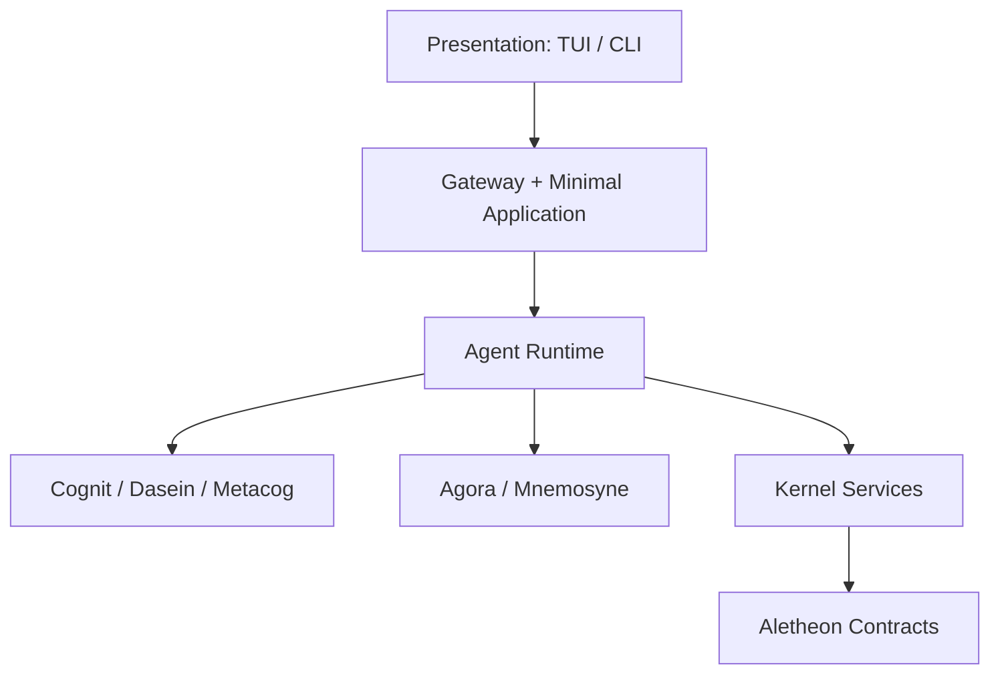
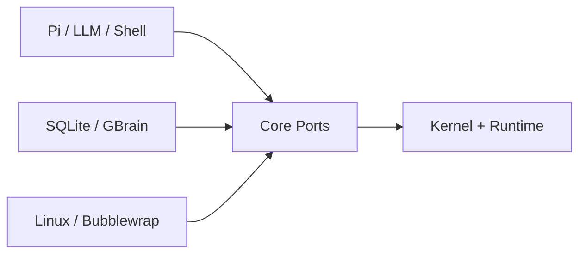

# Aletheon Agent Kernel V2 完整架构重构计划

> 状态：Proposed  
> 日期：2026-08-08  
> 目标分支：`dev`  
> 性质：架构迁移计划，不是功能路线图  
> 核心约束：完整重构边界与依赖方向，但不以一次性重写替代已经验证的运行时实现

## 0. 执行决议

Aletheon 进入以 Agent 核心为唯一主线的架构收敛阶段。

本次重构作出以下不可逆转的方向性决策：

1. `Dasein` 自我意识与 `metacog` 元认知继续作为核心能力，不冻结、不降级为应用插件。
2. Robot、非 Linux 多平台适配以及非核心应用功能冻结，不再进入当前生产依赖图。
3. `fabric` 重命名为 `contracts`，package 名为 `aletheon-contracts`，Rust 路径为 `aletheon_contracts`。
4. `contracts` 只保存跨核心子系统的稳定数据契约，不保存 Application、UI、Robot、Coding 或基础设施实现。
5. `kernel` 成为唯一的机制与强制执行根，负责进程、操作、时间、空间、权限、资源、配额、预算、监督和 Capability 调用纪律。
6. `runtime` 成为唯一的 Agent/Session/Turn 语义与生命周期权威。
7. `executive` 不再作为中央大对象；其职责逐项迁出，最终删除 crate。
8. Application 仅保留最小通用用例；TUI 仅保留可操作、可观察、可取消和可恢复的薄客户端。
9. 生产控制流必须显式调用；事件用于持久化事实、观察和通知，不能成为万能路由器。
10. 整个迁移最终只能保留一条 Turn 路径、一个 Session/Event 权威、一个 Self 权威和一个 Capability 强制执行入口。

这里的“完整重构”是指最终依赖图、所有权和执行路径全部达到目标状态；不是在一个超大 PR 中重写所有实现。

---

## 1. 为什么必须重构

当前 `executive` 同时依赖 `fabric`、`gateway`、`kernel`、`agora`、`cognit`、`corpus`、`mnemosyne`、`runtime`、`dasein`、`metacog` 和 `hardware`。其 `application` 目录同时包含 Turn、Session、Agent、Memory、Dasein、Metacog、Extension、Robot、审批、评估、Daemon 和部署验收逻辑。

这使 `executive` 同时扮演：

- Agent Kernel；
- Application Service；
- Composition Root；
- Daemon Host；
- Adapter 容器；
- 兼容层；
- Robot 业务编排器；
- 测试与发布验收协调器。

结果不是简单的“大文件”，而是系统权威不清：

- `TurnEngine` 已经存在，但周围仍有 daemon turn、pipeline、coordinator 和兼容入口；
- `RuntimeCore` 名义上 host-agnostic，实际持有具体 Provider、DaemonConfig 和 RequestHandler；
- 当前 `runtime` crate 只负责外部 Runtime manifest/selector，没有承担真正的 Agent Runtime；
- `fabric` 同时保存公共契约、UI 协议、Coding/Robot/Application 类型、IPC 和 policy 实现；
- `kernel` 已有 process/operation/admission/chronos/space/supervision，但它不是所有执行路径真正经过的唯一机制根；
- `Dasein`、`conscious_*` 和 `metacog` 的状态与变更权威仍有重叠；
- Robot 和平台逻辑进入默认启动与依赖路径，导致核心无法独立演化。

本次重构的目标不是让目录更漂亮，而是让这些不变量能够由代码结构强制保证。

---

## 2. 范围

### 2.1 活跃核心

以下能力继续开发，并必须进入最终核心闭环：

- Agent Process、Session、Turn、Operation；
- 单一 Turn Engine；
- Native Cognit 与受监督的外部 Agent Runtime（例如 Pi）；
- Dasein 自我意识、身份、价值、边界、承诺和连续性；
- Metacog 自我观察、认知评估、矛盾发现、改进提案和受治理演化；
- Agora 活跃认知空间；
- Mnemosyne 记忆、召回、固化和遗忘；
- Capability、Permission、Resource、Quota、Accounting、Budget；
- 父子 Agent、等待、取消、超时、终止回执和恢复；
- Linux 上的最小工具执行、沙箱、Provider 和持久化 Adapter；
- 最小 CLI/TUI/Daemon 壳；
- Nightwatch、tester 和安装态验收，但它们属于外部工程设施，不属于 Agent Kernel。

### 2.2 冻结范围

以下能力保留 Git 历史和必要回归证据，但不再新增生产功能：

- Robot Harness、embodiment、episode、Robot Policy 和硬件设备适配；
- Android、macOS、Windows、Embedded；
- eBPF、FUSE、io_uring 等尚未成为核心真实调用路径的能力；
- Extension marketplace 与非核心 channel；
- 新的应用产品工作流；
- 与核心闭环无关的新顶层 crate。

冻结不等于立即删除源码。第一步是从默认配置、生产启动、`aletheon` 依赖图和核心 CI 中移除；当不存在调用者后，再决定保留为独立实验代码还是只由 Git 历史保存。

### 2.3 明确不冻结

- `Dasein`；
- `metacog`；
- Native Cognit；
- Pi 等外部 Agent Runtime 适配；
- 记忆与工作空间；
- 最小交互与运行观测；
- 核心安全与恢复机制。

---

## 3. 目标分层



外部 Adapter 由 `aletheon` composition root 注入核心端口：



### 3.1 依赖方向

`A -> B` 表示 A 可以依赖 B：

```text
interact     -> gateway
gateway      -> application, contracts
application  -> runtime, contracts
runtime      -> kernel, contracts, cognit, dasein, metacog, agora, mnemosyne
cognit       -> contracts, selected kernel primitives
dasein       -> contracts, selected kernel primitives
metacog      -> contracts, selected kernel primitives
agora        -> contracts, selected kernel primitives
mnemosyne    -> contracts, selected kernel primitives
corpus       -> contracts, kernel capability port
kernel       -> contracts
contracts    -> no workspace crate
aletheon     -> all required concrete implementations for composition only
```

禁止任何反向依赖：

- `contracts` 不得依赖任何 workspace crate；
- `kernel` 不得依赖 Runtime、Cognit、Dasein、Metacog、Memory、TUI 或 Adapter；
- 领域模块不得依赖 Application、Gateway、Interact 或 `aletheon`；
- Runtime 不得依赖 TUI、Unix socket、systemd、SQLite、Provider HTTP 实现或 Robot；
- TUI 不得直接访问 Runtime repository 或 Kernel 内部状态。

---

## 4. `fabric` 重命名为 `contracts`

### 4.1 命名决议

最终名称：

```text
目录       crates/contracts
package    aletheon-contracts
Rust 路径  aletheon_contracts
```

不采用以下名字：

- `abi`：容易被理解为需要长期维持二进制兼容，而本项目当前主要需要的是跨 crate 数据与协议契约；
- `common`：没有所有权含义，容易成为公共垃圾场；
- `base`：边界过宽，不能说明内容必须是跨模块契约；
- `core`：会和真正的 Agent Runtime Core 混淆；
- `types`：会诱导所有模块把内部类型集中搬入。

“IPC Fabric”若作为概念保留，只表示 `kernel::ipc` 的通信机制，不再作为 crate 名称。

### 4.2 Contracts 允许包含

只允许跨两个或以上核心边界传递、且需要统一序列化语义的类型：

```text
contracts/src/
├── ids.rs
├── agent.rs
├── session.rs
├── turn.rs
├── operation.rs
├── lifecycle.rs
├── capability.rs
├── authority.rs
├── resource.rs
├── budget.rs
├── event.rs
├── receipt.rs
├── error.rs
└── version.rs
```

典型内容：

- `AgentId`、`SessionId`、`TurnId`、`OperationId`、`ProcessId`；
- `TurnRequest`、`TurnOutcome` 的跨边界投影；
- `AgentSpawnRequest`、`AgentResult`；
- `CapabilityRequest`、`ExecutionPermit`、`CapabilityReceipt`；
- `PrincipalId`、`AuthorityContext`、`PermissionDecision`；
- `ResourceLease`、`Quota`、`BudgetReservation`、`UsageReport`；
- `EventEnvelope`、`TerminalReceipt`、稳定错误分类；
- schema/version 常量和纯验证规则。

### 4.3 Contracts 禁止包含

- `UiSnapshot`、TUI reducer 状态、展示字符串；
- CodingJob、ChangedFile、VerificationReport；
- Robot/Embodiment/Episode 类型；
- Identity、Care、SelfState 的内部结构；
- Plan、Critique、Reflection 的内部结构；
- Agora workspace 内部 frame；
- Memory backend、召回索引和存储模型；
- Extension、Telegram、Mail 等应用类型；
- XDG/path/systemd/config/provider 路径；
- EventBus、socket、io_uring、数据库或 HTTP 实现；
- policy engine 和 permission evaluator 实现；
- 任意 compatibility flat re-export。

### 4.4 Contracts 依赖预算

目标依赖仅限纯数据所需的小型库，例如：

```text
serde
serde_json（仅确有 envelope payload 需要时）
uuid
chrono
thiserror
bitflags
```

明确禁止：

```text
tokio
rusqlite
reqwest
nix
tonic
任何 workspace crate
```

Contracts 中不得出现文件、网络、进程、环境变量、数据库或异步任务启动。

### 4.5 领域内部类型仍由领域拥有

核心数据不等于全部进入 Contracts：

```text
Cognit::Plan                  -> cognit
Dasein::SelfState             -> dasein
Metacog::EvaluationState      -> metacog
Agora::WorkspaceState         -> agora
Mnemosyne::MemoryRecord       -> mnemosyne
Runtime::RunningTurn          -> runtime
Kernel::ProcessControlBlock   -> kernel
```

Contracts 只保存它们跨边界所需的最小投影或句柄。

---

## 5. Kernel 的最终边界

Kernel 不是哲学概念，也不是另一套 Application Orchestrator。它只负责机制、强制执行和系统级不变量。

### 5.0 当前 Kernel 为什么像“鸡肋”

当前 Kernel 并非完全没有实现。最新 `dev` 中已经存在：

- `KernelRuntime`；
- `ProcessTable`、`OperationTable`；
- `SystemClock`/`SystemTimer`；
- `InMemorySpaceManager`；
- `ProductionAdmissionController`；
- Budget/Lease；
- `DefaultCapabilityInvoker`；
- `SupervisorTree`；
- in-process mailbox。

问题是这些机制没有成为生产 Agent 控制流不可绕过的根：

- 真正的 Turn 状态机仍位于 `executive::application::turn_lifecycle`；
- Agent/Session/child recovery 的主要语义和持久化仍位于 Executive；
- `RuntimeCore` 由 Executive 构造，并直接持有 Provider、DaemonConfig 和 RequestHandler；
- Executive 的 `governed_capability` 仍负责拼装 authority、working directory、session、streaming 和 conscious action；
- Pi 等外部进程还存在 Executive-owned reconciliation；
- Kernel 内部大量状态是 in-memory table，而生产恢复权威主要位于其他 repository；
- 某些调用可以只使用 Kernel 的一部分组件，而没有绑定完整 Process/Operation/settlement 生命周期。

因此当前 Kernel 更像“被部分调用的机制库”，而不是宏内核。它的代码有价值，但架构地位名不副实。

本次重构不接受继续维持这种中间状态。最终只有两个合法结果：

1. Kernel 成为所有生产 Agent 副作用、Process、Operation、Budget、Permit 和监督的必经机制根；
2. 如果某个 Kernel 子模块没有生产调用者且不承担不变量，则删除该子模块，而不是为了架构名称保留。

本计划选择第一条作为 Kernel 总体方向，同时对每个具体子模块执行“证明调用价值，否则删除”的规则。

Kernel 成功的最小可观察标准是：

```text
每个 Turn 都绑定 Kernel Process + Operation
每个 Tool/Agent 副作用都有 Kernel Permit
每个 Permit 都有 settle/revoke
每次 cancel 都传播到 Operation tree
每个 child exit 都进入 supervision/cleanup
每个 terminal Runtime receipt 都引用 Kernel lifecycle facts
```

如果删除或绕过 Kernel 后真实 Runtime 行为仍完全不受影响，就说明 Kernel 重构尚未完成。

### 5.1 Kernel 拥有

#### Process

- Kernel Process/Agent Process 的注册、句柄和状态转换；
- 父子进程关系；
- cancellation token 与终止传播；
- process generation，防止旧进程回执污染新实例；
- 生命周期状态转换的合法性。

#### Operation

- Operation tree；
- structured task group；
- deadline、取消、清理和 terminal receipt；
- 一个 Operation 只能结算一次；
- descendant resource cleanup。

#### Chronos

- 单调时间；
- wall-clock 投影；
- deadline 与 timeout；
- 测试时钟；
- 所有子系统共享同一时间语义。

#### Namespace 与 Context Space

- Principal/Agent/Session 作用域隔离机制；
- Context Space 的分配、句柄、容量和生命周期；
- 空间访问控制；
- 不存放 Agora 的认知内容，也不决定 Memory 召回策略。

#### Permission 与 Capability

- permit-before-execution；
- Capability 调用的唯一 syscall-like 入口；
- scope attenuation；
- permit 过期、撤销、幂等结算；
- 审计事实；
- 对实际 ToolExecutor 的端口调用。

Kernel 强制执行权限，但不决定“这个目标是否符合自我价值”。后者由 Dasein 给出策略判定，Kernel 只执行已认证的结果。

#### Resource、Quota、Accounting、Budget

- Resource lease；
- 进程、时间、token、tool-call、storage、network 等资源核算；
- quota 与 reservation；
- 父子 Agent 预算衰减；
- 使用量结算；
- 资源泄漏检测。

必须保持以下概念不混淆：

```text
Capability != Resource
Permission != Quota
Budget != Resource
Agora != Context Space
Mnemosyne != Space Manager
Cognit != Agent Process
```

#### Scheduling 与 Supervision

- 进程/Operation 的公平调度原语；
- provider/machine admission 的底层协调机制；
- restart policy；
- supervision tree；
- stuck/no-progress 信号；
- 子进程退出与清理事实。

Runtime 可以决定某个 Agent Turn 下一步要做什么，但不能绕过 Kernel 的调度、预算、权限和监督机制。

#### IPC 机制

- typed envelope；
- bounded queue；
- backpressure；
- delivery/terminal acknowledgement；
- process-to-process 内部通信原语。

Unix socket JSON-RPC、TUI client protocol 和外部 channel 属于 Gateway，不属于 Kernel IPC。

### 5.2 Kernel 不拥有

- prompt、message history 和 LLM provider；
- Agent Persona、Identity、Care、Narrative；
- Plan、Reasoning、Critique、Reflection；
- semantic/episodic memory；
- TUI、RPC、systemd、SQLite；
- Coding/Robot workflow；
- Provider route 策略；
- Application use case；
- self mutation 的内容与决策。

### 5.3 Kernel 与 Runtime 的区别

| 问题 | Kernel | Runtime |
|---|---|---|
| 谁能执行 | 强制 permit、scope、quota | 根据 Agent 目标请求执行 |
| 执行多久 | deadline、timer、budget enforcement | Turn 策略与阶段 |
| 如何停止 | cancel/kill/cleanup 机制 | 决定 Turn 已完成、失败或需要继续 |
| 父子关系 | process tree、资源继承 | Agent 委托语义、context fork |
| 状态恢复 | generation、operation receipt 原语 | Session/Turn 恢复语义 |
| 调度 | 通用进程与资源调度 | Agent/Turn 语义调度 |
| 自我价值 | 不负责 | 调用 Dasein 获取 Verdict |
| 元认知 | 不负责 | 将可信观察提交 Metacog |

Kernel 必须依赖 `contracts`，但不得依赖任何领域实现。

### 5.4 Kernel 落地顺序

Kernel 不能通过继续增加抽象“变重要”，必须通过接管真实路径变重要：

1. **K0 — 调用审计**：列出每个 Kernel public API 的生产调用者、测试调用者和零调用接口；零调用接口删除或暂缓。
2. **K1 — Canonical Kernel Handle**：`aletheon` 只构造一个 Kernel handle，并注入 Runtime；禁止各模块自行构造 admission、clock、budget、lease 或 process table。
3. **K2 — Turn lifecycle binding**：Runtime 启动 Turn 前必须创建/绑定 Kernel Process 与 Operation；Executive 旧状态机改为只委托，然后删除。
4. **K3 — Capability binding**：所有 Native、Pi、MCP、goal worker 和后台任务副作用统一经过 Kernel Capability path。
5. **K4 — Cancellation/supervision binding**：取消、timeout、child exit、daemon recovery 统一作用于 Kernel operation/process tree。
6. **K5 — Durable projection**：Kernel 保持机制事实，Runtime repository 持久化必要投影；两者通过 generation 和 receipt 对齐，不能双重解释 terminal 状态。
7. **K6 — Duplicate deletion**：删除 Executive 中重复的 admission、lifecycle、cleanup、budget 和 child supervision 实现。

不得把 prompt、Turn pipeline、Dasein、Metacog、Memory 或 UI 迁入 Kernel 来制造“使用率”。Kernel 只通过承接通用机制与强制执行成为核心。

---

## 6. Runtime 的最终边界

`runtime` 从当前“外部 Runtime selector”扩展为唯一 Agent Runtime。

```text
runtime/src/
├── agent/
│   ├── lifecycle.rs
│   ├── parent_child.rs
│   └── delegation.rs
├── session/
│   ├── authority.rs
│   ├── state.rs
│   └── recovery.rs
├── turn/
│   ├── engine.rs
│   ├── state_machine.rs
│   ├── lifecycle.rs
│   └── settlement.rs
├── context/
├── routing/
├── ports/
├── observation/
└── runtime.rs
```

Runtime 拥有：

- Agent、Session、Turn 的领域状态机；
- 唯一 `execute_turn`；
- Native/Pi runtime 选择语义；
- 父子 Agent delegation、wait 和 settlement；
- context fork、compaction 触发和 active-context 生命周期；
- 将 Cognit proposal 送交 Dasein 审查；
- 将可信执行结果送交 Cognit reflection、Mnemosyne 和 Metacog；
- restart/replay/recovery 的 Agent 语义；
- Session/Event 的单一权威投影。

Runtime 不拥有：

- 具体 LLM HTTP client；
- Pi process spawn 实现；
- SQLite repository 实现；
- Unix socket；
- TUI；
- systemd；
- Robot；
- Application 产品流程。

唯一核心入口：

```rust
pub trait AgentRuntime {
    async fn execute_turn(
        &self,
        request: TurnRequest,
        context: TurnContext,
    ) -> Result<TurnOutcome, RuntimeError>;

    async fn cancel(
        &self,
        operation: OperationId,
    ) -> Result<CancelReceipt, RuntimeError>;

    async fn recover(
        &self,
        session: SessionId,
    ) -> Result<RecoveryReceipt, RuntimeError>;
}
```

TUI、CLI、Daemon、Native child 和 Pi child 必须通过同一个 Runtime 入口。

---

## 7. Cognit、Dasein 与 Metacog

三者都属于核心，但拥有不同权威。

### 7.1 Cognit：如何做

负责：

- intent interpretation；
- reasoning、planning、critique；
- proposal 与 requested capabilities；
- outcome verification；
- reflection 和经验提取。

Cognit 只能产生 proposal，不能直接：

- 执行工具；
- 修改 Session；
- 修改 SelfState；
- 授予权限；
- 创建第二套 Agent 生命周期。

### 7.2 Dasein：我是谁、我是否应该做

Dasein 是唯一 Self Authority，负责：

- Identity；
- Values/Care；
- Boundary；
- Commitment；
- Narrative；
- Continuity；
- SelfModel；
- 可信结果驱动的 SelfTransition。

Dasein 介入三个核心门：

```text
Intent Gate
Action Gate
Outcome Assimilation
```

Dasein 不直接执行工具、写数据库、管理进程或操作 Runtime 生命周期。

### 7.3 Metacog：我如何理解并改进自己的认知

Metacog 不冻结。它作为核心 meta-loop 负责：

- 观察 Cognit、Runtime 和 Dasein 的结构化结果；
- 识别反复失败、矛盾、偏差和能力缺口；
- 评估 reasoning policy、prompt policy、memory policy 和 runtime profile；
- 形成可验证的 improvement proposal；
- 对候选变更设计 evaluator、success metric 和 rollback 条件；
- 维护元认知状态与长期改进证据。

Metacog 不是第二个 Self Authority，也不能直接修改核心：

```text
Metacog observes
  -> proposes MetaChange
  -> Dasein reviews identity/value impact
  -> human/approval policy authorizes material mutation
  -> Kernel grants bounded Capability
  -> Runtime executes transaction
  -> verifier evaluates
  -> commit or rollback receipt
```

允许自动发生的仅限低风险、可逆、预先授权的参数或策略调整。源码、架构、权限边界、自我身份和安全策略变更必须保留人工批准。

### 7.4 双循环

主循环：

```text
Intent -> Recall -> Cognit -> Dasein -> Execute -> Verify -> Reflect -> Remember
```

元循环：

```text
Observe repeated outcomes
  -> Metacog evaluate
  -> improvement proposal
  -> Dasein/approval governance
  -> bounded experiment
  -> evidence
  -> adopt or rollback
```

两个循环共享可信 receipt，但不能共享可变权威。

---

## 8. Agora 与 Mnemosyne

### 8.1 Agora

Agora 负责当前活跃认知空间：

- goals；
- hypotheses；
- proposals；
- conflicts；
- tool observations；
- attention/salience；
- active task graph；
- bounded scratchpad。

Agora 不是 IPC，不是持久 Event Store，不是 Agent Process，也不是长期记忆。

### 8.2 Mnemosyne

Mnemosyne 负责：

- episodic、semantic、procedural memory；
- provenance；
- recall；
- consolidation；
- retention/forgetting；
- supplemental backend governance；
- GBrain 作为外部 backend/adapter。

Mnemosyne 不拥有 Session 生命周期、Context Space 资源或 Self Authority。

---

## 9. Capability、Corpus 与 Adapter

### 9.1 Kernel Capability Path

所有副作用必须经过：

```text
Runtime request
  -> Kernel admission
  -> permission + budget + lease
  -> ExecutionPermit
  -> Corpus ToolExecutor
  -> terminal CapabilityReceipt
  -> Kernel settlement/accounting
```

不允许 Cognit、Dasein、Metacog、Application 或 Adapter 直接绕过该路径。

### 9.2 Corpus

Corpus 负责：

- capability/tool catalog；
- tool schema；
- tool executor implementations；
- sandbox adapter；
- MCP adapter；
- shell/file/search/git 等工具；
- Pi 进程执行所需的受控 host capability adapter。

Corpus 不负责 Agent 生命周期、Session、Dasein 权限策略或 Application workflow。

### 9.3 外部 Adapter

具体实现由 `aletheon` 组装：

- DeepSeek/OpenAI-compatible provider -> Cognit inference port；
- Pi runtime -> Runtime external-agent port；
- SQLite -> Runtime/Agora/Mnemosyne repository ports；
- GBrain -> Mnemosyne supplemental port；
- Bubblewrap/Linux process -> Kernel/Corpus execution port；
- Unix socket -> Gateway。

---

## 10. 最小 Application 与 TUI

### 10.1 Application

严格分层中，Application 不是 TUI。Application 只负责把外部请求转换成核心用例：

```text
SubmitTurn
CancelTurn
ResumeSession
SpawnChildAgent
WaitChildAgent
ReviewResult
SettleResult
InspectRuntime
```

不在当前阶段实现新的 Coding、Robot、Automation、Extension 或 Channel 产品流程。

### 10.2 TUI

TUI 属于 Presentation/Interface 层，位于 Application 外侧。当前只保留：

- 输入任务；
- 展示 conversation；
- 展示公开的 tool/agent progress；
- cancel；
- session resume；
- diff/review/settlement；
- runtime、provider、token、error 等可信运行事实。

TUI 不得：

- 自己推断 Runtime 状态；
- 自己计算权威 token/context；
- 直接访问数据库；
- 决定 Agent route；
- 拥有第二套 Task/Session 状态机；
- 承载 Robot 或复杂 dashboard。

冻结 TUI 功能扩张不等于删除 TUI。它仍是核心 Runtime 的最小真实使用和验收入口。

---

## 11. Executive 拆除矩阵

| 当前 Executive 内容 | 目标所有者 |
|---|---|
| `turn_engine` | `runtime::turn` |
| `turn_lifecycle` | `runtime::turn` |
| `turn_recovery` | `runtime::turn` |
| `settlement` | `runtime::turn` |
| `agent_control` | `runtime::agent` |
| session authority/recovery | `runtime::session` |
| budget/admission/lease enforcement | `kernel` |
| capability invoker | `kernel::capability` |
| daemon/request handler | `gateway` |
| config/composition | `aletheon` |
| provider construction | Cognit adapter + `aletheon` composition |
| cognitive workflow/harness factory | `cognit` |
| `conscious_*` self state/policy | `dasein` |
| `conscious_*` competition/workspace | `agora` |
| meta evaluation/improvement | `metacog` |
| memory gateway/policy/maintenance | `mnemosyne` |
| SQLite session repository | Runtime adapter |
| GBrain adapter | Mnemosyne adapter |
| Pi process adapter | Runtime/Corpus host adapter |
| application commands | minimal `application` |
| Robot modules | frozen, remove from production graph |
| Extension install/manage | frozen outer application |
| evaluation/benchmark/host acceptance | `tests/` and `tools/` |
| compatibility re-export | migrate then delete |

最终不存在一个新的“Executive 替代大对象”。`application` 不能重新吸收被拆出的核心和 Adapter。

---

## 12. 目标 workspace

```text
crates/
├── contracts/       # 跨核心模块的稳定契约
├── kernel/          # 机制、资源、权限、监督、IPC
├── runtime/         # Agent/Session/Turn 语义与生命周期
├── application/     # 最小通用用例
├── cognit/          # 推理、规划、验证、反思
├── dasein/          # Self Authority
├── metacog/         # Meta-awareness 与受治理改进
├── agora/           # 活跃认知空间
├── mnemosyne/       # 长期记忆
├── corpus/          # Capability 与 Tool adapters
├── gateway/         # RPC/transport/client protocol
├── interact/        # TUI/CLI presentation
├── platform/        # Linux-only host adapter，非核心
├── execd/           # 可选隔离执行 sidecar，非核心
└── aletheon/        # 唯一 composition root

frozen/retired from production graph:
├── executive/
├── hardware/
└── non-Linux platform implementations
```

`executive` 在迁移期间仍存在，但最终必须从 workspace active graph 删除。

---

## 13. 迁移策略

### 13.1 分支策略

建立长期集成分支：

```text
refactor/agent-kernel-v2
```

所有架构迁移 PR 先进入该分支；达到里程碑后再以一个 promotion PR 合入 `dev`。禁止一个数万行 Mega PR 直接进入 `dev`。

### 13.2 迁移原则

1. Wrap before move；先建立新边界，再迁移现有实现。
2. Move before rewrite；先改变所有权，不在同一提交重写算法。
3. One authority at every step；兼容入口只能委托新入口，不能双写或双执行。
4. Caller first, deletion second；先迁移调用者，再删除旧模块。
5. No feature work；架构 PR 不顺便加入新功能。
6. Every milestone deployable；每个里程碑必须可安装、可运行、可恢复。
7. Runtime facts over claims；完成状态必须由运行事实和 receipt 证明。

---

## 14. 分阶段实施计划

### Phase 0：冻结与基线

目标：阻止继续扩张，并为迁移建立可比较基线。

工作项：

- 记录当前 `dev` commit、release hash 和 installed hash；
- 建立 30 个真实 Agent 任务基线；
- 标记 Robot、多平台和 Application feature freeze；
- 增加 crate dependency inventory；
- 增加“禁止 Executive 新增职责”的 ratchet；
- 禁止新代码继续进入 `fabric`；
- 为 Turn/Session/Capability/Self authority 建立现状清单。
- 对现有约 1,700 个测试建立 `KEEP / REWRITE / DELETE / MOVE-TO-SOAK` 清单；
- 在迁移核心代码前先删除与冻结范围、兼容层和旧内部结构绑定的测试。

验收：

- 基线任务、失败分类、restart、resource leak 可重复；
- 架构检查能够检测新增 forbidden dependency；
- 没有修改生产行为。

### Phase 1：Fabric -> Contracts

目标：完成命名迁移并建立最底层契约边界。

步骤：

1. 将目录和 package 改为 `contracts` / `aletheon-contracts`；
2. 可短期在调用者 Cargo.toml 使用 package alias 保持编译；
3. 按 crate 迁移源码路径到 `aletheon_contracts`；
4. 将 UI、Coding、Robot、Channel、Extension 类型迁回所有者；
5. 将 policy、EventBus、IPC transport、paths 和 Adapter 实现迁出；
6. 删除 flat compatibility re-export；
7. 删除全部 `fabric` alias；
8. 添加 banned dependency/banned symbol gate。

最终验收：

- repository 中不存在生产 `fabric::` 路径；
- `contracts` 不依赖 workspace crate；
- `contracts` 不含 IO、async runtime 或业务类型；
- 所有 schema 迁移有兼容或显式版本策略。

### Phase 2：Kernel 成为机制根

目标：所有执行副作用和资源生命周期真实经过 Kernel。

工作项：

- 收敛 ProcessTable、OperationTable 和 generation fencing；
- 统一 Chronos、deadline 和 timeout；
- 完成 Namespace/Context Space 机制；
- 收敛 Permission、Resource、Quota、Budget、Accounting；
- Capability invoker 成为唯一副作用入口；
- 统一 supervision tree 和 child cleanup；
- 建立 Kernel IPC envelope/backpressure/ack；
- 移除 Executive 中重复机制。

验收：

- 任何工具执行都拥有 permit 和 terminal settlement；
- cancel 后不存在子进程和资源泄漏；
- late receipt 被 generation fence 拒绝；
- Kernel 不依赖任何领域或 Application crate。

### Phase 3：真正的 Agent Runtime

目标：把现有外部 selector crate 演进为唯一 Agent Runtime。

工作项：

- 迁入 TurnEngine；
- 迁入 Session authority、recovery 和 event projection；
- 迁入 AgentControl、parent-child、wait 和 settlement；
- 建立唯一 `AgentRuntime::execute_turn`；
- Native、Pi、CLI、Daemon 调用收敛；
- Runtime 通过端口调用 Cognit、Dasein、Metacog、Agora、Mnemosyne；
- 删除 daemon/native child 的独立 Turn 实现。

验收：

- 代码搜索只有一个生产 TurnEngine implementation；
- 所有入口产生相同的 typed outcome/receipt；
- restart/resume/cancel 行为一致；
- 不存在 fallback local registry 或 silent success。

### Phase 4：认知、自我与元认知闭环

目标：让三种权威真正进入一条可观察控制回路。

工作项：

- Cognit 收敛为 proposal/verify/reflect；
- Dasein 建立 Intent Gate、Action Gate、Outcome Assimilation；
- 合并重复 SelfState 和 mutation authority；
- Metacog 接收结构化 observation；
- 建立 MetaChangeProposal、evaluation contract 和 rollback receipt；
- 将 material mutation 接入人工审批；
- 将 active competition 状态迁往 Agora；
- 将长期经验迁往 Mnemosyne。

验收：

- Dasein 是唯一 Self Authority；
- Metacog 活跃但不能直接修改核心；
- Cognit 不能绕过 Self Gate 或 Kernel；
- 每个自我/元认知状态变化都有 provenance 和 receipt。

### Phase 5：Memory、Workspace 与 Capability 边界

目标：清理剩余跨域状态和具体 Adapter 泄漏。

工作项：

- Agora 只保留 active workspace；
- Mnemosyne 只保留 memory domain 与 repository ports；
- GBrain 收敛为 supplemental adapter；
- SQLite 实现移到 adapter；
- Corpus 只负责 capability/tool catalog 与执行；
- Provider/Pi/Bubblewrap 通过端口注入；
- Context Space 与 Agora、Memory 明确分离。

验收：

- Runtime 不直接构造 SQLite/GBrain/Pi/Provider；
- Agora 不承担 durable session authority；
- Mnemosyne 不承担 Kernel Space Manager；
- Capability 没有绕过 Kernel 的调用路径。

### Phase 6：最小 Application、Gateway 与 TUI

目标：保留能真实使用核心的薄壳，不继续做应用产品。

工作项：

- 新建最小 `application` crate；
- 迁移八个核心 use case；
- RequestHandler 和 socket 迁入 Gateway；
- client/UI read model 从 Contracts 移入 Gateway/Interact；
- TUI 只消费可信 Runtime projection；
- 删除 Robot dashboard 和非核心 application workflow；
- `aletheon` 成为唯一 composition root。

验收：

- Application 不包含具体 Adapter；
- Gateway 不包含 Agent 决策逻辑；
- TUI 没有第二套 Session/Task 状态；
- headless CLI 与 TUI 使用同一 Application/Runtime。

### Phase 7：拆除 Executive 与冻结依赖

目标：完成最终依赖图。

工作项：

- 删除所有 compatibility facade；
- 删除 Executive re-export；
- 删除空模块和重复 builder；
- 从 `aletheon` 移除 `executive` 依赖；
- 从 active workspace/production graph 移除 Executive；
- 从默认配置和启动中移除 Robot；
- 将 Platform 收缩为 Linux-only adapter；
- 更新 README、design index 和 contributor guide。

验收：

- `executive` crate 不再存在于 active graph；
- `cargo tree -p aletheon` 不包含 `hardware`/Robot；
- 不存在非 Linux 生产分支；
- 所有架构检查与文档路径检查通过。

### Phase 8：安装态收敛验收

目标：证明新架构不是只在测试中成立。

必须遵守仓库 installed runtime acceptance policy：

- 使用 `bash scripts/cargo-agent.sh`，不直接调用 Cargo；
- `sudo bash scripts/aletheon.sh deploy`；
- release、`/usr/bin/aletheon`、system daemon、user daemon SHA-256 一致；
- restart counter 稳定；
- official user socket 完成真实 LLM 请求；
- Native 与 Pi route 各完成规定真实任务；
- model-controlled routing 连续三次真实 TUI 验证；
- 同一 TUI session 完成多轮任务和短 follow-up；
- cancel、timeout、daemon restart、child crash、provider failure 都产生可信结果；
- Nightwatch 独立观察，无 false success、scope violation 或 resource leak。

---

## 15. PR 序列

建议使用一个架构 Epic 和一组有序 PR，而不是一个 Mega PR：

```text
AK2-00  freeze baseline and dependency ratchets
AK2-01  rename fabric to contracts
AK2-02  move application/UI/coding/robot schemas out of contracts
AK2-03  move policy/IPC/paths implementations out of contracts
AK2-04  converge kernel process/operation/resource authority
AK2-05  converge kernel capability and supervision path
AK2-06  move Turn/Session lifecycle into runtime
AK2-07  move AgentControl/recovery/settlement into runtime
AK2-08  converge Native/Pi on one AgentRuntime
AK2-09  establish Cognit/Dasein/Metacog core loop
AK2-10  separate Agora/Mnemosyne/Corpus adapters
AK2-11  create minimal application and gateway
AK2-12  reduce TUI to trusted presentation shell
AK2-13  remove executive and compatibility paths
AK2-14  freeze Robot/non-Linux production dependencies
AK2-15  installed acceptance and dev promotion
```

每个 PR 只完成一个所有权迁移。机械 rename、类型迁移和行为修改必须分开提交，方便 review 和 bisect。

---

## 16. 测试体系清仓与真实验收

### 16.1 当前判断

当前测试数量已经不能代表产品可靠性。工作区约 19 个 crate、约 1,700 个测试，历史全量测试单次需要数分钟，并曾生成超过 120 GiB 的测试构建产物；与此同时，真实使用仍然暴露：

- Pi wait 被外层固定超时截断；
- child 没有 terminal evidence；
- API Key 出现在进程 argv；
- cancel 污染下一轮目标；
- monitor 选择错误 Session；
- TUI 隐藏真实执行进度；
- 内部测试 PASS 与安装态失败不一致。

原因不是“测试还不够多”，而是大量测试验证内部实现、mock、兼容路径和静态结构，没有验证用户真正运行的已安装二进制、官方 socket、真实 provider、真实 child process 和恢复路径。

本次重构不追求测试数量或覆盖率。目标是删除测试债务，只保留能够保护核心不变量或捕获真实产品失败的测试。

### 16.2 直接删除的测试

以下测试默认删除，不随旧实现迁移：

- Robot、Hardware、非 Linux 平台的常规测试；
- 已冻结 Application/Extension/Channel 功能测试；
- compatibility facade、旧 re-export、旧路径存在性测试；
- getter、constructor、Default、简单 enum 和无业务价值 serde round-trip；
- 为内部函数逐个建立但不保护外部不变量的白盒测试；
- 重复 snapshot/golden test；
- 使用 mock provider、mock daemon、mock child 却宣称 E2E/production success 的测试；
- 绑定某条 acceptance prompt、固定仓库、固定自然语言或固定答案的测试；
- 只检查 module count、文件行数或旧目录布局的测试；
- 已被更高层真实测试完全覆盖、且没有更快故障定位价值的重复集成测试；
- 长时间调用真实网络但没有独立环境、预算和证据归档的普通 Cargo test。

删除旧代码时不要求“一条生产代码对应一条测试”保留。测试不能成为维持错误架构的理由。

### 16.3 必须保留的少量核心测试

以下测试保护不可从普通真实任务稳定穷举的系统不变量：

#### Kernel invariants

- Process/Operation 合法状态转换；
- generation fence；
- cancel/timeout descendant propagation；
- permit-before-execution；
- settle/revoke exactly once；
- Budget/Quota/Lease accounting；
- path/scope escape fail-closed；
- child exit、cleanup 和 resource leak。

#### Runtime invariants

- 一个 Turn 只能拥有一个 terminal settlement；
- Session/Turn replay 幂等；
- restart recovery 不产生 false success；
- async child 必须 wait/terminal receipt；
- Native/Pi 结果映射一致；
- late/old-generation evidence 被拒绝。

#### Self/Metacog invariants

- Dasein 是唯一 SelfState mutation authority；
- Cognit/Metacog 不能绕过 Self Gate；
- material MetaChange 必须审批；
- experiment 具备 evaluator、范围、预算和 rollback；
- outcome assimilation 保留 provenance。

#### Durable contracts

- 持久化 migration；
- public RPC/schema backward reading；
- conflicting receipt 拒绝；
- crash-safe/atomic durable write。

这些测试数量必须小、行为稳定、失败原因明确。只有保护上述不变量的测试才允许阻塞普通开发。

### 16.4 新的四级验证体系

#### L0 — 编译和静态边界

普通修改默认执行：

- changed package check；
- formatting；
- dependency/authority fitness gate；
- banned dependency/symbol check。

目标：常规本地反馈在约一分钟级，而不是默认运行 workspace 全量测试。

#### L1 — 核心不变量

仅运行受影响的 Kernel/Runtime/Dasein/Metacog 状态机与安全测试。

要求：

- 无网络；
- 无真实 provider pacing；
- 不启动完整 daemon；
- 可重复；
- 精确定位不变量失败。

#### L2 — 最小安装态黑盒 Smoke

只保留少量高价值场景，运行新安装的 `/usr/bin/aletheon` 和官方 user socket：

1. 普通 Turn 完成并产生可信 terminal receipt；
2. 受控文件修改、验证和 settlement；
3. Pi spawn -> wait -> terminal result；
4. Ctrl+C/cancel 后下一轮不受污染；
5. daemon restart 后 Session/child/Operation 正确恢复；
6. 权限拒绝与 sandbox unavailable 必须 fail closed。

L2 才能证明当前构建具备基本可用性。Mock、临时 daemon、替代 socket 和直接 provider 调用都不能替代它。

#### L3 — Nightwatch/Soak

长时间、20/30 任务、Provider failure、重复 session、资源泄漏和性能退化交给外部 Nightwatch 定时运行，不阻塞每次开发迭代。

Nightwatch 负责：

- 使用固定 commit 和干净 worktree；
- 安装态 provenance；
- 多轮同 Session 与新 Session 混合；
- timeout、crash、provider rejection 和 restart 注入；
- sealed evidence；
- failure clustering；
- 生成 issue draft，而不是自动改代码或合并。

用户不需要全天手动测试。

### 16.5 Mock 使用规则

Mock 只允许用于：

- 确定性注入 timeout/error；
- 纯状态机边界；
- 不可安全制造的异常；
- 快速验证错误映射。

任何依赖 Mock 的测试都不得命名或报告为：

```text
production accepted
installed accepted
real E2E
provider/runtime verified
```

### 16.6 不为每个 Bug 增加测试

Bug 修复只有在满足以下任一条件时才增加阻塞测试：

- 破坏核心不变量；
- 有较高概率重复出现；
- 静态类型和架构 gate 无法阻止；
- 真实安装态测试成本过高，且存在可靠的较低层复现。

一次性 UI 文案、内部布局或已经删除的兼容行为不自动增加永久测试。真实逃逸 Bug 优先转化为更高层 acceptance 场景或架构不变量，而不是继续堆叠局部单元测试。

### 16.7 测试清仓验收

- 不设代码覆盖率目标；
- 不以 test count 增长作为质量指标；
- 普通 PR 不运行 1,700-test workspace suite；
- frozen scope 测试不进入默认 CI；
- full workspace test 仅在明确迁移里程碑按需运行，最终由新的核心 suite 取代；
- 每一个保留测试必须标注保护的不变量或真实失败类型；
- 每一个 installed acceptance 必须绑定 source/release/installed/running digest；
- monitor PASS 与 TUI/session/log/receipt 不一致时，整体仍然 FAIL；
- 零 false success、零 scope violation、零 resource leak、零 hanging terminal task。

---

## 17. 架构 Fitness Gates

需要新增自动检查：

### Dependency gates

- `contracts` 无 workspace dependencies；
- `kernel` 只依赖 `contracts` 和通用运行库；
- core 不依赖 `interact`、`gateway`、`platform`、`hardware`；
- 领域 crate 不依赖 `application` 或 `aletheon`；
- Runtime 不依赖具体 Adapter。

### Symbol/content gates

- Contracts 禁止 `UiSnapshot`、`CodingJob`、`Robot`、`Embodiment`、`std::fs`、`reqwest`、`rusqlite`、`tokio::spawn`；
- Kernel 禁止 prompt/provider/TUI/Robot/SQLite；
- Runtime 禁止 socket/systemd/HTTP client；
- TUI 禁止直接 repository access；
- 生产源码禁止 `fabric::` 和 Executive compatibility 路径。

### Authority gates

- 一个 Turn Engine；
- 一个 Session/Event authority；
- 一个 Capability invoker；
- 一个 Self Authority；
- terminal success 必须有 host-owned receipt；
- async child success 必须经过 wait/terminal evidence。

### Product-scope gates

- `aletheon` 默认依赖图无 Robot；
- Linux-only 声明与实现一致；
- Application/TUI 新增模块需要架构审查；
- Metacog 变更必须保持 proposal/governance/rollback 路径。

---

## 18. 完成定义

只有以下条件全部满足，Agent Kernel V2 才算完成：

- [ ] `fabric` 已完全重命名为 `contracts`，无永久 alias；
- [ ] Contracts 只包含跨核心模块的数据契约；
- [ ] Kernel 是 process/operation/time/space/permission/resource/budget/supervision 的唯一机制根；
- [ ] Runtime 是 Agent/Session/Turn 的唯一语义权威；
- [ ] Cognit 只产生认知 proposal、verification 和 reflection；
- [ ] Dasein 是唯一 Self Authority；
- [ ] Metacog 保持活跃并拥有受治理的 meta-loop；
- [ ] Agora 与 Mnemosyne 分别拥有活跃认知空间和长期记忆；
- [ ] Capability 副作用全部经过 Kernel permit 与 settlement；
- [ ] `executive` 已从 active workspace 和生产依赖图删除；
- [ ] Application 只包含最小通用 use case；
- [ ] TUI 是可信、薄、可取消和可恢复的 presentation shell；
- [ ] Robot、硬件和非 Linux 平台不在生产依赖图；
- [ ] Native、Pi、CLI、TUI、Daemon 使用同一个 Agent Runtime；
- [ ] compatibility re-export 和第二执行路径已经清零；
- [ ] 30 个真实任务达到稳定性门槛；
- [ ] 旧测试已完成 KEEP/REWRITE/DELETE/MOVE-TO-SOAK 清仓；
- [ ] 默认 CI 只运行静态边界和少量核心不变量；
- [ ] 安装态 Smoke 与 Nightwatch 替代 mock-heavy “E2E”；
- [ ] 安装态来源、真实请求、恢复、取消和资源清理验收通过。

---

## 19. 最终原则

Aletheon 不再以 `Executive` 为中心，也不再以功能数量证明成熟度。

最终系统围绕以下核心关系组织：

```text
Contracts 定义共同语言
Kernel 提供机制并强制执行
Runtime 管理 Agent 的存在与行动
Cognit 决定如何思考
Dasein 维护“我是谁、是否应该”
Metacog 观察并改进“我是如何思考的”
Agora 保存正在发生的认知
Mnemosyne 保存跨时间的经验
Corpus 连接可治理的外部能力
Application/Gateway/TUI 只让人能够使用和观察核心
```

这次重构的目标不是制造新的架构词汇，而是让每一个权威、状态和副作用都只有一个可定位的所有者，并用编译依赖、架构检查、持久化回执和真实安装态验收共同证明。
