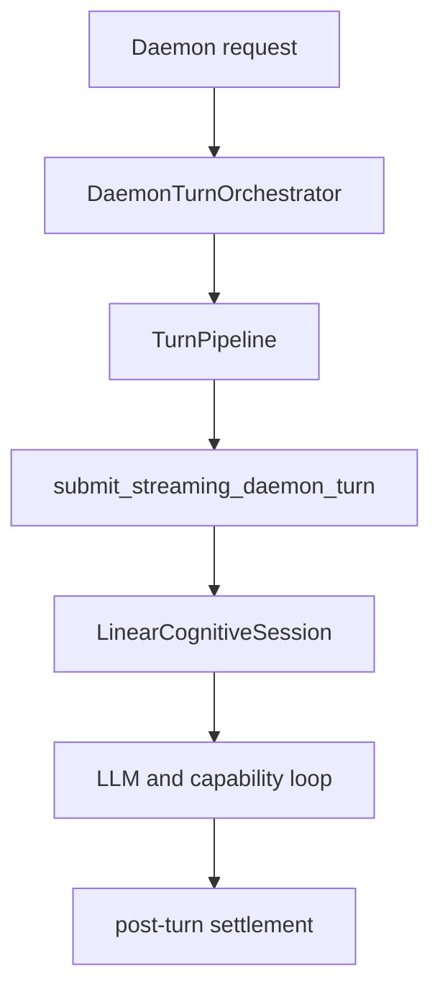
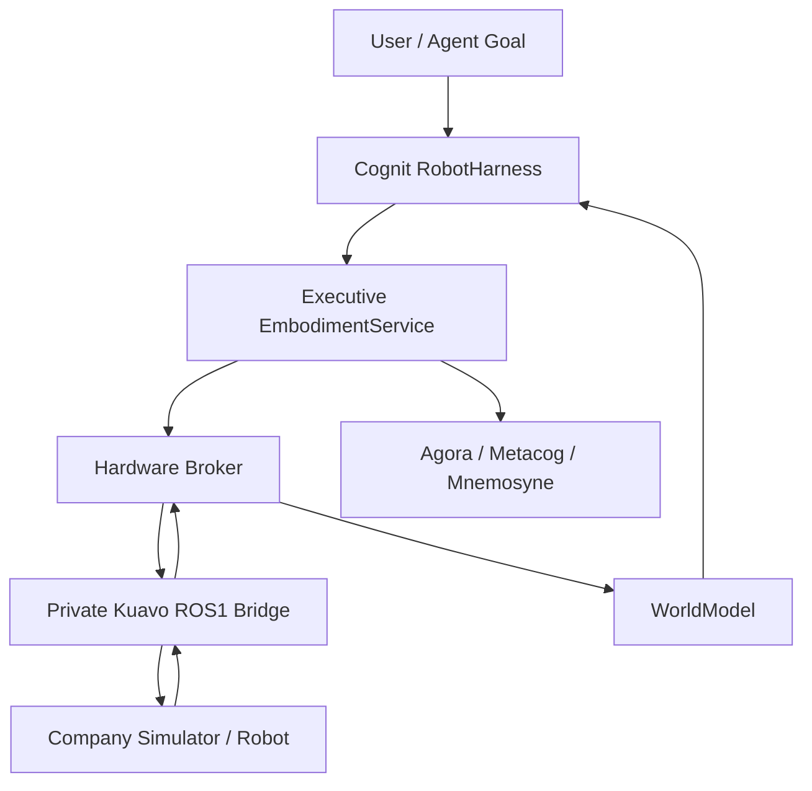
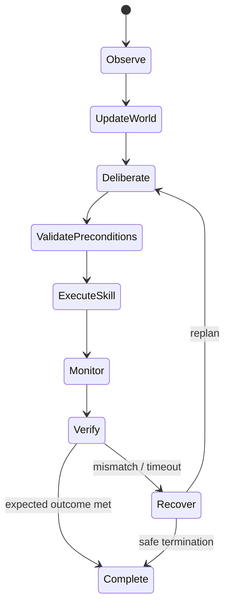
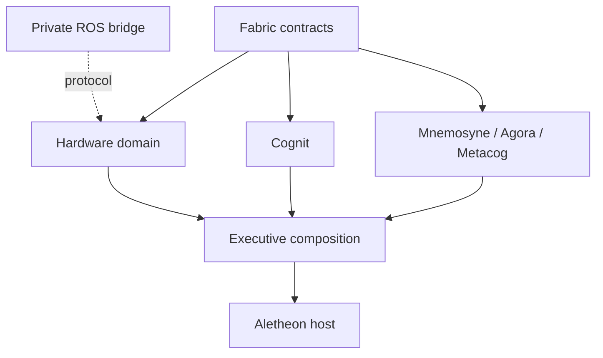
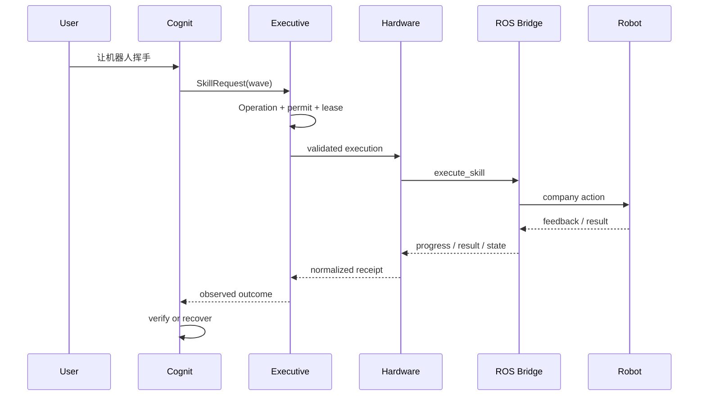

# Aletheon 机器人认知 / 推理层架构与耦合治理方案

> 基于代码版本：`dev @ 114039ed0ab42965df9263308f5c8d7ab4168c19`
> 审计日期：2026-07-21
> 审计范围：Aletheon workspace 的生产调用链、认知循环、世界模型、意识工作区、记忆、元认知、运行时、硬件域及现有硬件纵向切片
> 结论性质：代码现状审计 + 目标架构裁决 + 可执行改造计划

## 1. 执行摘要

Aletheon **可以发展为机器人的“大脑”中的认知与推理控制平面**，但不应被定义为完整机器人控制栈，也不应直接承担关节级实时控制。更准确的定位是：

> **Persistent Embodied Cognitive Operating Core（持久化具身认知操作核心）**

它应负责目标理解、任务状态、长期记忆、世界状态认知、规划、技能选择、受治理执行、结果验证和失败恢复；WBC、MPC、RL 控制器、伺服环、EtherCAT/CAN、ROS Control 等硬实时部分继续留在机器人侧。

从当前代码看，Aletheon 已经具备若干重要“脑结构”：

- `cognit` 有线性 ReAct 认知会话和 `WorldModel` 雏形；
- `executive` 已经把 Kernel、Dasein、Agora、Mnemosyne、Metacog、Corpus、会话和生命周期组织在一个 turn pipeline 中；
- `kernel` 有 Process、Operation、Permit、Lease、取消和监督等治理原语；
- `hardware` 已经实现设备命令、许可、租约、deadline、sequence、fail-safe、receipt 和 deterministic simulator；
- `mnemosyne`、`agora`、`dasein`、`metacog` 已提供记忆、全局竞争、自我约束和反思的基础。

但它目前还不是可接入机器人仿真的生产认知层，关键断点是：

1. `hardware` 只作为 `executive` 的 `dev-dependency`，生产链路没有调用者；
2. `WorldModel` 只在自身测试中使用，没有接入 turn 或 observation ingress；
3. `HarnessKind` 只有 `Linear`，配置也没有真正选择 RobotHarness；
4. 没有 ROS、仿真器、VLA、策略或技能 provider；
5. 输入主链仍以文本为中心，图像和机器人状态没有进入统一认知上下文；
6. `TurnEngine` 已定义为“统一生产路径”，但 daemon、exec 的真实入口尚未全部收敛到它；
7. 当前 `MetacogProcessor` 只输出置信度、冲突与不确定性，不能验证物理技能结果；
8. 跨域类型、授权语义、事件总线和启动装配已出现潜在耦合扩张点。

因此最合理的策略不是一次性新建很多 crate，而是先把现有 `hardware` 提升为正式的具身执行域，在 `fabric` 增加稳定协议，在 `executive` 增加具身操作编排，在 `cognit` 增加 RobotHarness，并把公司 ROS Noetic 接入做成 **独立私有 sidecar / bridge**。

## 2. 当前代码的真实生产调用链

### 2.1 入口与 turn 执行

程序入口最终分成 daemon 和 exec 两条路径：

- `crates/aletheon/src/main.rs`
- `crates/executive/src/host/launcher.rs::run_daemon`
- `crates/executive/src/host/launcher.rs::run_exec`

daemon 主路径为：



exec 路径则经 `ExecSessionBuilder`、`TurnService` 再进入 `LinearCognitiveSession`。两条路径共享了部分认知会话实现，但并未完全共享同一个生产编排入口。

`crates/executive/src/service/turn_engine.rs` 已定义 `TurnEngine`、`TurnEngineRequest`、`TurnEngineContext`、`TurnEngineEventSink` 和 `SessionTurnEngine`。从命名和注释看，它应当成为唯一生产 turn 合同；但代码搜索显示，当前主要引用仍在其实现和 parity 测试中，daemon 并未真正以它为统一入口。

**影响：** 如果直接再增加 RobotHarness 或机器人专用请求路径，会形成 daemon、exec、robot 三套生命周期语义，导致 Operation、取消、事件、结算和记忆写入逐渐分叉。

### 2.2 TurnPipeline 已经是认知系统的实际装配中心

`crates/executive/src/service/turn_pipeline.rs` 当前超过 1300 行，包含或持有：

- Kernel runtime 与 Operation scope；
- ContextAssembler；
- Canonical sessions；
- CognitiveSessionFactory；
- Conscious workspace；
- Session input；
- Workspace checkpoint；
- Lifecycle registry；
- Agora service；
- CanonicalEventBus；
- 取消 token、事件流、工具设置与 post-turn projection。

这说明 Aletheon 并不是“只有一个 LLM loop”。它已经具备大脑上层的多个功能域，并且 daemon 路径确实会把意识工作区、Dasein、记忆召回、能力治理、会话和 turn settlement 组合起来。

但 `TurnPipeline` 也已经接近 composition god object。机器人接入如果继续直接增加 provider、sensor stream、skill monitor、world model 和 safety 字段，会显著降低可测试性和替换能力。

### 2.3 记忆、意识工作区和元认知的实际成熟度

`crates/executive/src/impl/conscious/memory_processor.rs` 中的 `MnemosyneProcessor` 会：

- 把选中的 observation 作为 reflection experience 异步记录；
- 根据 broadcast summary 召回记忆；
- 将召回结果投影成受边界约束的 workspace candidates；
- 标注来源与 degraded source。

这已经是有用的“认知记忆闭环”，但它记录的是通用观察/反思，不是结构化的机器人动作 episode。

`crates/executive/src/impl/conscious/metacog_processor.rs` 当前主要计算：

- 平均置信度；
- 不确定性；
- 重复内容冲突；
- proposal-only 扩展。

它还不会比较“计划预期—技能回执—世界状态变化”，也不会据此触发 retry、replan、recovery 或 safe stop。因此，它是元认知信号源，而不是机器人 Outcome Verifier。

## 3. 当前机器人相关能力盘点

| 能力 | 当前代码 | 当前状态 | 机器人化缺口 |
|---|---|---:|---|
| 通用认知循环 | `cognit::LinearCognitiveSession` / ReAct | 已生产使用 | 没有机器人专用状态机 |
| Harness 选择 | `cognit::harness::HarnessKind` | 只有 `Linear` | 无 `Robot` variant，配置未真正驱动工厂 |
| 世界模型 | `cognit/src/core/world_model.rs` | 有雏形、无生产调用 | 无 frame、TTL、staleness、关系、版本化 belief |
| 设备控制契约 | `hardware` | deterministic simulator 完整 | 仅测试接入，无生产 broker/provider registry |
| 授权与治理 | `kernel` | Permit/Lease/Operation 基础较强 | Hardware 自己重复了部分 ID/时间/permit 映射 |
| 观察入口 | `fabric::WorkspaceObservation` | 通用 JSON observation | 缺 sequence、source time、received time、有效期、schema |
| 图像 | Fabric/OpenAI provider 支持 content image | 只到模型消息层 | daemon/TUI 入口仍主要是 String；历史投影会跳过 Image |
| 视觉 grounding | `VisionGroundingProvider` | 面向 UI 截图 | 不是机器人 camera/perception pipeline |
| 运行时能力 | `RuntimeCapability::{DeviceObserve, DeviceCommand}` | 枚举与测试存在 | 没有真实生产 runtime；语义与 sub-agent 混杂 |
| ROS / 仿真 | 无 | 未接入 | 无 ROS1/ROS2、Gazebo/MuJoCo/Isaac provider |
| VLA / RL | 无 | 未接入 | 无 policy provider、skill provider 或模型生命周期 |
| 技能结果验证 | 无专用端口 | 未接入 | 无 expected outcome / observed delta 对比 |
| 失败恢复 | 通用取消与 settlement | 部分基础 | 无机器人 recovery policy 和边缘安全联动 |

### 3.1 `hardware` 并不是空壳，但目前仍是实验纵向切片

现有 `hardware` crate 已拆分：

- `clock.rs`
- `command.rs`
- `device.rs`
- `lease.rs`
- `provider.rs`
- `safety.rs`
- `simulator.rs`
- `telemetry.rs`

它已经表达了正确的许多安全不变量：命令关联 Operation、Principal、Device、Sequence、Schema 和 monotonic deadline；普通命令需要 permit + lease；stop 有更高优先级；断连、租约过期和 deadline 违规进入 fail-safe；receipt 可以审计。

但在 `crates/executive/Cargo.toml` 中，`hardware` 只位于 `[dev-dependencies]`，唯一纵向调用者是 `crates/executive/tests/hardware_simulation.rs`。因此目前的准确表述应是：

> 已证明安全契约与模拟器，不等于已形成生产机器人执行链路。

### 3.2 `WorldModel` 是可保留的 v0，不是机器人世界模型成品

当前 `WorldModel`：

- 保存固定容量的 observation deque；
- 用 `observation.source` 作为 entity ID；
- 将 JSON data 合并到 entity properties；
- 记录更新时间、confidence、observation count；
- 用 hash 做简单变化检测；
- 输出文本 snapshot。

它适合做轻量通用环境状态缓存，但机器人场景还缺：

- 传感器 source time 与 Aletheon receive time；
- sequence、去重、乱序处理；
- TTL、staleness 与 source health；
- 坐标系 / frame 与变换引用；
- entity relation、pose、velocity、occupancy 等结构化状态；
- belief version 与增量 `WorldDelta`；
- observation provenance 和 evidence ref；
- provider disconnect 后的置信度衰减规则。

不要把 100Hz/1kHz 原始 telemetry 全部塞进这个结构。WorldModel 应存“可推理的当前 belief”，原始流留在机器人/bridge 或专门的 artifact/telemetry store。

## 4. 目标边界：Aletheon 应负责什么

### 4.1 Aletheon 负责的“脑”

- 用户目标与长期意图；
- task graph / plan；
- 当前任务上下文和世界 belief；
- 记忆召回与跨任务经验；
- 技能发现、选择和参数生成；
- 执行前条件校验；
- Operation、permit、lease、deadline、cancel；
- 进度监督；
- 预期结果与实际结果验证；
- retry、replan、recovery、safe-stop request；
- 对失败、恢复和结果 episode 的记忆沉淀。

### 4.2 Aletheon 不负责的“小脑 / 脊髓”

- 关节闭环与电机驱动；
- 500Hz/1kHz 实时状态控制；
- WBC、MPC、轨迹跟踪、碰撞反射；
- CAN、EtherCAT、串口、GPIO 驱动；
- ROS controller manager 的实时职责；
- 安全 PLC / E-stop 的最终裁决；
- VLA/RL policy 的高频 action rollout。

边缘控制器是最终安全权威。Aletheon 可以请求动作或 safe stop，但不能绕过边缘安全拒绝，也不能因为推理结论而提升自身权限。

## 5. 推荐的总体架构



核心设计原则是三层分离：

1. **稳定领域协议层**：描述 observation、robot state、skill、operation progress/result、safety event；
2. **Provider 接口层**：用 Rust trait 表达 Aletheon 所需能力，不包含 ROS 类型或传输细节；
3. **具体适配层**：公司私有的 Kuavo ROS1 bridge，之后才是 ROS2、VLA、RL 或 vendor SDK provider。

这不是一个“什么都能发的通用 JSON API”。它应该是 **版本化、类型化、带 schema 与安全语义的通用领域接口**。

## 6. crate 与模块裁决

### 6.1 总体裁决：暂时不要新建多个核心 crate

当前最优方案是：

- 保留并扩展现有 `hardware`；
- 在 `fabric`、`executive`、`cognit`、`corpus`、`mnemosyne`、`metacog` 中增加窄模块；
- 公司 ROS Noetic 接入做成独立私有服务 / 仓库 `aletheon-kuavo-bridge`；
- **暂不同时创建 `hardware` 和 `embodiment` 两个重叠 crate**；
- **暂不创建 `embodiment-protocol` crate**，除非协议需要跨语言独立发布，或多个独立 provider 已经出现。

理由：现有硬件计划明确选择单一 `hardware` crate，当前只有一个真实外部调用场景。现在拆出多个协议/provider crate 会增加依赖层、版本同步和循环风险，却还没有第二个生产 caller 证明边界。

如果未来 `hardware` 的命名无法覆盖技能、视觉、VLA、移动平台等具身语义，可以做一次受控重命名为 `embodiment`；但不能同时维护两个领域中心。

### 6.2 `fabric`：只放稳定跨域协议和标识

建议新增：

```text
crates/fabric/src/types/embodiment.rs
crates/fabric/src/types/skill.rs
crates/fabric/src/types/observation.rs
```

建议类型：

- `DeviceId`
- `SkillId`
- `EmbodiedObservation`
- `SkillDescriptor`
- `SkillRequest`
- `SkillProgress`
- `SkillResult`
- `SafetyEvent`
- `EvidenceRef`
- `ObservationSchemaVersion`

`EmbodiedObservation` 至少包含：

```rust
pub struct EmbodiedObservation {
    pub schema: String,
    pub schema_version: u16,
    pub source: String,
    pub sequence: u64,
    pub source_time: MonoTime,
    pub received_at: MonoTime,
    pub valid_until: Option<MonoDeadline>,
    pub confidence: f32,
    pub frame_ref: Option<String>,
    pub payload: serde_json::Value,
    pub evidence: Vec<EvidenceRef>,
}
```

当前 `WorkspaceObservation` 只有 `what/source/data/attribution`。可以扩展其 envelope 字段，或者让它引用规范化 `EmbodiedObservation`。不应把 `sensor_msgs::JointState`、ROS topic 名或公司 action type 放入 Fabric。

Fabric 只拥有 DTO、ID、schema 和事件 envelope，不拥有 provider、broker、执行器或业务服务实现，避免它变成“全系统万能 crate”。

### 6.3 `kernel`：保留纯治理语义

Kernel 不应知道 Robot、ROS、Skill 或 Joint。它继续负责：

- Process；
- Operation；
- Admission；
- Permit；
- Lease；
- monotonic Clock；
- Cancellation；
- Supervision；
- Settlement。

如机器人执行需要，可以增加通用能力，而不是机器人专用能力：

- lease heartbeat / renewal；
- operation progress checkpoint；
- cancellation acknowledgement；
- deadline extension policy；
- child operation / attempt relationship。

Hardware 不应自行签发 Kernel Permit 或 Lease。Executive 取得授权后，把一个不可伪造或已验证的执行上下文传给 Hardware。

### 6.4 `hardware`：从测试域升级为生产具身执行域

建议在现有模块基础上形成：

```text
crates/hardware/src/
├── device.rs
├── observation.rs       # 新增：规范化观察、去重、staleness
├── skill.rs             # 新增：技能描述、请求、进度和结果
├── telemetry.rs
├── provider.rs          # 扩展：异步 provider contract
├── registry.rs          # 新增：provider/device/skill 注册
├── broker.rs            # 新增：验证、路由、sequence、deadline、receipt
├── safety.rs
├── lease.rs
├── command.rs
└── simulator.rs
```

推荐把当前同步且很窄的 `DeviceProvider::apply` 扩展为异步领域端口，例如：

```rust
#[async_trait]
pub trait EmbodimentProvider: Send + Sync {
    async fn snapshot(&self, device: &DeviceId) -> Result<RobotSnapshot, ProviderError>;
    async fn list_skills(&self, device: &DeviceId) -> Result<Vec<SkillDescriptor>, ProviderError>;
    async fn execute_skill(
        &self,
        command: ValidatedSkillCommand<'_>,
        progress: Arc<dyn SkillProgressSink>,
    ) -> Result<SkillResult, ProviderError>;
    async fn cancel(&self, operation: &OperationId) -> Result<CancelAck, ProviderError>;
    async fn safe_stop(&self, device: &DeviceId) -> Result<StopReceipt, ProviderError>;
}
```

名称可以继续叫 `DeviceProvider`，但接口必须覆盖长时间运行技能与进度流；单次 `apply()` 不足以表达“导航 30 秒、可取消、有反馈、有结果”的机器人动作。

Hardware 应负责：

- provider manifest 和 schema 校验；
- provider/device/skill registry；
- observation sequence、dedupe、staleness；
- command/skill request 校验；
- deadline 与 lease expiry；
- fail-safe 和 stop 优先级；
- progress / result / receipt 归一化；
- provider disconnect 的安全降级。

Hardware 不负责：

- 用户意图理解；
- 任务规划；
- Kernel 授权决策；
- LLM prompt；
- ROS topic mapping；
- 记忆写入策略。

长期需要裁决 `hardware::OperationId`、`PrincipalId`、`MonotonicInstant` 与
Fabric/Kernel 同名类型的关系。P1 只统一同语义的 `DeviceId`/`SkillId`；其余类型先
保留各自语义，并在跨域边界使用显式、受测映射。是否统一由独立后续裁决，Hardware
内部专属 sequence 可以保留。

### 6.5 `executive`：新增具身操作编排服务

建议新增：

```text
crates/executive/src/service/embodiment_service.rs
crates/executive/src/service/robot_operation.rs
crates/executive/src/service/skill_supervisor.rs
crates/executive/src/impl/daemon/bootstrap/embodiment.rs
```

职责：

- 把 `hardware` 从 dev dependency 提升为 production dependency；
- 为技能执行创建 Kernel Operation；
- 请求 admission / permit / lease；
- 关联 principal、session、turn、goal、skill attempt；
- 驱动 broker/provider；
- 接收 progress；
- 处理 cancel、timeout、disconnect；
- settlement 并输出标准化结果；
- 将结果送给 OutcomeVerifier、Agora 与 Mnemosyne。

不要把以上字段继续堆进 `TurnPipelineResources` 或 daemon `request.rs`。使用独立 `EmbodimentGroup` / `EmbodimentServices` 聚合并在 `bootstrap/embodiment.rs` 装配，TurnPipeline 只依赖窄端口。

### 6.6 `corpus`：暴露受治理的机器人能力工具

建议提供以下窄工具：

- `robot.observe`
- `robot.get_state`
- `robot.list_skills`
- `robot.execute_skill`
- `robot.cancel`
- `robot.safe_stop`

工具实现必须由 Executive 注入的 embodiment service 支撑。Corpus 不调用 ROS，也不自行管理 lease。

明确禁止直接暴露给模型：

- `robot.publish_topic`
- `robot.call_any_service`
- `robot.set_joint`
- `robot.raw_bus_write`

模型只能选择经过 manifest 注册、参数 schema 校验、风险分级、前置条件明确、成功条件明确的技能。否则“通用接口”会退化为语义绕过层。

### 6.7 `cognit`：新增真正的 RobotHarness

建议新增：

```text
crates/cognit/src/harness/robot/
├── mod.rs
├── state_machine.rs
├── planner.rs
├── precondition.rs
├── monitor.rs
├── verifier.rs
└── recovery.rs
```

并扩展：

```rust
pub enum HarnessKind {
    Linear,
    Robot,
}
```

RobotHarness 不应只是“给 ReAct prompt 加机器人说明”，它需要显式状态机：



建议定义窄端口：

- `WorldModelPort`
- `SkillPlannerPort`
- `EmbodimentExecutionPort`
- `OutcomeVerifier`
- `RecoveryPolicy`

当前 `CognitiveSessionFactory` 是合适的扩展 seam，但 production factory 必须真正读取 `ExecutiveConfig.harness_kind`。RobotHarness 不应建立第三条独立 turn path。

### 6.8 `WorldModel`：生产化但不存原始高频流

保留现有 `cognit::WorldModel` 作为 v0，实现以下增强：

- `BeliefVersion`；
- `WorldSnapshot` / `WorldDelta`；
- source time、received time、sequence；
- TTL、stale、lost、degraded；
- frame reference 与 transform evidence；
- entity relation；
- confidence decay；
- observation provenance；
- provider health；
- 按 goal/task 的 bounded projection。

权威边界必须清楚：

- **WorldModel**：当前环境 belief 的权威；
- **Agora**：当前意识竞争与注意力投影，不是世界数据库；
- **Mnemosyne**：历史经验，不拥有当前状态；
- **ROS/bridge**：高频原始事实源，不拥有任务语义。

### 6.9 `agora`、`mnemosyne`、`metacog`、`dasein`

`agora` 保持通用，只接收归一化的：

- 重要 observation；
- skill progress / result；
- prediction error；
- safety concern；
- recovery proposal。

不要把所有 joint telemetry 投入 Agora。Bridge/Hardware 先聚合、阈值化、变化检测，再投影为 bounded candidates。

`mnemosyne` 建议增加通用 episode：

```rust
pub struct EmbodiedEpisode {
    pub goal_ref: String,
    pub device: DeviceId,
    pub skill: SkillId,
    pub parameters_digest: String,
    pub initial_state_ref: EvidenceRef,
    pub result: SkillResult,
    pub duration_ms: u64,
    pub failure_class: Option<String>,
    pub recovery: Vec<String>,
    pub evidence: Vec<EvidenceRef>,
}
```

rosbag、视频和大体积 telemetry 只存 artifact ref，不直接复制进记忆记录。

`metacog` 建议新增 `OutcomeVerifier`：比较 expected outcome、skill result、WorldDelta 和 safety event，输出 complete、retry、replan、recover 或 abort 建议。

`dasein` 不应引入 Robot/ROS 类型。它只接收归一化目标、结果、风险、关切与自我约束。

### 6.10 `runtime`、`gateway`、`interact`、`platform`

当前 `RuntimeCapability::DeviceObserve/DeviceCommand` 放在 sub-agent runtime manifest 中，容易把“机器人身体”错误建模成另一个 agent runtime。建议：

- 设备能力转移到 Hardware provider/skill manifest；或
- 如果 VLA/RL 需要独立模型执行，新增 `PolicyProvider` 端口，但不要复用 `SubAgentRuntime`；
- VLA/RL 作为 policy/skill provider，不成为 Aletheon 核心控制器。

`gateway/interact` 可以增加经过认证的外部 observation/event stream 和 operation status API，但 API 使用 Fabric 协议，不能暴露 ROS 消息。

`platform` 保持 Host OS 抽象，不放 ROS、机器人驱动或 skill 语义。

## 7. 公司 ROS Noetic 仿真的推荐接入方式

### 7.1 新建独立私有适配服务，而不是 workspace 核心 crate

推荐名称：

```text
aletheon-kuavo-bridge
```

它可以是公司仓库中的 Python `rospy` sidecar，部署在已有 ROS Noetic 容器或同一网络命名空间中，通过 Unix socket 或 localhost gRPC/JSON-RPC 与 Aletheon 通信。

Bridge 内部负责：

- 公司 topic / service / action 名称映射；
- ROS msg 与 Aletheon protocol 的转换；
- action feedback 与取消；
- 高频状态聚合和降采样；
- rosbag / image artifact 引用；
- ROS master 断连检测；
- 失联时触发本地安全策略。

第一版只需要五个领域方法：

1. `snapshot`
2. `list_skills`
3. `execute_skill`
4. `cancel`
5. `safe_stop`

不要让 Aletheon core 编译 ROS1 message generation，也不要把公司私有 action 名泄漏进开源协议。

### 7.2 VLA 和 RL 的位置

VLA 是视觉—语言—动作策略，RL 是训练/优化策略的方法。它们与 Aletheon 的关系应是：

- Aletheon 决定目标、选择技能、设置约束、监督结果；
- VLA/RL provider 在给定 observation、goal 和安全约束下输出动作或技能参数；
- 边缘控制器继续执行高频闭环；
- OutcomeVerifier 判断动作是否实现目标；
- 失败经验进入 Mnemosyne，训练数据进入独立数据管道。

第一阶段不要等待 VLA。先用公司已有稳定 action/service 作为 skill provider，先打通治理、执行、反馈、验证和记忆闭环。

## 8. 依赖方向与耦合治理

### 8.1 推荐依赖图



必须保持：

- `fabric` 不依赖任何业务 crate；
- `hardware -> fabric`，不依赖 `executive`、`corpus`；
- `cognit` 依赖抽象端口/协议，不依赖 ROS；
- `executive` 是 composition root，可以依赖各域；
- bridge 在 workspace 外，仅依赖发布的协议；
- 任何领域 crate 都不反向依赖 `executive`。

### 8.2 主要耦合问题与处理方案

#### 问题 1：Executive 装配中心继续膨胀

证据：`TurnPipeline` 字段很多且超过 1300 行，daemon `impl/daemon/bootstrap/request.rs` 直接构造 cognitive session、Agora、ConsciousWorkspace 等。

风险：修改一个 provider 会影响 daemon 初始化、测试 builder、exec 和 native runtime。

处理：新增 `EmbodimentServices` 聚合和独立 composer；TurnPipeline 只持有 `Arc<dyn EmbodimentExecutionPort>` 与 `Arc<dyn WorldModelPort>`。

#### 问题 2：Fabric 变成类型垃圾场

风险：为了跨 crate 方便，把 provider、业务逻辑、ROS schema、公司类型全部塞进 Fabric。

处理：Fabric 只收稳定、跨域、版本化 DTO；所有 payload 有大小边界、schema version 和 provenance；实现留在所属域。

#### 问题 3：Executive—Corpus—Hardware 形成循环

错误结构：Corpus 依赖 Executive service，Executive 依赖 Corpus，Hardware 又调用 Executive 授权。

处理：端口定义在最低合理领域。`fabric` 定义跨 Corpus/Executive 的 `EmbodimentExecutionPort`；Hardware 保留 provider/broker/registry 领域合同；Corpus 的 tool adapter 只依赖 Fabric 窄端口，Executive 负责实现、创建与注入。Hardware 永不调用 Executive。

#### 问题 4：Hardware 重复治理身份与时间

证据：Hardware 自己定义 `OperationId`、`PrincipalId`、`MonotonicInstant`，集成测试需要手动把 Kernel permit 投影为 Hardware permit。

风险：两个同名 Operation 实际不一致；授权字段在映射时丢失；时钟域不一致。

处理：跨域 ID 和时间统一复用 Fabric；Kernel 是 permit/lease 权威；Hardware 接收已验证授权上下文并输出 receipt，不生成新权威。

#### 问题 5：ROS 类型污染核心

风险：ROS1 构建环境、catkin、message generation 和公司 topic 进入 workspace，导致 CI、跨平台和开源边界失控。

处理：ROS 只存在于私有 bridge；核心只见版本化领域协议。

#### 问题 6：模型绕过语义层直接控制机器人

风险：任意 publish/service/set_joint 工具让 prompt 直接成为低层控制命令，绕过 schema、precondition、risk class、lease 和 outcome criteria。

处理：只暴露注册技能；skill manifest 必须声明输入 schema、风险等级、资源、前置条件、超时、取消、成功条件和安全行为。

#### 问题 7：高频 telemetry 把认知上下文淹没

风险：token/context 爆炸、Agora 候选抖动、数据库写放大、推理读取过期状态。

处理：边缘/bridge 聚合；Hardware 做去重、staleness 和变化检测；WorldModel 存当前 belief；原始流写 artifact；Agora 只接重要变化。

#### 问题 8：WorldModel、Agora、Mnemosyne 三重真相源

处理：WorldModel 是当前 belief 权威；Agora 是有限注意力窗口；Mnemosyne 是历史经验。三者只通过 immutable snapshot/ref 关联，不共享可变实体对象。

#### 问题 9：Goal、Operation、SkillExecution 状态重叠

建议语义：

- `Goal`：用户意图或长期目标；
- `Operation`：受治理的执行生命周期；
- `SkillExecution`：某 provider 的一次物理尝试。

允许 `Goal -> Operation -> SkillExecutionAttempt` 单向引用，不复制彼此的可变状态。重试生成新 attempt，可继续属于同一个 operation，也可由策略生成 child operation。

#### 问题 10：EventBus 承载过多控制语义

当前多个路径仍使用 `CanonicalEventBus`。事件适合表达已发生的事实，不适合表达必须确认的设备控制。

建议：

- command/cancel/stop 使用显式 request-response 端口；
- progress 使用有背压、可关闭的 stream/mailbox；
- observation 和 settled result 使用版本化事件；
- EventBus 逐步成为 transport，而不是状态权威；
- 新机器人 ingress 先通过 envelope + dispatcher adapter，避免立即大规模重写旧总线。

如果项目目标是 Dispatcher + RoutingPolicy + Subscription + IPC，应渐进收敛，不把 Robot P0 绑在一次全仓 EventBus 重构上。

#### 问题 11：多条 Turn 路径继续分叉

处理：先让 daemon、exec、native 真正通过 `TurnEngine` 或至少共享相同的 operation/lifecycle adapter；RobotHarness 必须通过 `CognitiveSessionFactory` 接入，不能自行启动第三套 turn。

#### 问题 12：安全权威位置错误

边缘 safety supervisor / E-stop 是最终权威。Aletheon 的 lease 过期必须导致 stop；provider 断连必须 fail safe；Aletheon 不能覆盖边缘拒绝。所有 stop 都需要 receipt，并且即使认知会话崩溃也能由 lease expiry 自动终止危险动作。

#### 问题 13：Provider API 与 transport 绑定

Rust trait 表达领域能力，gRPC/JSON-RPC/Unix socket 只是 adapter。不要在 `EmbodimentProvider` 类型中出现 socket、topic、service 名，避免测试和 provider 被单一 transport 锁死。

#### 问题 14：公司私有边界与开源边界

Aletheon 仓库只包含通用协议、模拟 provider 和安全契约；公司机器人型号、topic、action、标定和安全参数留在私有 bridge。两边通过版本化 manifest 和兼容性测试对接。

## 9. 推荐实施顺序

### P0：先收敛认知执行入口

- 明确 `TurnEngine` 为生产合同；
- daemon/exec/native 的 Operation、取消、事件和 settlement 语义对齐；
- 让 `CognitiveSessionFactory` 真正消费 `harness_kind`；
- 不新增机器人专用 daemon 入口。

完成标准：同一 turn 输入在 daemon 与 exec 下产生同构 lifecycle 事件和 settlement。

### P1：打通 production simulator 纵向切片

- Fabric 新增具身 observation/skill/result 协议；
- Hardware 增加 registry、broker、skill progress；
- `executive` 正式依赖 Hardware；
- Corpus 增加六个窄机器人工具；
- 使用现有 `SimulatedDevice` 走完整 production path，而不只是测试手工调用。

完成标准：模型通过 Corpus 发起模拟技能，Kernel 授权，Hardware 执行，Executive 监督并 settlement，结果进入 Agora/Mnemosyne。

### P2：接公司 ROS Noetic 仿真

- 私有 `aletheon-kuavo-bridge`；
- 首批只映射稳定 action/service，不暴露任意 topic；
- 支持 snapshot、list_skills、execute_skill、cancel、safe_stop；
- observation 限频、聚合、去重；
- 断连和 lease expiry 的 fail-safe 集成测试。

完成标准：同一个 production simulator 测试只替换 provider，不修改 Cognit/Executive/Corpus。

### P3：RobotHarness、世界模型与结果验证

- `HarnessKind::Robot`；
- WorldModel production port；
- expected outcome schema；
- OutcomeVerifier；
- retry/replan/recovery；
- 结构化 EmbodiedEpisode。

完成标准：技能返回“成功”但世界状态未变化时，系统能判定 mismatch 并恢复，而不是盲信 provider。

### P4：视觉、VLA 与策略 provider

- Camera/perception observation；
- frame/evidence；
- VLA/PolicyProvider；
- 低频 skill proposal 与高频 edge rollout 分离；
- policy version、模型来源、置信度和回放 evidence。

### P5：HIL 与真机门禁

- Hardware-in-the-loop；
- 网络抖动、乱序、重复、延迟、断连故障注入；
- emergency stop；
- 权限与安全审计；
- 真机 allowlist；
- 默认 simulation namespace，production 必须显式配置。

## 10. 第一个端到端验收场景

建议统一用“让机器人挥手”作为第一条 acceptance path：



必须验证：

- Cognit 不生成关节轨迹；
- 同一个 `OperationId` 从发起到 settlement 可追踪；
- 支持 progress、cancel、success、failure、timeout；
- Aletheon/bridge 任一崩溃后，lease expiry 会安全停止；
- provider result 与实际世界状态都参与成功判断；
- Agora 收到重要结果，而不是高频全量 telemetry；
- Mnemosyne 能在后续任务中召回此次 episode；
- 替换 simulator 与 ROS provider 不修改认知域代码。

## 11. 建议新增文件清单

### 核心仓库内

```text
crates/fabric/src/types/embodiment.rs
crates/fabric/src/types/skill.rs
crates/fabric/src/types/observation.rs

crates/hardware/src/observation.rs
crates/hardware/src/skill.rs
crates/hardware/src/registry.rs
crates/hardware/src/broker.rs

crates/executive/src/service/embodiment_service.rs
crates/executive/src/service/robot_operation.rs
crates/executive/src/service/skill_supervisor.rs
crates/executive/src/impl/daemon/bootstrap/embodiment.rs

crates/cognit/src/harness/robot/mod.rs
crates/cognit/src/harness/robot/state_machine.rs
crates/cognit/src/harness/robot/precondition.rs
crates/cognit/src/harness/robot/monitor.rs
crates/cognit/src/harness/robot/verifier.rs
crates/cognit/src/harness/robot/recovery.rs

crates/corpus/src/tools/robot.rs
crates/mnemosyne/src/types/embodied_episode.rs
crates/metacog/src/outcome_verifier.rs
```

具体目录应服从各 crate 当前 module convention；上面表达的是职责，不要求一次 PR 全部创建。

### 公司私有仓库

```text
aletheon-kuavo-bridge/
├── protocol/
├── providers/kuavo_noetic/
├── skill_manifest/
├── launch/
├── tests/contract/
└── tests/fault_injection/
```

## 12. 不建议现在创建的 crate

| 候选 crate | 当前裁决 | 原因 |
|---|---|---|
| `embodiment` | 暂不创建 | 与现有 `hardware` 职责重叠；先用真实 caller 验证是否值得重命名 |
| `embodiment-protocol` | 暂不创建 | Fabric 已是跨域协议层；当前额外拆分只增加层级 |
| `ros-provider` | 不进核心 workspace | ROS1/公司类型污染构建、CI 与开源边界 |
| `vla` | 暂不创建 | 尚无实际模型/provider；先定义窄 `PolicyProvider` 端口 |
| `robot-brain` | 不创建 | 会成为跨 Cognit/Executive/Memory/Hardware 的万能 god crate |
| 多个设备 provider crate | 暂不创建 | 目前只有一个公司场景；先放私有 bridge，第二个独立实现出现后再抽取 |

满足以下任一条件后，才考虑拆出 `embodiment-protocol`：

- Rust、Python、C++ 三方需要独立发布和兼容性版本；
- 至少两个独立 provider 在不同仓库复用协议；
- Fabric 的发布节奏明显阻碍 provider 协议升级；
- 协议需要生成 Protobuf/JSON Schema 并独立做 conformance suite。

## 13. 风险优先级

| 优先级 | 风险 | 后果 | 首要措施 |
|---:|---|---|---|
| P0 | 模型绕过技能层直接控制 | 安全事故、不可审计 | 只暴露注册技能和显式 stop |
| P0 | Lease/断连不能 fail safe | 动作失控 | 边缘最终权威、租约过期自动停止 |
| P0 | 多条 turn 生命周期分叉 | 取消/结算/记忆不一致 | 收敛 TurnEngine / factory seam |
| P0 | ROS 类型进入核心 | 构建和组织边界污染 | 私有 sidecar bridge |
| P1 | 多套 Operation/ID/Clock | 授权映射错误 | 统一 Fabric/Kernel identity |
| P1 | WorldModel 与 Agora 双权威 | 状态不一致 | 明确 belief 与 attention 边界 |
| P1 | 高频 telemetry 进入上下文 | 性能和认知抖动 | 聚合、TTL、变化投影 |
| P1 | Executive god object 扩张 | 难测试、难替换 | EmbodimentServices + 窄端口 |
| P2 | Runtime 与 robot body 混模 | provider 语义混乱 | 独立 Embodiment/Policy port |
| P2 | 提前过度拆 crate | 依赖复杂、开发变慢 | 先模块化，后用真实 caller 裁决 |

## 14. 最终判断

以当前代码成熟度做保守判断：

- 通用 agent runtime：约 **6/10**；
- 机器人认知 / 推理层：约 **2/10**；
- 完整机器人“大脑”：约 **1/10**。

这不是否定现有基础。Aletheon 已经有比普通 agent 框架更适合作为机器人认知核心的组件：持久会话、Operation 治理、全局工作区、记忆、元认知、可插拔 harness 和安全硬件契约。真正缺少的不是再加一个 LLM，而是把这些组件通过 **Observation → WorldModel → Plan → Governed Skill → Monitor → Verify → Recover → Memory** 的生产闭环接起来。

最重要的架构裁决是：

1. Aletheon 定位为机器人认知/推理控制平面，不接管硬实时小脑；
2. 暂不大量新建 crate，优先生产化现有 `hardware`；
3. 核心只见类型化具身协议，不见 ROS/公司消息；
4. 公司 ROS Noetic 接入使用私有 sidecar bridge；
5. RobotHarness 通过现有 CognitiveSessionFactory 接入，不新建第三条执行路径；
6. WorldModel、Agora、Mnemosyne 各自只有一个明确真相边界；
7. 所有物理执行必须经过 Operation、permit、lease、deadline、receipt 和 outcome verification。

## 15. 审计证据索引

- `crates/aletheon/src/main.rs`
- `crates/executive/src/host/launcher.rs`
- `crates/executive/src/service/turn_pipeline.rs`
- `crates/executive/src/service/turn_engine.rs`
- `crates/executive/src/service/harness_factory.rs`
- `crates/executive/src/impl/daemon/bootstrap/request.rs`
- `crates/executive/src/service/conscious_workspace.rs`
- `crates/executive/src/impl/conscious/memory_processor.rs`
- `crates/executive/src/impl/conscious/metacog_processor.rs`
- `crates/cognit/src/harness/mod.rs`
- `crates/cognit/src/core/world_model.rs`
- `crates/fabric/src/types/workspace.rs`
- `crates/runtime/src/manifest.rs`
- `crates/hardware/src/lib.rs`
- `crates/hardware/src/provider.rs`
- `crates/hardware/src/simulator.rs`
- `crates/executive/Cargo.toml`
- `crates/executive/tests/hardware_simulation.rs`

## 16. 验证说明

本报告基于源码、Cargo manifest、生产引用关系、测试引用关系和仓库内文档交叉审计。本报告的架构判断来自依赖声明、生产调用方与测试调用方的交叉审计。开始实施 P0/P1 后，应在仓库固定的 Rust 1.88 MSRV 环境中，通过 `scripts/cargo-agent.sh` 执行至少：

```bash
bash scripts/cargo-agent.sh test -p hardware
bash scripts/cargo-agent.sh test -p executive --test hardware_simulation
bash scripts/cargo-agent.sh test -p executive --test turn_engine_parity
bash scripts/cargo-agent.sh test --workspace
```
