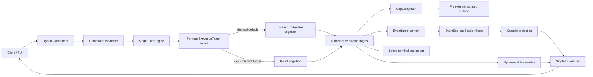
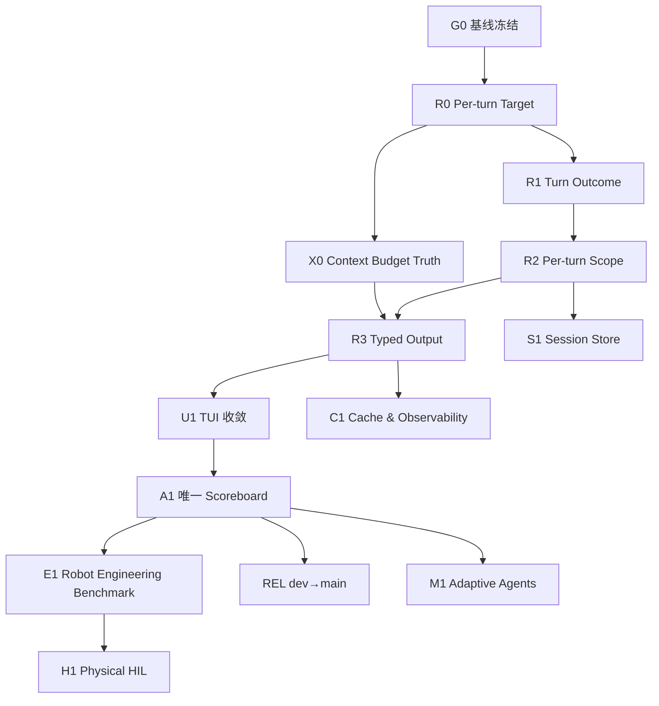

# Aletheon 运行时收敛、产品化与工程闭环解决方案

> 用途：作为 Codex 在 Aletheon 仓库中实施后续改进的主执行文档\\
> 基线分支：`dev`\\
> 审阅基线：PR #185 合并后的 `dev`，HEAD `1351ac04b538a3749a48c5c280edc186c8aaacf9`\\
> 文档日期：2026-08-07（仓库 UTC）\\
> 建议落库位置：`docs/plans/Aletheon_Runtime_Product_Convergence_and_Engineering_Closure_Plan_2026-08-07.md`\\
> 状态：Proposed → 执行前须重新确认基线 SHA

---

## 1. 结论

Aletheon 目前已经具备一条真实的宏内核执行链、事件溯源会话、统一命令入口、Agent 生命周期管理、普通编码工具、模型/记忆/工具缓存、Robot Bridge 与安装态验收框架。下一阶段不应继续横向增加概念、顶层 crate 或外围能力，而应完成以下九件事：

1. 把 Robot 从 daemon 级唯一 harness 改为 per-turn 显式执行目标；同一实例默认支持普通 Codex 类工作，只有明确 Robot 目标才进入具身执行。
2. 把模型原生上下文、profile 输入上限、历史可用预算、root rollout 与 child rollout 分开建模和展示；1M 模型不能显示成“200k 上下文”。
3. 修正 `TurnEngine` 的终态、错误、令牌统计与权限上下文语义。
4. 将执行资源作用域改为真正的 per-turn 生命周期，消除并发覆盖和异常路径泄漏风险。
5. 让 daemon → command → TUI 的输出协议类型化，并收敛实时态与持久投影双状态。
6. 建立唯一、机器生成、不可自相矛盾的安装态验收记分板。
7. 将编码基准扩展到 Robot Engineering 的实际工作面，但只使用公开、合成或脱敏夹具。
8. 在严格安全门槛下完成 physical HIL 的单个受控动作，而不是把实时控制搬进 Aletheon。
9. 通过上述门槛后，将 `dev` 晋升到 `main` 并打版本标签。

执行原则是：**先闭合正确性，再闭合可观测性和 UI，最后做性能、Robot HIL 与发布。** 每个工作包单独分支、单独 PR、单独验收，禁止一个 PR 同时跨越多个高风险边界。

---

## 2. 绑定约束

以下约束不是建议，而是本计划的边界条件。Codex 在任何实现中均不得绕过。

### 2.1 架构边界

- Aletheon 保持为**单实例、模块化宏内核，外部隔离执行**。
- 不改写为微服务，不重写主干，不新增无必要的顶层 crate。
- 只能有一个 `ClientIntent` 入口。
- 只能有一个 Session/Event 权威来源。
- 只能有一个 Turn Engine 权威执行路径。
- 只能有一个 capability 调用路径。
- 只能有一个 terminal settlement 路径。
- UI 是投影和交互界面，不拥有第二份业务真相。
- Aletheon 决策，Pi 执行，GBrain 记忆。
- Robot 实时控制、WBC、MPC、watchdog 和硬停止留在 Bridge/机器人控制栈；Aletheon 不进入硬实时闭环。

### 2.2 安全与数据边界

- 不向未授权第三方上传公司私有代码、配置、日志、模型权重、凭据或真实设备数据。
- Robot Engineering 基准只可使用公开仓库、合成代码、脱敏夹具或明确授权的内部镜像。
- 不把测试桩、模拟成功或“代码完成”当作安装态成功。
- 缺失认证/授权上下文时必须 fail closed，禁止以 `uid=0`、`gid=0`、`ApprovalPolicy::Never` 等兼容默认值继续执行。
- physical HIL 必须有本地独立急停、超时保护、动作范围限制和人工控制权。

### 2.3 本轮明确不做

- eBPF、FUSE、Android 或更多跨平台面。
- 新向量数据库。
- 新的“意识”“自进化”概念层。
- 为拆文件而新建 crate。
- 追求大规模 UI 改版。
- 把机器人控制算法移进 Aletheon。
- 在正确性门槛通过前继续堆新功能。

---

## 3. 当前状态与问题矩阵

| ID | 当前状态 | 风险 | 本计划处理方式 | 优先级 |
|---|---|---|---|---|
| P0-0A | Kuavo 配置使用 daemon 级 `agent.harness_kind = "robot"`，bootstrap 只选择一个根 `CognitiveSessionFactory` | Robot-enabled 实例把 `hello`、编码、文件任务也送入 RobotHarness；普通工具虽已注册却不可由根线性循环调用 | 引入类型化 per-turn `ExecutionTarget`，默认 General，Robot 必须显式选择 | P0 |
| P0-0B | 1M 模型窗口、profile input limit、history budget、root/child rollout 混在不同配置和投影中；TUI 可显示 `context unknown` 或把 200k 当上下文 | 用户无法判断真实容量，压缩/调度/子 Agent 预算可能被误解 | 建立唯一 `ContextBudgetProjection`，分别显示并校验每个量 | P0 |
| P0-1 | `SessionTurnEngine` 将任意 `Ok` 映射为 `Completed`，错误映射为 `Blocked` | 终态和错误语义失真，调用者无法可靠恢复 | 建立类型化 `TurnOutcome`，唯一映射表，移除兼容包装层 | P0 |
| P0-2 | 权限上下文存在 root/never-approve 兼容回退 | 可能绕过授权边界 | 删除回退，缺失上下文直接拒绝 | P0 |
| P0-3 | `TurnPipeline.current_scope` 是 daemon 全局 `Mutex<Option<_>>`，异常路径未稳定 drain | 并发 turn 互相覆盖、资源跨 turn 泄漏 | per-turn RAII guard，所有退出路径强制清理 | P0 |
| P0-4 | daemon 和 TUI 大量解析 `serde_json::Value` | 协议漂移到运行时才暴露 | 类型化输出 envelope，版本化并提供兼容迁移窗口 | P0 |
| P1-1 | 实时事件更新 `app.chat`，主视图渲染 `TaskConsoleRenderable` | 用户看不到真实流式状态，滚动/工具卡行为分裂 | durable projection + ephemeral overlay 单一 reducer | P1 |
| P1-2 | X12 文档与 PR 证据对 20-task 结果表述冲突 | 无法判定是否达到发布门槛 | 唯一机器生成 scoreboard，人工文档只引用它 | P1 |
| P1-3 | 编码基准以 20 个小型 Rust 任务为主 | 不能代表 ROS/Docker/EtherCAT/CAN/MPC 工作价值 | 新增 Robot Engineering 分层基准 | P1 |
| P1-4 | `EventSourcedSessionStore.append` 全局串行且重复读完整历史 | 长会话趋向 O(n²)，多会话相互阻塞 | per-session 序列/CAS 与 last-seq 索引 | P1 |
| P2-1 | Prompt profile 构造时 tool count 为 0，且 profile 未消费 | 缓存观测链名存实亡 | 传入真实工具定义，持久化/输出 profile 指标 | P2 |
| P2-2 | Recall cache 容量/TTL 硬编码，工具缓存覆盖很窄 | 难调优，缓存收益不可证明 | 配置化、依赖感知 key、命中与正确性基准 | P2 |
| P2-3 | 多 Agent 工作流固定为 Planner→Explorer→Executor 等阶段 | 简单任务开销大，复杂任务适应性不足 | 在主正确性闭合后改为证据驱动状态机 | P2 |
| P2-4 | `dev` 明显领先 `main` | 能力长期停留在开发分支，发布真相不清晰 | 完成门槛后晋升、打 tag、生成 release evidence | P1 |

---

## 4. 目标架构

目标不是增加一套新框架，而是让现有权威链真正只有一条：



关键不变量：

- 输入是类型化的，输出也必须类型化。
- Robot 是显式的 turn 执行目标，不是整个 daemon 的唯一人格；未明确选择 Robot 时默认走 General。
- 不允许仅凭 LLM 对自然语言的分类结果获得硬件执行权。
- 所有 turn 均产生恰好一个 terminal outcome。
- terminal outcome 写入权威事件后，才向 UI 宣告完成。
- 实时 overlay 可丢弃、可重建，不得覆盖 durable projection 的事实。
- 每个 turn 的资源作用域只属于该 turn。
- cancel、error、panic、disconnect 和进程退出均进入同一清理与结算协议。

---

## 5. 执行方式

### 5.1 PR 与分支策略

每个工作包使用独立分支与 PR，例如：

```text
codex/g0-baseline-freeze
codex/r0-per-turn-execution-target
codex/x0-context-budget-truth
codex/r1-typed-turn-outcome
codex/r2-per-turn-operation-scope
codex/r3-typed-command-output
codex/u1-tui-state-convergence
codex/a1-acceptance-scoreboard
codex/e1-robot-engineering-benchmark
codex/s1-session-store-scaling
codex/c1-cache-observability
codex/m1-adaptive-agent-workflow
codex/h1-physical-hil-gate
codex/rel-dev-main-promotion
```

规则：

- 每次开始前获取最新 `origin/dev`，记录起始 SHA，并检查 dirty worktree。
- 读取仓库内全部适用的 `AGENTS.md`、架构约束和测试说明。
- 不修改与工作包无关的用户改动。
- 同一个 PR 只解决一个主要风险。
- 禁止用大范围重命名、格式化或生成文件掩盖功能改动。
- 新类型先在现有 crate 内以私有模块落地，只有确有跨 crate 稳定 API 时才提升可见性。
- 若实现发现必须突破绑定约束，停止并提交设计说明，不自行扩 scope。

### 5.2 每个 PR 的固定交付物

PR 描述必须包含：

1. 基线 SHA 与目标不变量。
2. 根因，而不仅是表面症状。
3. 修改的权威路径。
4. 删除或废弃的旧路径。
5. 测试命令与原始结果摘要。
6. 并发、失败、取消和恢复证据。
7. 是否影响协议、持久数据或安装态升级。
8. 明确的回滚方式。
9. 剩余风险与后续工作包 ID。

### 5.3 通用验证命令

Codex 应先以仓库已有脚本为准。普通工作包只运行能验证改动的最窄 package/test target；只有当前集成/验证负责人可以串行执行 workspace-wide 检查。集成门若命令存在，则至少执行：

```bash
./scripts/cargo-agent.sh fmt --all -- --check
./scripts/cargo-agent.sh clippy --workspace --all-targets --all-features -- -D warnings
./scripts/cargo-agent.sh test --workspace --all-features
```

还应运行仓库已有的架构检查、安装态 smoke、X12/R8/X13 以及与工作包直接相关的定向测试。不得并发运行 `executive` 或 workspace build。若全量测试因环境条件无法运行，PR 必须列出：未运行项、原因、风险和可复现命令，不能写成“通过”。

---

## 6. 工作包 G0：基线冻结与可复现证据

### 目标

在动主链前固定事实，避免修复期间继续引入功能和验收口径漂移。

### 实施任务

- 拉取远端并确认 `origin/dev` HEAD；若已不同于本文 SHA，重新审查 PR 差异。
- 记录 Rust toolchain、feature set、OS、安装包版本、模型端点、Robot 模拟器版本和测试数据版本。
- 运行当前全量单元/集成/架构检查，保存机器可读 baseline。
- 为 P0/P1/P2 项建立可追踪的 issue 或仓库内状态表。
- 在发布完成前冻结新顶层 crate、新概念层和非必要外延能力。
- 将已有 X12/R8/X13 证据中的状态词统一为枚举，禁止自由文本充当状态。

### 验收标准

- 有一份包含 commit SHA、工具链和测试结果的 baseline JSON。
- 每个失败项均可复现，不以“偶发”关闭。
- 本文后续工作包可引用稳定的基线 ID。

### 不要做

- 不在这个 PR 修功能。
- 不人工修改结果为通过。

---

## 7. 工作包 R0：General/Robot Per-turn 执行目标路由

### 现状证据

- `config/aletheon.kuavo-mujoco.example.toml` 设置 `[agent] harness_kind = "robot"`。
- daemon bootstrap 根据这个全局值，在 `LinearCognitiveSessionFactory` 与 `RobotCognitiveSessionFactory` 中二选一，并把结果作为所有根 turn 共用的 `cognitive_sessions`。
- `RobotCognitiveSession` 把任何自然语言输入视为 robot task，直接驱动 observe → plan → authorize → execute → verify → settle；因此普通 `hello` 也可能出现 Robot activity 和 blocked settlement。
- 普通工具并未缺失：`agents/general-agent.md` 已列出 `repo_inspect`、`file_read`、`apply_patch`、`exec_command`、`git_diff`、`agent_spawn` 等 Codex 类工具，bootstrap 也会注册完整 ToolRegistry。问题是全局 Robot harness 不运行普通 linear tool loop。

这不是“再注册几个工具”能修复的问题，而是**执行目标选择层级错误**：硬件模式被放在 daemon 全局配置，而不是一个 turn 的显式、可审计意图中。

### 目标

同一个 Aletheon 实例、同一个 Session/Event 权威和同一个 Turn Engine 同时支持：

- General：聊天、代码阅读、文件修改、命令执行、Git、搜索、子 Agent 等 Codex 类工作。
- Robot：针对明确 device 的 observe/plan/authorize/execute/verify/settle。
- Mixed workflow：先在 General 中修改 ROS/Bridge/控制代码并验证，再由用户显式切换到 Robot 目标执行受控动作。

### 类型设计

优先在已有 `SubmitPromptIntent` / `TurnRequest` 上增加明确目标，命名与现有领域词汇对齐。示意：

```rust
pub enum ExecutionTarget {
    General,
    Robot {
        device_id: DeviceId,
        environment: RobotExecutionEnvironment,
    },
}

pub struct SubmitPromptIntent {
    // existing fields...
    pub execution_target: ExecutionTarget,
}
```

约束：

- 缺省值永远是 `General`。
- `Robot` 必须来自用户显式模式/命令或受信客户端的类型化字段，不能由模型自由文本分类直接升级。
- `harness_kind = "robot"` 改为“Robot capability enabled/available”的部署配置，不再决定每个 prompt 的认知路径。
- 选择 cognition factory 只能发生在唯一 Turn Engine 内部的 per-turn 路由点；不得新建第二个 Turn Engine 或第二条结算链。
- General profile 看得见的 robot 工具仍受 capability policy 控制；没有显式 Robot target 和 device binding 时，actuation 必须拒绝。

### TUI 交互

- 标题栏明确显示 `target general` 或 `target robot:<device>`。
- 提供显式切换，例如 `/target general`、`/target robot kuavo-mujoco-01`，或等价的 typed UI action。
- 输入“移动机器人前进 5m”但 target 仍是 General 时，不自动下发；UI/assistant 应提示选择 Robot target 并展示 device/environment。
- 切换 target 不创建第二份 session truth；它生成可审计的 session event。
- `hello`、代码任务和普通文件任务默认留在 General。

### 实施任务

1. 在 `ClientIntent → CommandDispatcher → TurnRequest` 中贯穿 `ExecutionTarget`。
2. 将 daemon bootstrap 的二选一 factory 改为一个组合 factory/router，持有 General 与可选 Robot factory。
3. 由 router 根据当前 turn 的类型化 target 创建 cognitive session。
4. Robot 未配置时，General 仍可启动；只有显式 Robot turn 返回 typed unavailable 错误。
5. Robot 已配置时，General 仍使用 `general-agent` 和完整普通工具路径。
6. 将 target、device、environment 和 target source 写入权威 turn-start event 与状态投影。
7. TUI timeline 按 turn 分组，不把旧 Robot activity 误投影到新的 General turn。
8. 删除“全局 harness 选择等于所有 turn 类型”的旧生产路径；保留配置迁移并给出弃用告警。

### 必需测试

- Robot-enabled daemon 中提交 `hello`，走 General，零 Robot observe/authorize/execute 事件。
- Robot-enabled daemon 中执行 repo inspect/read/patch/validation，普通工具可见且受原权限控制。
- 显式 Robot target 才创建 RobotCognitiveSession。
- General 文本包含“robot/移动”但无显式 target 时，不能获得 actuation 权限。
- Robot target 缺 device、配置、attestation 或授权时 fail closed。
- 同一 session 的 General → Robot → General 三个 turn 事件顺序正确、投影不串线。
- 两个不同 target 的并发 turn 不共享 scope、device binding 或 terminal settlement。

### 验收标准

- 同一安装实例可完成一项 Codex 类代码任务和一项 Robot simulation 任务，无需重启/换配置。
- 普通 `hello` 不产生 Robot EpisodeReport。
- Robot 动作只能由显式 target 触发。
- 仍然只有一个 ClientIntent、Turn Engine、Event authority、capability governance 和 settlement authority。

---

## 8. 工作包 X0：1M 上下文与多层预算真相

### 现状证据

当前源码同时存在多个数值，但含义不同：

| 字段/来源 | 当前默认或来源 | 正确含义 |
|---|---:|---|
| 模型目录 `deepseek-v4-flash/pro` | 1,000,000 | 模型原生 context window |
| `request.rs: llm.max_context_length()` | 由解析后的 provider/model capability 得出 | session model context window |
| active profile `max_input_tokens` | 未覆盖时等于 model context window | profile 输入上限 |
| active profile `max_output_tokens` | 默认 16,384 | 为输出保留的上限 |
| `agent.admission.root_max_tokens` | 2,000,000 | 一个 root rollout 的累计调度预算，不是单次上下文 |
| `agent.admission.max_child_tokens` | 200,000 | 单个 child Agent rollout allowance，不是模型上下文 |
| context planner history budget | 动态计算 | 扣除 system、tools、pending input、output reserve 和 safety margin 后可给历史的容量 |

因此，默认 `[1m]` 模型的主 turn 源码目标确实是 1M。若安装态显示“200k context”，优先怀疑：

1. UI 把 `max_child_tokens` 错标为 context；
2. 当前 turn 实际是 child Agent，展示的是 rollout allowance；
3. effective config 对 profile `max_input_tokens` 做了 200k override；
4. provider capability 解析/模型 alias 选择与 `[1m]` 不一致；
5. 状态投影字段缺失，客户端用错误 fallback。

具体安装属于哪一种，必须读取**实际 effective config、启动日志中的 `Session context window configured` 和当前 profile snapshot**后才能下结论；不能只看 checked-in default。

### 目标

建立一个权威、类型化、可投影的上下文预算快照，使用户看到 1M 是 1M，同时理解实际可用 history 会低于 1M，也不会把 200k child allowance 误认为模型容量。

### 建议类型

```rust
pub struct ContextBudgetProjection {
    pub model_spec: String,
    pub model_context_tokens: u64,
    pub profile_input_limit_tokens: u64,
    pub reserved_output_tokens: u64,
    pub system_and_skill_tokens: u64,
    pub tool_schema_tokens: u64,
    pub pending_input_tokens: u64,
    pub safety_margin_tokens: u64,
    pub current_history_tokens: u64,
    pub admissible_history_tokens: u64,
    pub compaction_threshold_tokens: u64,
    pub rollout: RolloutBudgetProjection,
}

pub struct RolloutBudgetProjection {
    pub root_remaining_tokens: u64,
    pub child_limit_tokens: u64,
    pub current_agent_remaining_tokens: u64,
}
```

### 计算与显示规则

- `model_context_tokens` 只来自经过验证的 runtime model capability。
- `profile_input_limit_tokens = min(profile override, model context)`。
- `admissible_history_tokens` 由现有 `ContextBudgetPlanner` 计算，不另写第二套公式。
- `max_child_tokens` 只能显示为 `child rollout limit`，禁止命名为 `context`。
- root/child rollout 是跨多次请求的累计预算；model context 是一次请求的窗口，类型上不得复用同一字段。
- 未知值显示 `unknown` 并带 missing-source reason；禁止用 0 或 200k fallback。
- TUI 示例：

```text
model deepseek-v4-flash[1m] · window 1,000k · profile input 1,000k
history 83k / 933k · output reserve 16k · system+tools 18k · safety 50k
rollout root remaining 1,742k · child limit 200k
```

### 实施任务

1. 盘点 model capability、AgentConfig、AgentProfile、admission 和 context planner 中全部 token 字段。
2. 为语义不同的 token budget 使用不同 newtype/结构，禁止裸 `usize/u64` 跨层误接。
3. 在 daemon status/turn-start projection 输出 `ContextBudgetProjection`。
4. TUI 删除 `context unknown · budget unknown` 的无原因展示，并分别渲染 window/history/rollout。
5. 提供只读诊断命令输出 effective provider/model/profile 及各预算来源；敏感配置只显示来源和 digest，不显示 secret。
6. 启动时记录 model spec、catalog/override 来源和最终 window；若 `[1m]` alias 最终不是 1M，给出显式冲突并按现有 capability 规则拒绝不可信覆盖。
7. compaction event 记录触发阈值、触发前后 token 和预算快照。
8. child Agent 状态明确显示“模型窗口 1M、该 child rollout 上限 200k”，而不是只显示 200k。

### 必需测试

- `[1m]` Flash/Pro 解析为 1,000,000。
- main general profile 未覆盖时 input limit 为 1,000,000。
- override 200k 时 model window 仍显示 1M，profile limit 显示 200k。
- child allowance 200k 不改变 SessionManager context window。
- tool schema/output reserve/safety margin 扣减 history budget 的 golden test。
- provider capability 与配置冲突时 fail closed 或按现有明确策略报错，不能静默缩成 200k。
- daemon status、JSON 协议和 TUI 对同一快照 round-trip 一致。

### 验收标准

- 运行 `[1m]` 模型时 TUI 明确显示 `window 1,000k`。
- 任何 200k 都带 `profile input limit` 或 `child rollout limit` 标签，不会显示为 model context。
- 用户能从单一 status 快照解释压缩为何触发及实际剩余容量。
- scoreboard 记录同一预算快照，避免性能/上下文测试口径漂移。

---

## 9. 工作包 R1：统一类型化 Turn Outcome

### 目标

让一个 turn 的完成、停止、取消、阻塞和失败具有不可歧义的类型语义，并删除会吞掉错误或伪造权限的兼容路径。

### 主要位置

- `crates/executive/src/application/turn_engine.rs`
- `crates/executive/src/application/daemon_turn_engine.rs`
- `crates/executive/src/application/turn_service.rs`（如仍存在权威调用）
- `crates/executive/src/application/turn_pipeline.rs`
- 相关 command/event/session 类型与测试

### 设计要求

优先复用现有领域类型；如确需新增，形态应类似：

```rust
pub struct TurnExecutionResult {
    pub turn_id: TurnId,
    pub outcome: TurnOutcome,
    pub usage: TurnUsage,
    pub committed_event: EventId,
}

pub enum TurnOutcome {
    Completed { stop_reason: StopReason },
    Cancelled { reason: CancelReason },
    Blocked { reason: BlockReason },
    Failed { error: TurnFailure },
}

pub struct TurnUsage {
    pub input_tokens: u64,
    pub output_tokens: u64,
    pub cache_read_tokens: u64,
    pub cache_write_tokens: u64,
}
```

最终命名应与仓库现有词汇一致，不能平行发明第二套 `status/result/stop` 体系。

### 实施任务

1. 画出现有 `ClientIntent → CommandDispatcher → TurnEngine → TurnPipeline → EventSpine → settlement` 调用图。
2. 列出所有现有 stop/error/cancel 值，并建立一张穷尽映射表。
3. 将 `TurnResult.stop` 正确映射到终态，不再将所有 `Ok` 视作 `Completed`。
4. 保留可恢复与不可恢复错误的类型信息，不把任意错误吞成 `Blocked`。
5. 从真实 provider/turn usage 汇总令牌，不再默认写 0；无法获得时使用显式 `Unknown` 或可空类型，禁止伪造 0。
6. 删除 `LocalOsPrincipal { uid: 0, gid: 0 }`、`permission_profile = "exec"`、`ApprovalPolicy::Never` 的兼容回退。
7. 权限上下文缺失时，在执行 capability 之前产生可审计的拒绝事件。
8. 将 `SessionTurnEngine` 的兼容职责内联或删除，确保生产只绑定一个实现。
9. 对 terminal settlement 增加“恰好一次”断言或幂等键。

### 必需测试

- 每种 stop reason 的终态映射表测试。
- provider error、tool error、policy deny、user cancel、runtime crash 的独立测试。
- 缺失 `PrincipalContext` 时 fail-closed 测试。
- token usage 非零、未知和 cache token 的测试。
- terminal settlement 重试不会重复结算。
- 老事件回放仍可读；若协议变化，提供版本迁移测试。

### 验收标准

- 生产路径只有一个 `TurnEngine` 实现/绑定点。
- 不再存在 `Ok(_) => Completed` 的无条件映射。
- 不再存在权限兼容默认值。
- 所有终态均可由类型和事件唯一解释。
- API/TUI 不需要猜测字符串或 JSON 字段来判断终态。

---

## 10. 工作包 R2：Per-turn OperationScope 与全路径清理

### 目标

消除 daemon 全局 `current_scope` 的并发覆盖风险，确保资源在成功、失败、取消、panic 和连接中断时均被清理。

### 根因

`TurnPipeline.current_scope: Arc<Mutex<Option<OperationScope>>>` 把 per-turn 状态提升为 daemon 共享状态。新 turn 可以覆盖旧 turn 的 scope；当前 drain 主要位于成功路径，closure 返回错误后不一定执行同一清理逻辑。

### 设计要求

- scope 由 `run_turn` 局部创建并拥有。
- 使用 RAII guard 或等效结构在 `Drop` 时触发兜底清理。
- 正常结束显式 `settle_and_drain()`；异常结束 `abort_and_drain()`。
- 清理动作必须幂等。
- 外部 PID/start identity、tool invocation、临时目录和租约均绑定 turn/generation。
- 不通过 daemon 全局可变槽传递当前 turn。

### 实施任务

1. 枚举 `OperationScope` 注册的所有资源类型及释放方法。
2. 将 scope 作为参数传入需要的私有 stage，或放入不可跨 turn 的 `TurnExecutionContext`。
3. 删除或封闭 `set_current_scope/take_current_scope` 一类全局 API。
4. 在 terminal settlement 前后明确清理顺序。
5. 让 cancel 和 timeout 进入同一 abort protocol。
6. 对无法同步清理的外部运行时记录待回收事件，并由恢复器按 generation fencing 回收。
7. 增加资源计数/未清理 scope 指标。

### 必需测试

- 两个并发 turn 交错注册资源，资源不会串线。
- provider/tool 在不同 await 点失败，scope 均归零。
- 用户取消、daemon shutdown、外部 runtime crash 均归零。
- 重复 drain 不产生二次删除或二次结算。
- 模拟进程 PID 重用时 start identity fencing 生效。
- 可使用属性测试或故障注入覆盖 stage 边界。

### 验收标准

- 生产代码中不存在 daemon 级 `Option<OperationScope>`。
- 测试结束时 active scope/resource gauge 为 0。
- 成功、错误、取消路径共享一个可审计的清理协议。

---

## 11. 工作包 R3：类型化 Command Output 与协议版本化

### 目标

完成“类型化输入，类型化输出”，把 daemon 与 TUI 之间的协议漂移从运行时错误变成编译期错误。

### 主要问题

- `DaemonTurnEngine` 动态索引 `serde_json::Value`。
- `CommandOutput::PromptCompleted`、`StatusProjected` 等携带动态 JSON。
- TUI `response.rs` 通过大量字段分支猜测消息形态。

### 实施任务

1. 盘点所有 `CommandOutput` 变体和 TUI 消费字段。
2. 建立版本化 envelope，例如 `CommandOutputV1`，内部使用领域类型。
3. 为完成、增量文本、tool lifecycle、status projection、usage、error 定义明确 payload。
4. JSON 仅保留在传输序列化边界，进入进程后立即解析为类型。
5. 若需兼容旧客户端，在单一 adapter 中处理 V0→V1，设定删除期限。
6. 对未知字段保持向前兼容，对未知必需变体明确拒绝并记录协议版本。
7. 移除 TUI 内按字符串/字段存在性判断消息类型的分支。

### 必需测试

- 序列化 round-trip 和 snapshot/golden 测试。
- daemon 与 TUI 使用同一类型契约的编译期覆盖。
- 协议版本不匹配时给出可操作错误。
- old event/replay adapter 测试。
- 模糊 JSON 输入不能导致 panic。

### 验收标准

- 业务层不再动态索引 turn/status JSON。
- 每种输出只有一个领域含义。
- TUI 主路径没有散落的 schema 猜测。

---

## 12. 工作包 U1：TUI 实时态与持久投影收敛

### 目标

让用户在主界面看到实时流式输出、工具状态和最终持久结果，同时保留断线重连与事件回放能力。

### 目标状态模型

```text
DurableProjection(session events)
        +
EphemeralOverlay(active turn chunks/tool progress)
        ↓
SingleReducer keyed by session_id + turn_id + item_id
        ↓
TaskConsoleRenderable / one visible interaction surface
```

### 实施任务

1. 记录当前所有写入 `app.chat` 和 `AppState.items/tasks/activities` 的代码路径。
2. 定义 `UiItemKey` 与 reducer 事件，避免通过文本位置合并。
3. 将流式 token、tool start/progress/end 放入 ephemeral overlay。
4. durable projection 到达后，以事件 ID/turn ID 原子替换 overlay，而不是重复追加。
5. reconnect/replay 时丢弃旧 overlay，只从 durable projection 重建，再接新 live stream。
6. 让主 `TaskConsoleRenderable` 渲染统一 state。
7. 统一键盘、鼠标滚动、Markdown、tool card、错误卡和取消状态。
8. 删除不再可见但仍被更新的第二套 chat state，或将其降为同一 reducer 的薄视图。

### 必需测试

- 流式文本在 durable commit 前可见，commit 后不重复。
- tool start→progress→success/failure 卡片状态正确。
- 断线重连、重复事件、乱序但有序列号的事件可收敛。
- 两个并发 turn 不互相覆盖。
- 鼠标与键盘滚动作用于实际可见区域。
- 长 Markdown、Unicode、宽字符、终端 resize 不 panic。
- 至少一组 PTY 或渲染 snapshot 测试。

### 验收标准

- 主视图与实时事件使用同一 reducer。
- UI 不拥有 durable 业务真相。
- 任意时刻可通过事件回放重建稳定界面。

---

## 13. 工作包 A1：唯一安装态验收记分板

### 目标

消除 PR 描述、测试文档和人工总结之间的状态冲突，让发布判断只依赖一份机器生成证据。

### 产物

建议生成：

```text
artifacts/acceptance/<run-id>/manifest.json
artifacts/acceptance/<run-id>/scoreboard.json
artifacts/acceptance/<run-id>/scoreboard.md
artifacts/acceptance/<run-id>/logs/...
```

`scoreboard.json` 至少包含：

- repo SHA、dirty flag、构建 profile、features。
- installed artifact digest，而不只是源码 SHA。
- daemon/client version 与 protocol version。
- provider/model endpoint 标识（脱敏）。
- task fixture digest。
- 每题状态、开始/结束时间、退出码、证据路径。
- terminal settlement 数量。
- scope/resource leak 计数。
- 重试次数和 generation ID。
- 总体 gate 状态与失败原因。

### 状态枚举

仅允许：

```text
not_run
infra_blocked
failed
passed
waived
```

`code_complete`、`looks_good`、`evidence_complete` 不是执行状态。`waived` 必须带批准人、原因和到期时间，且默认不能用于发布 P0 gate。

### 实施任务

1. 选择已有 X12 runner 为唯一入口，不平行新造 runner。
2. runner 直接生成 JSON，Markdown 只能从 JSON 渲染。
3. 文档引用 run ID 和 digest，禁止手填通过数量。
4. 区分 source test、installed test、simulation、HIL 和 physical-real 五个环境级别。
5. 加入“单一 generation、零 scope violation、零 resource leak、恰好一次 settlement”校验。
6. 将结果上传到授权的 CI artifact 或保留在受控本地；不得泄露私有内容。

### 20-task 发布门槛

- 使用新安装的同一 artifact 完成一次 fresh run。
- 20/20 有 terminal state；不得有悬挂任务。
- 至少 19/20 `passed`；任何 P0 语义/安全失败均使总体失败。
- 零 scope violation。
- 零资源泄漏。
- 每个 turn 恰好一次 terminal settlement。
- 无人工修改 scoreboard。
- 失败重跑保留原 run，不覆盖历史证据。

### 验收标准

- PR、文档和 release note 只引用同一 run ID。
- JSON 与 Markdown 可通过重生成比对。
- 无法再出现“19/20 完成”和“门槛仍未运行”同时成立的情况。

---

## 14. 工作包 E1：Robot Engineering 基准扩展

### 目标

测量 Aletheon 是否能完成机器人团队的真实工程工作，而不只是在小型 Rust 算法题上表现良好。

### 建议任务分布

在保留现有 20 题作为 core regression 的基础上，新增独立 Robot Engineering suite。第一版建议 30 题：

| 类别 | 数量 | 示例 |
|---|---:|---|
| ROS 2 / lifecycle / launch | 6 | 修 QoS、lifecycle transition、launch 参数、bag 回放解析 |
| 容器与构建 | 4 | 修 Docker multi-stage、colcon cache、交叉编译配置 |
| CAN / EtherCAT / 串口 | 5 | 帧解析、字节序、超时、状态机、错误恢复 |
| 控制与数值 | 5 | PID anti-windup、轨迹限幅、简单 MPC 配置、单位转换 |
| 传感与日志 | 4 | 时间戳对齐、丢包检测、CSV/MCAP 摘要、异常诊断 |
| 安全与设备协议 | 3 | watchdog、safe-stop、attestation 校验 |
| 多文件工程变更 | 3 | 接口迁移、测试补全、跨包修复 |

### 夹具规则

- 使用合成或公开代码，固定许可与来源。
- 不出现公司名、内部域名、设备序列号、真实拓扑、访问令牌或专有算法。
- 每题拥有 deterministic oracle、超时、资源上限和网络策略。
- 区分只读诊断、代码修改、模拟运行和设备动作权限。
- 注入典型失败：延迟、乱序、丢包、字节序、时钟漂移、设备拒绝和 watchdog。

### 评分维度

- 功能正确性。
- 测试质量与回归保护。
- 安全边界遵守。
- 修改范围和架构一致性。
- 首次成功率与总耗时。
- token、cache、tool 调用成本。
- 是否需要人工干预。

### 验收标准

- suite manifest 可版本化、可复现。
- 不含未授权私有代码或数据。
- 每个任务有独立 oracle 和失败分类。
- 报告能按领域、风险和成本切片，而不只给总分。

---

## 15. 工作包 S1：EventSourcedSessionStore 可扩展性

### 目标

保留事件溯源权威模型，同时避免每次 append 扫描完整历史和所有会话共用一把 writer mutex。

### 设计方向

- 以 session 为粒度分配序列，而非读取全历史推导下一序号。
- 通过数据库/存储层唯一约束或 compare-and-swap 保证 `(session_id, sequence)` 唯一。
- 只读取 last sequence/last event ID，不加载完整 item 集合。
- 锁粒度降为 per-session；不同 session 可并发。
- 快照只是加速投影，不替代事件权威。
- crash recovery 能识别已提交事件与未完成 settlement。

### 实施任务

1. 为当前 append 路径建立基准：1k、10k、100k events；1、10、100 sessions。
2. 确认后端存储事务与唯一约束能力。
3. 引入 session head/index，使用原子 append。
4. 保持旧事件格式可读，必要时后台惰性建立 head。
5. 增加冲突重试的上限和指标。
6. 验证 replay、projection、compaction/snapshot 不改变事件事实。

### 必需测试

- 同 session 高并发 append 序列连续且无重复。
- 不同 session 真并发，不被全局锁串行化。
- commit 前后 crash 的恢复测试。
- 旧数据迁移/惰性索引测试。
- 长会话 append 延迟不随全历史线性增长。

### 验收标准

- append 不再加载完整 session 历史。
- 不同 session 没有全局写锁竞争。
- 事件序列唯一、连续或具有明确 gap 语义。
- 基准展示 p50/p95/p99 和吞吐改进。

---

## 16. 工作包 C1：缓存正确性与可观测性闭环

### 目标

让缓存收益可测、失效可解释、错误不会被缓存掩盖，同时把已构造的 prompt profile 真正用于观测和调优。

### 实施任务

1. 将真实 tool definitions/count 传入 prompt partition 构造，不再固定为 0。
2. 让 `assembled_context.profile` 被消费：写入 turn telemetry、scoreboard 或受控诊断事件。
3. 配置化 recall cache 的容量与 TTL，给出安全默认值和上限。
4. 明确三层缓存：provider prefix、recall result、read-only tool result。
5. 为 mutable workspace 工具设计依赖感知 key：内容 digest、metadata/version、repo HEAD/index 状态、参数和权限上下文。
6. 默认不缓存有副作用工具、权限敏感结果、时间敏感状态和未声明依赖的读取。
7. 为缓存记录 hit/miss/bypass/stale-reject、节省 token/延迟和校验失败。
8. 保留 DeepSeek Flash/Pro 当前高命中结果作为诊断基线，但不将单次结果宣称为 SLA。

### 缓存安全规则

- TTL 不能单独证明 mutable file cache 正确。
- 权限上下文必须进入 cache key 或强制 bypass。
- tool schema/version 变化必须失效。
- 错误、取消、部分输出默认不缓存。
- streaming 和 ordinary path 必须具有一致 key/invalidations。
- cache miss 与 cache disabled 的结果必须语义等价。

### 必需测试

- 文件修改后旧读取不能命中。
- 同内容不同权限不能串缓存。
- tool version/schema 变化失效。
- ordinary 与 streaming 结果一致。
- provider prefix profile 包含真实工具分区。
- 缓存关闭时所有 acceptance 仍通过。

### 验收标准

- PromptConstructionProfile 在真实 turn 中可观测。
- cache policy 不再只有声明而无度量。
- 所有新增缓存均有依赖/失效模型和错误等价测试。

---

## 17. 工作包 M1：证据驱动的多 Agent 控制器

### 前置条件

R0、X0、R1、R2、R3、U1、A1 必须先通过。本项不能阻塞首个收敛发布。

### 目标

在不增加顶层 crate 的前提下，把固定角色流水线改为可跳过、可并行、可根据证据回退的私有状态机。

### 实施任务

- 将 2k 行级 orchestration 文件拆成同 crate 私有 stage/module；不改变外部 API。
- 定义任务风险/不确定性分类。
- 简单、局部、低风险任务允许跳过 Planner 或 Explorer。
- 独立探索可受控并行，但共享写入必须串行或隔离。
- Tester/Reviewer 根据缺失证据触发，不以固定角色次数触发。
- Fixer 只接收结构化失败证据，并设置回路上限。
- 所有角色共用同一 OperationScope、权限和 terminal settlement。

### 验收标准

- 低风险任务的角色/令牌/延迟显著下降。
- 高风险任务不降低 acceptance 成功率。
- 工作流无无限回路，所有转换有原因码。
- 仍然只有一个 Turn Engine 和一个 settlement path。

---

## 18. 工作包 H1：Physical HIL 安全门槛

### 前置条件

- Robot simulation R8/X13 通过。
- R0/R1/R2/A1 通过。
- 独立本地急停和 watchdog 已人工验证。
- 操作员明确批准本次受控动作。

### 第一动作范围

只选择一个低能量、可观察、可立即停止的动作，例如：在受限工作空间内执行短距离单关节/末端位姿动作。不得把第一轮扩展为连续自主任务。

### 必备条件

- pinned device serial、firmware、bridge manifest 和 configuration digest。
- 环境/设备 attestation。
- 位置、速度、力矩、持续时间和空间边界。
- 本地 watchdog，不依赖云端或 Aletheon 心跳完成硬停止。
- 物理急停独立于软件路径。
- operator ownership token 和明确倒计时。
- heartbeat 丢失、bridge crash、daemon crash 均触发 safe-stop。
- EpisodeReport 包含命令、观测、限制、停止原因和证据 digest。

### 验收顺序

1. dry-run：只验证计划与限制，不下发动作。
2. bridge simulation：同一命令和安全 envelope。
3. hardware enabled、actuation disabled：完成 attestation/heartbeat。
4. 低能量单动作。
5. 人工触发 cancel。
6. 人工断 heartbeat，验证本地 safe-stop。
7. 保存 EpisodeReport，并由操作员签字确认。

### 失败即停止条件

- manifest/digest/serial 不匹配。
- 急停或 watchdog 未通过。
- telemetry 时间戳不可信。
- 限制值缺失或单位不明确。
- Aletheon 与 Bridge 对控制权理解不一致。
- 任何 scope/settlement 重复或资源残留。

---

## 19. 工作包 REL：`dev` 晋升、标签与发布

### 发布门槛

必须同时满足：

- R0、X0、R1、R2、R3、U1、A1 完成。
- workspace fmt/clippy/test 与架构检查通过。
- fresh installed 20-task scoreboard 达标。
- simulation Robot acceptance 达标。
- 零已知 P0 安全/正确性问题。
- 协议和数据迁移路径已验证。
- README 从愿景陈述补充为可验证的当前能力、安装和限制。

H1 physical HIL 可以作为发布后独立 gate；若 release 宣称支持 physical robot，则 H1 必须先通过。

### 实施任务

1. 在短期 freeze 下将 `dev` 与 `main` 做最终 compare。
2. 生成 release candidate artifact 和 digest。
3. 只用 RC artifact 执行 acceptance，不在测试后重建不同 artifact。
4. 更新 README、CHANGELOG、known limitations 和 acceptance run ID。
5. 晋升 `dev` 到 `main`，保留完整历史。
6. 打语义化 tag，附 machine-generated evidence。
7. 发布后执行 smoke，并记录回滚点。

### 验收标准

- `main` 指向已验收的代码。
- tag 指向与 installed artifact digest 对应的 commit。
- release note 不做超出证据的能力宣称。

---

## 20. 推荐顺序与依赖



推荐迭代：

- Iteration 0：G0。
- Iteration 1：R0；先让同一实例恢复 General/Codex 类工作，同时保留显式 Robot 路径。
- Iteration 2：X0、R1；分别闭合上下文真相与 turn 终态语义。
- Iteration 3：R2、R3。
- Iteration 4：U1、A1，然后首个收敛 release candidate。
- Iteration 5：S1、C1，可在不同 PR 中并行评审。
- Iteration 6：E1。
- Iteration 7：H1；M1 可独立排期。
- Final：REL；若希望尽快稳定主干，也可在 A1 后先发布 core convergence 版本，再把 E1/H1/M1 放后续版本。

---

## 21. 全局完成定义（Definition of Done）

本计划的核心部分只有在以下事实同时成立时才算完成：

- [ ] Robot-enabled 安装中，General/Codex 类工作默认可用；普通 `hello` 不进入 RobotHarness。
- [ ] Robot actuation 只由类型化、显式的 per-turn target 触发。
- [ ] `[1m]` 模型显示 1,000,000 model window；200k child allowance 不被标成 context。
- [ ] model/profile/history/rollout 预算在一个权威快照中分别可见。
- [ ] 单一、类型化的 Turn Engine 生产路径。
- [ ] 无 root/never-approve 兼容权限回退。
- [ ] stop/error/cancel/blocked/completed 映射穷尽且经过测试。
- [ ] usage 真实或显式 unknown，不再伪造 0。
- [ ] OperationScope 为 per-turn，所有退出路径清理，活跃资源归零。
- [ ] daemon → command → TUI 输出类型化并版本化。
- [ ] TUI durable projection 与 live overlay 使用同一 reducer。
- [ ] 唯一 machine-generated acceptance scoreboard。
- [ ] fresh installed 20-task run 达到门槛。
- [ ] 影响 tools、Agent profile、配置、持久化、IPC、daemon bootstrap 或 client 行为的改动，已通过 `sudo bash scripts/aletheon.sh deploy`。
- [ ] `target/release/aletheon`、`/usr/bin/aletheon`、machine daemon 与 user daemon 实际运行文件的 SHA-256 完全一致。
- [ ] systemd restart counters 稳定，并使用 `/usr/bin/aletheon` 通过官方 user socket 完成真实 LLM 请求。
- [ ] session append 不再全历史扫描和全局串行。
- [ ] prompt/cache profile 在真实 turn 中可观测。
- [ ] Robot Engineering suite 不包含未授权私有数据。
- [ ] physical HIL（若宣称支持）通过安全门槛。
- [ ] `main`、tag、artifact digest 与 acceptance run 一致。

---

## 22. Codex 执行守则

Codex 在每个工作包中应遵循以下循环：

1. **Inspect**：先读代码、测试、git 历史和适用 `AGENTS.md`，证明根因。
2. **Constrain**：写下本 PR 的不变量、非目标和允许修改的文件区域。
3. **Test first**：先增加能复现当前错误的测试或最小诊断。
4. **Implement**：做最小架构一致改动，删除被替代路径。
5. **Adversarial verify**：覆盖并发、失败、取消、恢复、权限和重复消息。
6. **Full verify**：运行格式、clippy、workspace test、架构和安装态检查。
7. **Evidence**：生成机器可读结果，PR 只引用证据。
8. **Stop**：达到工作包 DoD 后停止，不顺手扩功能。

遇到以下情况必须暂停并向维护者请求决策：

- 需要新增顶层 crate 或第二条执行路径。
- 需要改变外部稳定协议但没有迁移方案。
- 需要访问/上传私有代码或设备数据。
- 需要启用真实硬件动作但安全门槛未完成。
- 工作树存在与本工作包重叠的未知用户修改。
- 发现当前 `dev` 已使本文根因失效。

---

## 23. 可直接粘贴给 Codex 的主提示词

```text
你正在 Aurobear/aletheon 仓库中工作。请严格按照
docs/plans/Aletheon_Runtime_Product_Convergence_and_Engineering_Closure_Plan_2026-08-07.md
执行，但本次只实施工作包 <WORK_PACKAGE_ID>，不要实施后续工作包。

开始前：
1. 读取所有适用的 AGENTS.md、架构说明和该工作包涉及的测试文档。
2. 获取最新 origin/dev，报告当前 SHA、本文基线 SHA 与差异；检查 dirty worktree。
3. 用代码和测试重新验证本文列出的根因。若根因已变化，先报告，不机械套用方案。
4. 写出本次不变量、非目标、预计修改文件和验证命令。

实现约束：
- 保持单实例模块化宏内核与外部隔离执行。
- 不新增无必要的顶层 crate，不做微服务化或重写。
- 维持唯一 ClientIntent、Session/Event authority、Turn Engine、capability path、settlement path。
- General 是默认 turn target；Robot 只允许由显式类型化 target 选择，禁止 LLM 文本分类直接升级硬件权限。
- model context、profile input、history budget、root/child rollout 必须分开建模和展示。
- UI 只做投影；Aletheon 决策，Pi 执行，GBrain 记忆。
- 缺失权限/身份上下文必须 fail closed。
- 不上传任何未授权公司私有代码、日志、配置、凭据或设备数据。
- 优先在现有 crate 内使用私有 module/stage；删除被替代的旧路径。
- 不用 mock success、人工编辑结果或仅代码完成替代安装态证据。

执行要求：
1. 先写能复现问题的定向测试或诊断。
2. 实施最小完整修复。
3. 覆盖成功、错误、取消、并发、恢复、权限和幂等场景中与本包相关的部分。
4. 运行仓库标准 fmt、clippy、workspace test、架构检查及该工作包验收。
5. 提交一份结果报告：根因、改动、删除的旧路径、测试结果、未运行项、风险、回滚方式。
6. 达到该工作包 DoD 后停止，不顺手开始下一包，不推送/开 PR，除非我明确要求。

本次工作包：<WORK_PACKAGE_ID>
附加限制：<OPTIONAL_CONSTRAINTS>
```

### 推荐第一条 Codex 指令

```text
按照主计划只执行 G0。不要修改功能代码。重新确认 dev 基线，生成可复现的 baseline JSON，列出现有测试/验收冲突，并给出 R0/X0 开工前检查清单。完成后停止。
```

G0 通过后的第二条：

```text
按照主计划只执行 R0。先用测试证明 robot-enabled daemon 中普通 hello 和代码请求也进入 RobotCognitiveSession；随后引入 per-turn 类型化 ExecutionTarget，默认 General，只有显式 Robot target 才创建 RobotCognitiveSession。必须证明同一实例无需重启即可先完成普通 repo_inspect/file_read 任务，再完成 Robot simulation turn。不要同时做 X0/R1/TUI 重构。完成验证后停止。
```

R0 通过后的第三条：

```text
按照主计划只执行 X0。核对 effective provider/model/profile 与启动日志，建立类型化 ContextBudgetProjection。deepseek-v4-flash[1m] 的 model window 必须显示为 1,000,000；200,000 只能标为 child rollout limit 或显式 profile override，不能显示成 context。让 daemon status 和 TUI 分别展示 model window、profile input、history budget、output reserve 与 rollout budget。不要同时做 R1/R2。完成 round-trip 和安装态验证后停止。
```

X0 通过后再执行 R1：

```text
按照主计划只执行 R1。先用测试证明当前 TurnEngine 的 Ok/stop/error/permission fallback 语义问题，再建立穷尽的类型化 outcome 映射并删除不安全兼容回退。不要同时做 R2、TUI、缓存或 benchmark。完成全部定向和 workspace 验证后停止。
```

---

## 24. 最终优先级判断

如果只能投入一个短周期，做 `G0 → R0 → X0 → R1 → R2 → A1`。其中 R0 先修复当前最直观的产品断裂：启用 Robot 不应让普通 Codex 类能力消失；X0 则让 1M/200k 的真实语义不再混淆。随后四项决定系统是否能可信地回答：一次执行到底发生了什么、是否正确结束、资源是否清理、证据是否真实。

如果有两个迭代，再加入 `R3 → U1`，让这种真实状态能够被客户端稳定理解和展示。

Robot Engineering、缓存、session 性能和多 Agent 自适应都很有价值，但它们必须建立在正确、可清理、可结算、可验收的运行时之上。当前最有杠杆的工作不是再扩能力边界，而是把已经存在的主链收成一条可证明、可发布、可持续演进的产品路径。
